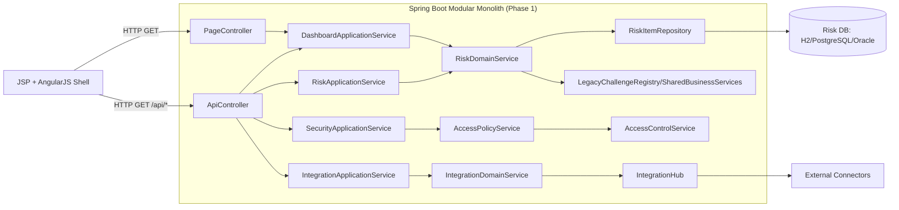
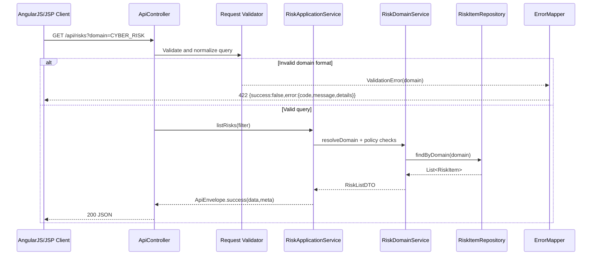
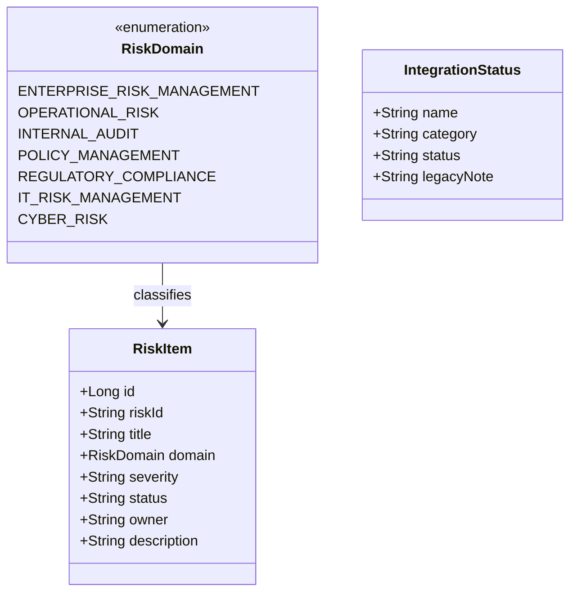

# 02 Design Document - Legacy Monolith Modernization via Modular Service Calls

## I. Executive Summary

- This design modernizes the existing Java/Spring MVC monolith by introducing clear module boundaries and distinct service-call contracts while preserving current behavior, endpoints, and JSP/AngularJS UI compatibility.
- Target audience: backend engineers, architects, QA, and DevOps teams delivering phased modernization without a disruptive rewrite.
- Success criteria:
  - API/service boundaries are explicit and testable (controller -> application service -> domain service -> repository/integration adapter).
  - Shared legacy logic is encapsulated behind module-level contracts instead of direct cross-package access.
  - Risk, integration, and security capability paths can be split into deployable services in later phases with no contract break.
  - Standardized validation/error envelopes exist for all public API reads.
- Detected stack (high confidence): Java 8 + Spring Boot 2.7/Spring MVC + Spring Data JPA, JSP + AngularJS 1.8 frontend shell, WAR packaging, H2 demo with PostgreSQL/Oracle runtime support.
- Scope boundary: in scope = architectural modularization design and service-call strategy inside current stack; out of scope = framework rewrite (e.g., Laravel/Node/.NET), UI redesign, and full microservice cutover implementation.

## II. System Architecture



### Component Breakdown

| Component | Responsibility | Inputs | Outputs | Boundary |
|---|---|---|---|---|
| `PageController` | Serves JSP pages and model attributes | Web request/query | View model | Presentation boundary |
| `ApiController` | Serves JSON resources | API request/query | API DTOs + envelope | API boundary |
| `*ApplicationService` (new layer) | Orchestrates use-cases and transaction scope | Controller DTO/query | Response DTOs | Use-case boundary |
| `RiskDomainService` (extracted from `RiskService`) | Risk rules, counts, domain filtering, challenge aggregation | Domain requests | Domain results | Domain boundary |
| `SecurityApplicationService` + `AccessPolicyService` | Security posture/read-only authorization view model | role/region/classification context | posture + permission decisions | Security boundary |
| `IntegrationApplicationService` + adapter façade | Integration status abstraction from legacy adapter shape | integration query | normalized status list | Integration boundary |
| `RiskItemRepository` | JPA persistence for `risk_register` | domain filters | `RiskItem` rows | Data boundary |
| Legacy utilities (`LegacyChallengeRegistry`, `SharedBusinessServices`) | Legacy mapping compatibility | region/domain | challenge/dialect data | Compatibility boundary |

### Primary Flow Sequence (Risk Query)



### Cross-Cutting Concerns

- Logging: structured request logs with `requestId`, route, module, latency, result code.
- Error handling: centralized `@ControllerAdvice` style mapper for `400/422/500`.
- Configuration: per-module configs (`mod.risk.*`, `mod.integration.*`, `mod.security.*`) and externalized secrets.
- Consistency: all API responses use one envelope schema and typed DTO contracts.

## III. Data Model

### Entities and Relationships

| Entity | Key Fields | Relationship |
|---|---|---|
| `RiskItem` | `id`, `riskId`, `title`, `domain`, `severity`, `status`, `owner`, `description` | Core persisted risk register row |
| `RiskDomain` | enum code + label | One-to-many with `RiskItem` |
| `ScaleMetrics` | age, loc, modules, APIs, tables | Computed read model for dashboard |
| `LegacyChallenge` | title, detail, severity | Read model from registry |
| `IntegrationStatus` | name, category, status, legacyNote | Read model from integration adapter |

### Field Specification Table

| Field | Type/Format | Required | Default | Nullability | Validation Class | Constraints |
|---|---|---|---|---|---|---|
| `domain` (query) | string enum/code | Optional | none | nullable | Input | must match `RiskDomain.code` or enum name |
| `severity` (future query) | string | Optional | none | nullable | Input | allow-list (`LOW`,`MEDIUM`,`HIGH`,`CRITICAL`) |
| `riskId` | varchar(32) | Mandatory | none | non-null | Database | unique per tenant scope (planned) |
| `title` | varchar(200) | Mandatory | none | non-null | Input/DB | min 3, max 200 |
| `domain` (`RiskItem`) | enum string | Mandatory | none | non-null | Database | must map to `RiskDomain` |
| `status` | varchar(32) | Mandatory | `OPEN` (planned for writes) | non-null | Business/DB | lifecycle transition rules |
| `owner` | varchar(64) | Optional | null | nullable | Input | trim + max length |
| `description` | varchar(512) | Optional | null | nullable | Input | max 512, sanitize output |

### Storage Strategy and Migration/Rollback

- Strategy: keep Spring Data JPA + relational backend; avoid persistence stack change.
- Phase 1: read-path refactor only (no schema mutation).
- Phase 2: additive schema hardening (indexes, uniqueness, status check constraints where DB supports).
- Index plan:
  - `idx_risk_register_domain`
  - `idx_risk_register_severity`
  - composite `idx_risk_register_domain_status`
- Rollback:
  - Application rollback via feature toggles to legacy `RiskService` path.
  - Schema rollback through reversible migrations for additive indexes/constraints.



## IV. API / Interface Design

### Endpoint Contracts

| Method | Path | Auth | Idempotency | Notes |
|---|---|---|---|---|
| `GET` | `/api/health` | public/internal | idempotent | redact sensitive operational details in phased hardening |
| `GET` | `/api/risks` | public/internal | idempotent | query by `domain` |
| `GET` | `/api/domains` | public/internal | idempotent | enum values |
| `GET` | `/api/scale` | public/internal | idempotent | dashboard read model |
| `GET` | `/api/legacy-challenges` | public/internal | idempotent | read-only |
| `GET` | `/api/integrations` | public/internal | idempotent | integration read model |
| `GET` | `/api/security/posture` | restricted recommended | idempotent | currently open; add role guard phase |
| `GET` | `/api/domain-counts` | public/internal | idempotent | aggregate counts |

### Standard Response Envelope

```json
{
  "success": true,
  "data": {},
  "meta": {
    "requestId": "uuid",
    "timestamp": "2026-07-21T16:41:14.721Z",
    "module": "risk"
  }
}
```

### Standard Error Envelope

```json
{
  "success": false,
  "error": {
    "code": "VALIDATION_FAILED",
    "message": "Invalid request parameters.",
    "details": {
      "domain": ["must match supported domain code"]
    },
    "requestId": "uuid"
  }
}
```

### Backward Compatibility and Versioning

- Keep existing endpoint URLs and HTTP methods.
- Preserve current response field names for existing AngularJS consumers where feasible.
- Introduce `v2` endpoints only when contract-breaking payload restructuring is unavoidable.

## V. Business Logic & Validation Design

### Core Workflow Rules

1. Controller validates request fields and normalizes casing.
2. Application service routes the use-case to the correct domain service.
3. Domain service enforces business rules (domain mapping, lifecycle constraints, security gates).
4. Repository/adapters fetch data through bounded interfaces only.
5. Response builder wraps data in uniform success/error contract.

### Validation Matrix

| Field/Input | Input Validation | Business Validation | Database Validation | Conditional Validation | Error Behavior |
|---|---|---|---|---|---|
| `domain` query | not blank if present; enum/code format | must map to known `RiskDomain` | n/a | if invalid, no fallback to broad `findAll` in strict mode | `422` |
| `severity` query | enum format | allowed only for risk list use-case | index-backed filter in phase 2 | optional filter | `422` |
| `riskId` | pattern + length | uniqueness within tenant boundary | unique index (planned) | required for create/update flows | `422/409` |
| `status` | allow-list | transition rules (`OPEN->IN_REVIEW->CLOSED`) | DB check constraint (where supported) | only on write operations | `422` |
| `region` (security ABAC) | non-empty when required | deny restricted data without trusted role | n/a | required for restricted classification | `403` |
| `/api/health` payload | n/a | exclude secrets and topology internals | n/a | redact in prod profile | `200` redacted |

### Gap Closures

- Replace permissive domain fallback (`invalid domain -> findAll`) with explicit validation mode.
- Standardize error schema across all API controllers.
- Encapsulate dual-path RBAC/ABAC logic in dedicated security service contracts.
- Prevent direct controller access to integration/legacy helpers except via application services.

## VI. Infrastructure & DevOps

- Deployment target: current Spring Boot WAR-compatible runtime (embedded Tomcat/local, servlet container in enterprise deployment).
- Delivery strategy:
  - Phase 1: modular monolith refactor in-place.
  - Phase 2: extract integration/security/risk bounded contexts behind REST or messaging adapters.
- CI/CD:
  - Build: `mvn clean verify`
  - Tests: unit + slice tests (`@WebMvcTest`, service tests, repository tests)
  - Quality gates: API contract tests + architecture rules (package boundaries).
- Config/secrets:
  - Externalized via env and secret store (Vault/managed identity already referenced by current posture model).
- Observability:
  - Metrics: request latency by endpoint/module, error rate by code, repository query timings.
  - Logs: structured JSON logs with `requestId` and module tag.
  - Health checks: per-module health contributors for DB and integration adapters.

## VII. Security & Compliance

- Authentication/authorization:
  - Introduce method-level guards for security-sensitive endpoints (`/api/security/posture`) in phase 1.5.
  - Keep ABAC + RBAC policy evaluation in one service contract to avoid drift.
- Data protection:
  - TLS enforced at ingress.
  - No secrets in API responses; sanitize legacy notes if they contain operationally sensitive details.
- Secure coding controls:
  - Centralized validation and exception handling.
  - Output encoding for JSP and JSON payloads.
  - Least-privilege DB users for read vs write paths.
- Compliance alignment:
  - Audit logging for policy checks and risk data access.
  - PII tagging for `owner` and free-text `description` fields in downstream governance.

## VIII. Enhancement / Implementation Strategy

### Impact Analysis

- Business impact: reduces modernization risk by isolating legacy concerns while preserving current UX.
- Technical impact: medium; introduces new service layer and DTO contracts with minimal endpoint churn.
- Blast radius:
  - Affected packages: `controller`, `service`, `security`, `integration`, `repository`, model DTO additions.
  - Consumers: JSP pages, AngularJS controllers, future API clients.

### Ordered Delivery Plan (Sprint-Ready)

1. **Sprint 0 - Baseline and guardrails**
   - Add API contract tests for all `/api/*` endpoints.
   - Introduce common response envelope and global error mapper.
   - Add package architecture tests to enforce new module boundaries.
2. **Sprint 1 - Modular monolith foundation**
   - Split current `RiskService` into application/domain services.
   - Route controllers through application services only.
3. **Sprint 2 - Validation and policy hardening**
   - Add strict request validation for query params.
   - Implement strict domain/severity validation and remove permissive fallbacks.
   - Gate security posture endpoint with role policy.
4. **Sprint 3 - Distinct service-call preparation**
   - Introduce internal client interfaces for `Risk`, `Security`, `Integration` modules.
   - Implement adapter layer so internal calls can be switched to remote calls later.
5. **Sprint 4 - Optional service extraction**
   - Extract one bounded context (recommended: `Integration`) into standalone service.
   - Keep API compatibility via façade in monolith and phased traffic migration.

### Scope Boundary

- This enhancement stays on Java/Spring MVC + JSP/AngularJS stack.
- No platform rewrite is proposed; modernization is achieved through modular decomposition and contract-first service calls.

## IX. Traceability

| Design Decision | Source |
|---|---|
| Treat codebase as Java/Spring monolith, not Laravel | `pom.xml`, `ErmComplexityApplication.java`, repo blueprint metadata |
| Preserve existing API routes while modularizing internals | `ApiController.java` current route surface |
| Preserve JSP/AngularJS compatibility in first phase | `PageController.java`, `src/main/resources/static/js/erm-app.js` |
| Introduce application-service boundary before extraction | Tight controller-to-service coupling visible in `ApiController.java` and `PageController.java` |
| Encapsulate security dual-path (RBAC + ABAC) behind service contract | `AccessControlService.java` comments and methods |
| Normalize integration call boundary for future remote service calls | `IntegrationHub.java` adapter-style data source |
| Data model anchored on `risk_register` + `RiskItem` | `RiskItem.java`, `RiskItemRepository.java` |
| Follow-up objective: modular design with distinct service calls | User reply to previous output in this run |
| Address validation and error consistency gaps first | Prior analyzer findings theme: payload validation + standardized error responses |

## X. Open Questions & Risks

| Item | Type | Risk | Mitigation | Owner/Decision |
|---|---|---|---|---|
| Strict validation vs current permissive behavior (`invalid domain` currently falls back to all records) | Behavior change | Existing UI flows may rely on permissive fallback | Release with feature flag (`strictValidationMode`) and monitor errors | Product + Backend Lead |
| Security posture endpoint exposure level | Security | Operational details may leak if public | Introduce role guard and response redaction profile | Security Owner |
| Service extraction order | Architecture | Wrong first extraction increases coupling debt | Extract `Integration` first (lowest data ownership complexity) | Architecture Board |
| Java 8 runtime constraints | Platform | Limits newer framework/library choices | Keep Java 8-compatible APIs in near term; plan runtime upgrade track separately | Platform Team |
| Dual DB dialect complexity (Oracle + PostgreSQL) | Data | Divergent SQL/index behavior during hardening | Keep JPA-first changes; test both dialects in CI matrix for schema phases | DBA + DevOps |
