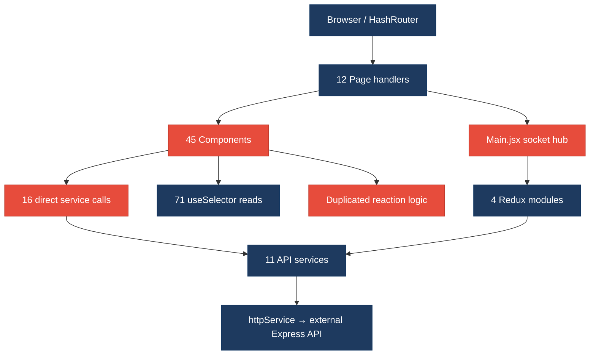
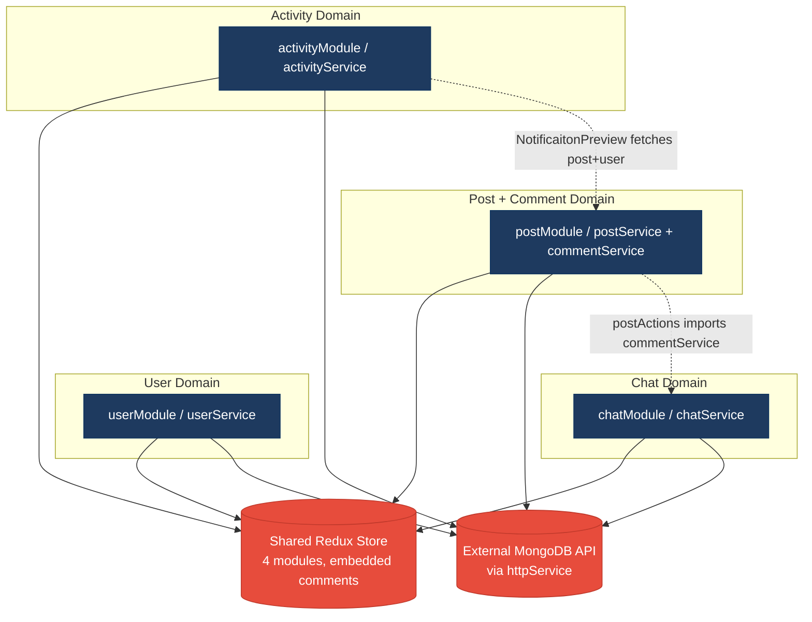
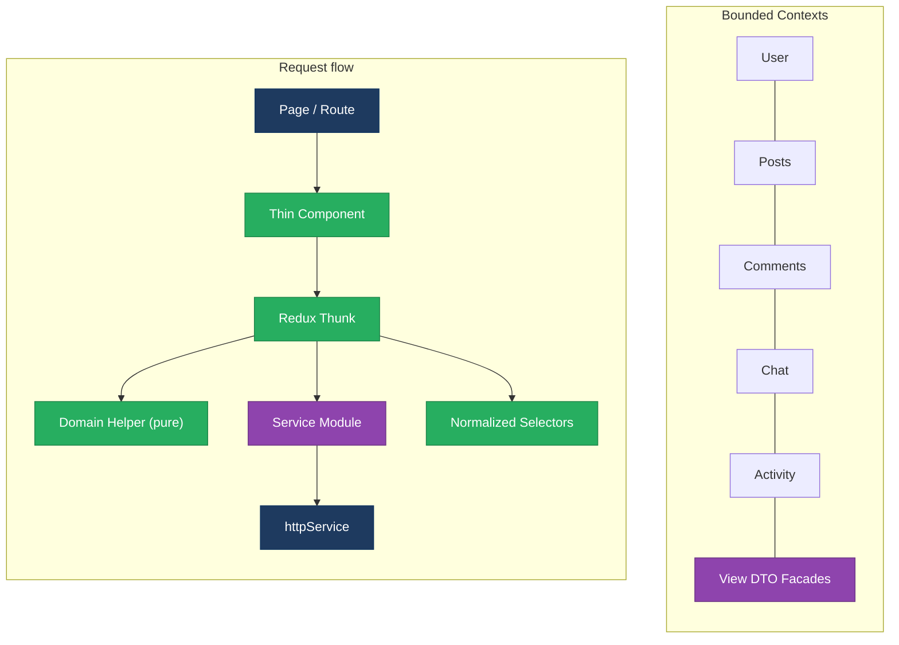
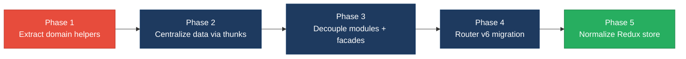

# 1. Architecture & Design Hotspots Analysis

**Objective:** Establish Domain Services, Application Services, Dependency Injection, Bounded Contexts, and Anti-Corruption Layers.

**Date:** Friday, July 17, 2026 | **Scope:** `target/social-media-react` — React 18 SPA (Redux, React Router v5, Axios, Socket.io client); external Express/MongoDB API (not in repo)

## Executive Summary

> **Executive Summary**
>
> This TARGET_WORKSPACE is a **frontend-only** social-network SPA (`social-media-react`) with **90 source files** (12 pages, 45 components, 11 services, 4 Redux modules). **No backend/server layer exists in the repository** — all persistence goes through an external REST API at `localhost:3030/api/` (production: `/api/`). Architectural health is **mixed**: HTTP access is partially centralized via `httpService` and domain service modules, but **presentation components bypass Redux** in 16 files, **business rules are duplicated** across post/comment/reply components, and **four feature domains** (user, post/comment, chat, activity) are tightly coupled through shared Redux state, socket orchestration in `Main.jsx`, and direct cross-service calls. The dominant risks are **legacy React Router v5 patterns (20 files)**, **cross-domain coupling (8 access points)**, and **inconsistent data-flow conventions** that will amplify change cost as features grow.

<div class="metric-grid">
<div class="metric-card"><div class="metric-number">12</div><div class="metric-label">Controllers / Handlers</div></div>
<div class="metric-card"><div class="metric-number">4</div><div class="metric-label">Models / Entities</div></div>
<div class="metric-card"><div class="metric-number">11</div><div class="metric-label">Service Classes Found</div></div>
<div class="metric-card"><div class="metric-number">0</div><div class="metric-label">Repository Classes Found</div></div>
</div>

<div class="overall-rating overall-rating--high-risk"><div class="overall-rating-label">Overall Codebase Rating — Architecture &amp; Design</div><div class="overall-rating-value">High Risk</div><div class="overall-rating-note">Driven by High-Risk cross-domain coupling (H8), legacy React Router v5 patterns (F5), and duplicated domain logic in view components (H10).</div></div>

## 1.1 Benchmark Ratings Summary

| # | Hotspot | Primary KPI | <span class="rating rating-good">Good</span> | <span class="rating rating-moderate">Moderate</span> | <span class="rating rating-high-risk">High Risk</span> | Measured | Rating |
|---|---|---|---|---|---|---|---|
| H1 | Fat Controllers | Avg LOC per controller | <150 | 150–300 | >300 | N/A (no backend) | <span class="rating rating-good">Good</span> |
| H2 | Missing Service Layer | Controllers accessing repos/models | <10 | 10–20 | >20 | 0 backend handlers | <span class="rating rating-good">Good</span> |
| H3 | Missing Repository Pattern | Direct DB access points | <10 | 10–20 | >20 | 0 (external API) | <span class="rating rating-good">Good</span> |
| H4 | Circular Dependencies | Dependency cycles | 0 | 1–3 | >3 | 0 cycles (88 files, 137 edges) | <span class="rating rating-good">Good</span> |
| H5 | Shared Utility Abuse | Utility files w/ business logic | 0 | 1–5 | >5 | 0 (`utilService` is generic) | <span class="rating rating-good">Good</span> |
| H6 | Direct SQL in Controllers | ORM compliance % | >90% | 60–90% | <60% | N/A (no backend) | <span class="rating rating-good">Good</span> |
| H7 | God Classes | Classes >1000 LOC | 0 | 1–3 | >3 | 0 (max: `postActions.js` 210 LOC) | <span class="rating rating-good">Good</span> |
| H8 | Domain Boundary Violations | Cross-domain access points | 0 | 1–5 | >5 | 8 | <span class="rating rating-high-risk">High Risk</span> |
| H9 | Shared Database Coupling | Tables shared across domains | <10% | 10–30% | >30% | N/A (schema external) | <span class="rating rating-good">Good</span> |
| F1 | Business Logic in Components | Avg LOC per component | <150 | 150–300 | >300 | 78.6 avg (58 `.jsx` files) | <span class="rating rating-good">Good</span> |
| F2 | Missing Frontend Service/Data Layer | Components w/ inline API calls | <10 | 10–20 | >20 | 16 | <span class="rating rating-moderate">Moderate</span> |
| F3 | God / Oversized Components | Components >400 LOC | 0 | 1–3 | >3 | 0 (max: `Message.jsx` 250 LOC) | <span class="rating rating-good">Good</span> |
| F4 | Prop Drilling / Global State Abuse | Max prop-drilling depth | ≤2 | 3–4 | >4 | 2 levels; 71 `useSelector` hooks | <span class="rating rating-moderate">Moderate</span> |
| F5 | Legacy / Inconsistent Component Patterns | Legacy-pattern components | 0 | 1–10 | >10 | 20 | <span class="rating rating-high-risk">High Risk</span> |
| H10 | Duplicated Domain Logic in Views (additional) | Components duplicating reaction/connection rules | 0 | 1–3 | >3 | 5 | <span class="rating rating-moderate">Moderate</span> |

**No additional hotspots beyond the standard set were observed** beyond H10 (duplicated domain logic in views).

## 1.2 Hotspot-by-Hotspot Evidence

### H1. Fat Controllers <span class="sev sev-low">Low</span>

**Benchmark:** Avg LOC per controller = N/A → falls in the **Good** band (no backend controllers in TARGET_WORKSPACE).

**What to check:** Business logic inside controllers/handlers.

**Evidence:** Not observed — TARGET_WORKSPACE contains no server-side controllers, route handlers, or API entry points; HTTP is consumed remotely via `httpService.js`.

### H2. Missing Service Layer <span class="sev sev-low">Low</span>

**Benchmark:** Controllers accessing repos/models directly = 0 → **Good**.

**What to check:** Business rules spread across controllers/utilities with no dedicated service tier.

**Evidence:** Not observed on the backend — no server code present. Frontend domain services exist under `src/services/` (11 files).

### H3. Missing Repository Pattern <span class="sev sev-low">Low</span>

**Benchmark:** Direct DB access points = 0 in-repo → **Good**.

**What to check:** Direct DB/ORM access scattered through the codebase.

**Evidence:** Not observed — persistence is delegated to an external API. Frontend `*Service.js` modules act as API gateways but are not formal repositories.

### H4. Circular Dependencies <span class="sev sev-low">Low</span>

**Benchmark:** Dependency cycles = 0 → **Good** (Good 0 · Moderate 1–3 · High Risk >3).

**What to check:** Modules/packages importing each other in cycles.

**Evidence:** Static import graph across 88 `src/` files (137 internal edges) shows no circular import chains. Services import `httpService`; Redux actions import services; components import actions/services — all acyclic.

### H5. Shared Utility Abuse <span class="sev sev-low">Low</span>

**Benchmark:** Utility files holding business logic = 0 → **Good**.

**What to check:** Large common/helpers/utils files holding business logic.

**Evidence:** Not observed — `utilService.js` (118 LOC) contains only generic helpers (`makeId`, `debounce`, storage wrappers, lorem generator); no domain rules.

```javascript
export const utilService = {
  makeId,
  debounce,
  getRandomInt,
  getRandomColor,
  getLoremIpsum,
  loadFromStorage,
  saveToStorage,
  loadFromSessionStorage,
  saveToSessionStorage,
  delay,
}
```

### H6. Direct SQL in Controllers <span class="sev sev-low">Low</span>

**Benchmark:** ORM compliance = N/A → **Good**.

**What to check:** Raw SQL embedded in controllers/handlers.

**Evidence:** Not observed — no backend or SQL in TARGET_WORKSPACE.

### H7. God Classes <span class="sev sev-low">Low</span>

**Benchmark:** Files >1000 LOC = 0 → **Good**.

**What to check:** Single files handling many unrelated responsibilities at excessive size.

**Evidence:** Not observed — largest files are `Message.jsx` (250 LOC), `CreatePostModal.jsx` (229 LOC), `postActions.js` (210 LOC); all under 300 LOC.

### H8. Domain Boundary Violations <span class="sev sev-high">High</span>

**Benchmark:** Cross-domain access points = 8 → **High Risk** (Good 0 · Moderate 1–5 · High Risk >5).

**What to check:** Code in one business area directly reading/writing another area's data or models.

**Evidence:**

**Example 1 — `postActions.js` imports comment persistence from the post workflow module:**

```javascript
import { postService } from '../../services/posts/postService'
import { commentService } from '../../services/comment/commentService'
import { socketService } from '../../services/socket.service'
```

Post actions orchestrate comment CRUD and socket events — post and comment domains share one action module instead of bounded application services.

**Example 2 — `NotificaitonPreview.jsx` fetches user and post entities directly from the activity UI:**

```javascript
import { userService } from '../../services/user/userService'
import { postService } from '../../services/posts/postService'
```

Activity presentation reaches into user and post services to build strings — no anti-corruption layer or activity-specific DTO assembler.

**Example 3 — `Main.jsx` central socket hub couples all four Redux modules:**

```javascript
  useEffect(() => {
    socketService.on('add-post', addPost)
    socketService.on('update-post', updatePost)
    socketService.on('remove-post', removePost)
    socketService.on('add-chat', addChat)
    socketService.on('update-chat', updateChat)
```

**Why it matters here:** Adding a new domain (e.g., groups or media albums) requires editing `Main.jsx`, shared reducers, and cross-importing services. A schema or API change in posts silently breaks notifications, comments, and activity feeds because they share raw entity shapes.

**Recommended approach:** (1) Split `postActions.js` — move comment operations to `commentActions.js` with explicit postId references. (2) Introduce an `activityFacade` that maps activity records to view DTOs without components calling `postService`/`userService`. (3) Replace the monolithic socket registry in `Main.jsx` with per-module socket subscribers.

<!-- affected-files
search: (userService|postService|chatService|commentService|activityService)
glob: src/**/*.{js,jsx}
issue: Cross-domain service import bypasses bounded context
action: Route data access through feature-specific facades or Redux thunks only
-->

### H9. Shared Database Coupling <span class="sev sev-low">Low</span>

**Benchmark:** Shared tables across domains = N/A → **Good**.

**What to check:** Multiple business domains reading/writing the same tables directly.

**Evidence:** Not observed — database schema and ORM models live in the external Express API (referenced at `localhost:3030` / production `/api/`), which is outside TARGET_WORKSPACE.

### F1. Business Logic in Components <span class="sev sev-medium">Medium</span>

**Benchmark:** Avg LOC per component = 78.6 → **Good** by size; business logic presence noted separately in H10.

**What to check:** Validation, calculations, data transformation, or workflow logic inside view components.

**Evidence:** Average component size is healthy (58 `.jsx` files, 4,557 total LOC). However, non-trivial domain rules exist inline — e.g., reaction toggling mutates entity state inside `PostPreview.jsx`:

```javascript
  const onLikePost = () => {
    const isAlreadyLike = post.reactions.some(
      (reaction) => reaction.userId === loggedInUser._id
    )
    if (isAlreadyLike) {
      post.reactions = post.reactions.filter(
        (reaction) => reaction.userId !== loggedInUser._id
      )
    } else if (!isAlreadyLike) {
      post.reactions.push({
        userId: loggedInUser._id,
        fullname: loggedInUser.fullname,
        reaction: 'like',
      })
    }
```

Direct prop mutation violates React/Redux immutability conventions and duplicates logic also found in `CommentPreview.jsx` and `ReplyPreview.jsx`.

<!-- affected-files
search: reactions\.(some|filter|push)
glob: src/**/*.{jsx,js}
issue: Reaction toggle business logic embedded in view
action: Extract shared toggleReaction(domainEntity, userId) domain helper
-->

### F2. Missing Frontend Service/Data Layer <span class="sev sev-medium">Medium</span>

**Benchmark:** Components with direct service/API calls = 16 → **Moderate** (Good <10 · Moderate 10–20 · High Risk >20).

**What to check:** HTTP/API calls hard-coded inline in components instead of a shared client/service/data layer.

**Evidence:**

**Example 1 — `PostPreview.jsx` calls `userService.getById` instead of dispatching a thunk:**

```javascript
  const loadUserPost = async (id) => {
    if (!post) return
    const userPost = await userService.getById(id)
    setUserPost(() => userPost)
  }
```

**Example 2 — `PrivateRoute.jsx` reads auth state from service layer, bypassing Redux:**

```javascript
import { userService } from '../services/user/userService'

function PrivateRoute({ component: Component, ...rest }) {
  const isAuthenticated = userService.getLoggedinUser()
```

A centralized `httpService` exists, and Redux thunks wrap most mutations — but **16 components/pages** import domain services directly, creating dual data paths (Redux vs local `useState` + service).

**Why it matters here:** Components like `NotificaitonPreview`, `CommentPreview`, and `PostPreview` each maintain their own fetched-user state. Cache invalidation in `userService.usersCash` will not propagate to Redux, causing stale UI across feed, notifications, and profile.

**Recommended approach:** (1) Add `loadUserById(userId)` thunks to `userActions.js`. (2) Select user entities from Redux store (normalized by id). (3) Restrict component imports to actions/selectors only; keep services internal to the store layer.

<!-- affected-files
search: from ['\"].*services/
glob: src/{cmps,pages}/**/*.{jsx,js}
issue: Component bypasses Redux/data layer with direct service import
action: Replace with dispatch(selectUser(id)) via centralized thunks
-->

### F3. God / Oversized Components <span class="sev sev-low">Low</span>

**Benchmark:** Components >400 LOC = 0 → **Good**.

**What to check:** Single components handling many unrelated responsibilities at excessive size.

**Evidence:** Not observed — largest component is `Message.jsx` at 250 LOC; `CreatePostModal.jsx` at 229 LOC.

### F4. Prop Drilling / Global State Abuse <span class="sev sev-medium">Medium</span>

**Benchmark:** Max prop depth = 2; 71 `useSelector` hooks across 4 global modules → **Moderate**.

**What to check:** Props threaded through many layers, or one giant global store everything reads & writes.

**Evidence:**

**Example 1 — Widespread global store reads (71 `useSelector` calls across ~30 files):**

```javascript
  const { loggedInUser } = useSelector((state) => state.userModule)
  const dispatch = useDispatch()
```

Nearly every page reads `loggedInUser` from global state independently rather than through a dedicated auth context.

**Example 2 — Mixed pattern: some props drilled, most global:**

```javascript
export const CreatePostModal = ({
  toggleShowCreatePost,
  onAddPost,
  isShowCreatePost,
  loggedInUser,
}) => {
```

`loggedInUser` is passed from `AddPost.jsx` (2 levels) while sibling components re-fetch via `useSelector` — inconsistent convention increases cognitive load.

**Why it matters here:** The four Redux modules (`userModule`, `postModule`, `chatModule`, `activityModule`) are not normalized; `postReducer` embeds comments inside posts, so any selector on posts pulls comment subgraphs. New contributors cannot predict whether to use props, `useSelector`, or direct service calls.

**Recommended approach:** Introduce a thin `AuthContext` for `loggedInUser`; normalize entities with `@reduxjs/toolkit` `createEntityAdapter`; document a single data-access rule.

<!-- affected-files
search: useSelector\(
glob: src/**/*.{jsx,js}
issue: Direct global store coupling without selector abstraction
action: Introduce memoized selectors (reselect) per feature module
-->

### F5. Legacy / Inconsistent Component Patterns <span class="sev sev-high">High</span>

**Benchmark:** Legacy-pattern files = 20 → **High Risk** (Good 0 · Moderate 1–10 · High Risk >10).

**What to check:** Mixed paradigms, deprecated APIs, inconsistent conventions.

**Evidence:**

**Example 1 — React Router v5 `HashRouter` + `component=` prop (deprecated in v6):**

```javascript
import { HashRouter as Router, Route, Switch } from 'react-router-dom'
// ...
          <Switch>
            <PrivateRoute path="/main" component={Main} />
            <Route path="/about" component={About} />
```

**Example 2 — `useHistory` used in 18+ files (removed in React Router v6, replaced by `useNavigate`):**

```javascript
import { useHistory } from 'react-router-dom'
export function NotificaitonPreview({ activity }) {
  const history = useHistory()
```

**Example 3 — Inconsistent naming: `socket.service.js`, `imgUpload.service.js` vs `userService.js`, `postService.js`; typo filenames `NotificaitonPreview.jsx`, `useFormRegister.js.js`.**

**Why it matters here:** Router v5 blocks adoption of data routers, lazy-route error boundaries, and `<Outlet>` layouts. Upgrading to v6 will touch all 20 legacy files simultaneously — a high-blast-radius migration.

**Recommended approach:** (1) Plan React Router v6 migration (`BrowserRouter`, `Routes`, `element`, `useNavigate`). (2) Standardize service file naming to `*.service.js`. (3) Fix typo filenames and add an ESLint rule for router imports.

<!-- affected-files
search: useHistory|component=\{|HashRouter|Redirect 
glob: src/**/*.{jsx,js}
issue: React Router v5 legacy API usage
action: Migrate to React Router v6 element-based routes and useNavigate
-->

### H10. Duplicated Domain Logic in Views (additional) <span class="sev sev-medium">Medium</span>

**Benchmark:** Components duplicating reaction/connection rules = 5 → **Moderate** (Good 0 · Moderate 1–3 · High Risk >3).

**What to check:** Same business rule copy-pasted across unrelated view components instead of shared domain helpers.

**Evidence:**

**Example 1 — Identical reaction-toggle pattern in `PostPreview.jsx`, `CommentPreview.jsx`, `ReplyPreview.jsx`.**

**Example 2 — Connection graph mutation duplicated in `Profile.jsx` and `ConnectionPreview.jsx`:**

```javascript
      connectionToAdd.connections.unshift({
        userId: loggedInUser._id,
        fullname: loggedInUser.fullname,
      })
      loggedInUserToUpdate.connections.push({
```

**Example 3 — `Message.jsx` appends chat messages by mutating chat object directly (`chatToUpdate.messages.push`) instead of a chat domain service.**

**Why it matters here:** Bug fixes to like/connection logic must be applied in five places; one missed file yields inconsistent UX between posts, comments, replies, and connections.

**Recommended approach:** Extract `reactionService.js` and `connectionService.js` pure functions; route all mutations through Redux thunks that enforce immutability.

<!-- affected-files
search: reactions\.(some|filter|push)|connections\.(unshift|push)
glob: src/**/*.{jsx,js}
issue: Duplicated domain mutation logic in views
action: Consolidate into shared domain helpers invoked by thunks only
-->

## 1.3 Diagrams

### Current-state architecture (as-is)



### Clean reference path (target pattern found in codebase)


### Domain boundary map (business domains vs. shared data)



### Target architecture (proposed)



### Improvement roadmap



## 1.4 Actions Required

| Hotspot | Action | Rating | Priority |
|---|---|---|---|
| H8 | Split cross-domain imports: move comment actions out of `postActions.js`, add `activityFacade` for notification DTO assembly, decentralize socket subscriptions from `Main.jsx` | <span class="rating rating-high-risk">High Risk</span> | <span class="sev sev-critical">Critical</span> |
| F5 | Migrate React Router v5 (`HashRouter`, `component=`, `useHistory`) to v6 across 20 files; standardize service naming | <span class="rating rating-high-risk">High Risk</span> | <span class="sev sev-high">High</span> |
| F2 | Eliminate 16 direct service imports from components — route all reads through Redux thunks and selectors | <span class="rating rating-moderate">Moderate</span> | <span class="sev sev-high">High</span> |
| F4 | Introduce `AuthContext` + memoized selectors; document single data-access convention | <span class="rating rating-moderate">Moderate</span> | <span class="sev sev-medium">Medium</span> |
| H10 | Extract shared `toggleReaction` and `addConnection` domain helpers; remove duplicated logic from 5 view files | <span class="rating rating-moderate">Moderate</span> | <span class="sev sev-medium">Medium</span> |

## 1.5 Expected Outcomes

- **Bounded feature modules** — user, post, comment, chat, and activity can evolve independently with explicit facades instead of cross-imports.
- **Single data-flow path** — components consume selectors/thunks only, eliminating dual Redux + direct-service paths and stale cache bugs in `userService.usersCash`.
- **Testable domain rules** — extracted reaction/connection helpers become unit-testable without mounting React components.
- **Lower migration cost** — React Router v6 upgrade unlocks modern layouts, error boundaries, and code-splitting patterns.
- **Immutable, predictable state** — normalized Redux store removes embedded comment graphs and direct prop mutation anti-patterns.
