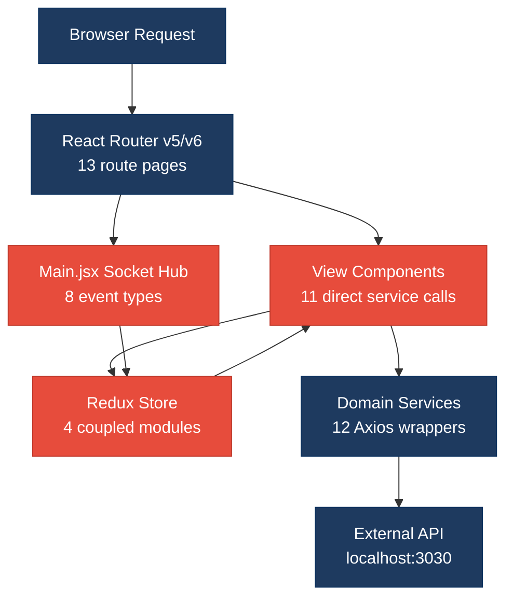
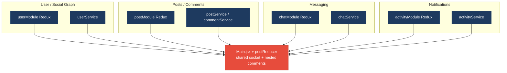
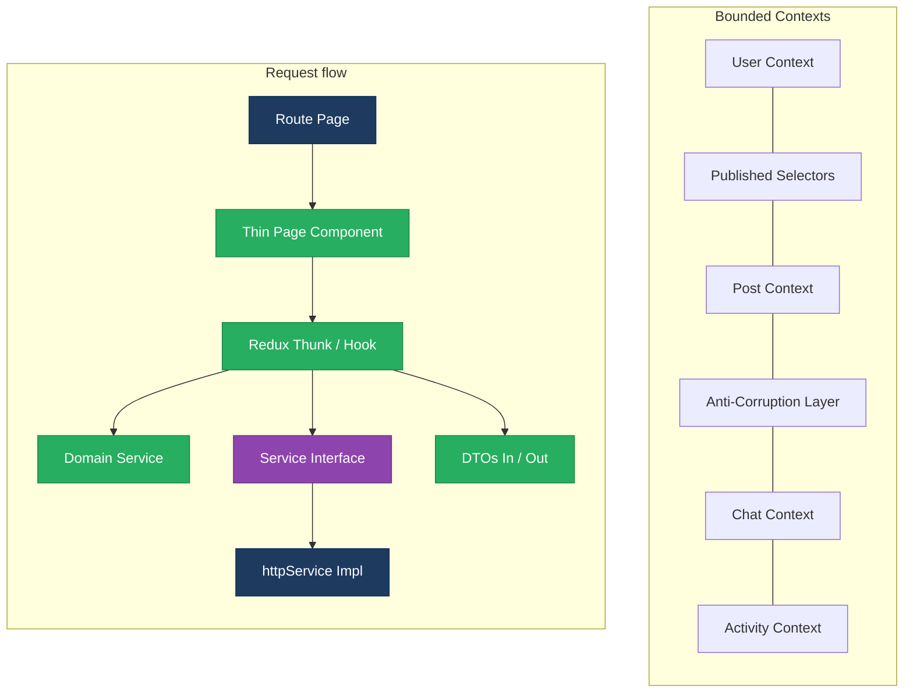
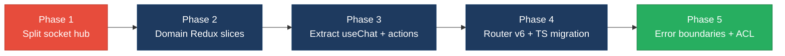

# 1. Architecture & Design Hotspots Analysis

**Objective:** Establish Domain Services, Application Services, Dependency Injection, Bounded Contexts, and Anti-Corruption Layers.

**Date:** July 16, 2026 | **Scope:** `target/` — React 18 SPAs (JavaScript + TypeScript), Redux, Axios; no server-side application layer present in workspace

## Executive Summary

> **Executive Summary**
>
> TARGET_WORKSPACE contains two React 18 single-page applications — `social-media-react` (58 JSX components, Redux store, 11 domain services) and `workbench-demo` (4 TSX pages, 1 auth service) — with **no backend/server source code** checked in locally. Frontend layering is partially sound (`httpService` → domain services → Redux thunks), but **domain boundaries collapse into a monolithic Redux store** and **11 view components bypass the action layer** with direct `userService` calls. The most severe risks are **cross-domain coupling (H8)** through shared Redux modules and socket orchestration in `Main.jsx`, and **inconsistent frontend paradigms (F5)** — JavaScript + React Router v5 in one app versus TypeScript + React Router v6 in the other. Average component size (77 LOC) and absence of god files (>400 LOC) are healthy, but prop-drilling depth reaches four levels in the messaging subtree.

<div class="metric-grid">
<div class="metric-card"><div class="metric-number">13</div><div class="metric-label">Controllers / Handlers</div></div>
<div class="metric-card"><div class="metric-number">4</div><div class="metric-label">Models / Entities</div></div>
<div class="metric-card"><div class="metric-number">12</div><div class="metric-label">Service Classes Found</div></div>
<div class="metric-card"><div class="metric-number">0</div><div class="metric-label">Repository Classes Found</div></div>
</div>

<div class="overall-rating overall-rating--high-risk"><div class="overall-rating-label">Overall Codebase Rating — Architecture &amp; Design</div><div class="overall-rating-value">High Risk</div><div class="overall-rating-note">Driven by High-Risk Domain Boundary Violations (H8) and Legacy / Inconsistent Component Patterns (F5).</div></div>

## 1.1 Benchmark Ratings Summary

| # | Hotspot | Primary KPI | <span class="rating rating-good">Good</span> | <span class="rating rating-moderate">Moderate</span> | <span class="rating rating-high-risk">High Risk</span> | Measured | Rating |
|---|---|---|---|---|---|---|---|
| H1 | Fat Controllers | Avg LOC per controller | <150 | 150–300 | >300 | 131 avg (13 route pages) | <span class="rating rating-good">Good</span> |
| H2 | Missing Service Layer | Controllers accessing repos/models | <10 | 10–20 | >20 | 11 view files call services directly | <span class="rating rating-moderate">Moderate</span> |
| H3 | Missing Repository Pattern | Direct DB access points | <10 | 10–20 | >20 | 0 (no persistence layer in repo) | <span class="rating rating-good">Good</span> |
| H4 | Circular Dependencies | Dependency cycles | 0 | 1–3 | >3 | 0 confirmed | <span class="rating rating-good">Good</span> |
| H5 | Shared Utility Abuse | Utility files w/ business logic | 0 | 1–5 | >5 | 1 (`utilService.js`) | <span class="rating rating-good">Good</span> |
| H6 | Direct SQL in Controllers | ORM compliance % | >90% | 60–90% | <60% | N/A — no SQL layer | <span class="rating rating-good">Good</span> |
| H7 | God Classes | Classes >1000 LOC | 0 | 1–3 | >3 | 0 (max file 250 LOC) | <span class="rating rating-good">Good</span> |
| H8 | Domain Boundary Violations | Cross-domain access points | 0 | 1–5 | >5 | 12 cross-module touchpoints | <span class="rating rating-high-risk">High Risk</span> |
| H9 | Shared Database Coupling | Tables shared across domains | <10% | 10–30% | >30% | N/A — no DB schema in repo | <span class="rating rating-good">Good</span> |
| F1 | Business Logic in Components | Avg LOC per component | <150 | 150–300 | >300 | 77 avg (61 components) | <span class="rating rating-good">Good</span> |
| F2 | Missing Frontend Service/Data Layer | Components w/ inline API calls | <10 | 10–20 | >20 | 1 (`LoginPage.tsx`) | <span class="rating rating-good">Good</span> |
| F3 | God / Oversized Components | Components >400 LOC | 0 | 1–3 | >3 | 0 | <span class="rating rating-good">Good</span> |
| F4 | Prop Drilling / Global State Abuse | Max prop-drilling depth | ≤2 | 3–4 | >4 | 4 levels (Message → MsgPreview) | <span class="rating rating-moderate">Moderate</span> |
| F5 | Legacy / Inconsistent Component Patterns | Legacy-pattern components | 0 | 1–10 | >10 | 58 JSX files (no TypeScript) + Router v5/v6 split | <span class="rating rating-high-risk">High Risk</span> |
| H10 | Socket–Redux God Orchestrator (additional) | Socket handlers wired in one module | 0 | 1–2 | >2 | 8 event types in `Main.jsx` | <span class="rating rating-high-risk">High Risk</span> |

**No additional hotspots beyond the standard set were observed** beyond H10 (Socket–Redux God Orchestrator), which is listed above.

**Layers covered:** Backend — **absent** (0 server-side source files; external API assumed at `localhost:3030`). Frontend — `social-media-react` (88 JS/JSX files) + `workbench-demo` (8 TS/TSX files) = **96 frontend source files** analyzed.

## 1.2 Hotspot-by-Hotspot Evidence

### H1. Fat Controllers <span class="sev sev-low">Low</span>

**Benchmark:** Avg LOC per route page = 131 → falls in the **Good** band (Good <150 · Moderate 150–300 · High Risk >300).

**What to check:** Business logic inside controllers/handlers; controllers should only translate HTTP ↔ application calls.

**Evidence:** Not observed as a backend anti-pattern — no server-side controllers exist in TARGET_WORKSPACE. Route pages (`social-media-react/src/pages/`) average 131 LOC; largest is `Message.jsx` at 250 LOC with an embedded `useChat` hook carrying chat workflow logic that would ideally live in a dedicated application service.

### H2. Missing Service Layer <span class="sev sev-medium">Medium</span>

**Benchmark:** View-layer files calling data services directly = 11 → falls in the **Moderate** band (Good <10 · Moderate 10–20 · High Risk >20).

**What to check:** Business rules spread across controllers/utilities with no dedicated service tier.

**Evidence:**

`target/social-media-react/src/pages/Profile.jsx:44-47` — page loads user data by calling `userService` directly instead of dispatching a user action:

```javascript
const loadUser = async () => {
  const user = await userService.getById(params.userId)
  setUser(() => user)
}
```

This bypasses the Redux action layer used elsewhere (`loadPosts` via dispatch), duplicating data-fetch orchestration in the view.

`target/social-media-react/src/cmps/comments/CommentPreview.jsx:32-36` — presentation component fetches its own user entity:

```javascript
const loadUserComment = async (userId) => {
  if (!userId) return
  const userComment = await userService.getById(userId)
  setUserComment(userComment)
}
```

Eleven files total (`Profile.jsx`, `Message.jsx`, `CommentPreview.jsx`, `PostPreview.jsx`, `ReplyPreview.jsx`, `LikePreview.jsx`, `ImgPreview.jsx`, `ThreadMsgPreview.jsx`, `NotificaitonPreview.jsx`, `MyConnectionPreview.jsx`, `PrivateRoute.jsx`) call domain services directly.

**Why it matters here:** Any change to user-fetch caching (see `usersCash` in `userService.js`) or error handling must be updated in 11 scattered view files instead of one action/thunk, and tests cannot mock a single action boundary.

**Recommended approach:** (1) Add `loadUserById(userId)` to `userActions.js` wrapping `userService.getById`. (2) Replace direct calls in all 11 view files with `dispatch(loadUserById(...))`. (3) Move connection graph mutations in `Profile.jsx:60-99` into a `connectionService` or `updateConnections` action.

<!-- affected-files
search: userService\.(getById|getUsers|login|update)
glob: target/social-media-react/src/**/*.{jsx,js}
issue: View layer bypasses Redux action/service tier
action: Route data access through userActions thunks instead of direct userService calls
-->

### H3. Missing Repository Pattern <span class="sev sev-low">Low</span>

**Benchmark:** Direct DB access points = 0 → falls in the **Good** band.

**What to check:** Direct DB/ORM access scattered through the codebase.

**Evidence:** Not observed — TARGET_WORKSPACE contains no persistence layer. All data access goes through Axios-based `httpService` to an external API (`localhost:3030/api/`). This is the expected SPA pattern; a formal Repository abstraction is absent but not violated locally.

### H4. Circular Dependencies <span class="sev sev-low">Low</span>

**Benchmark:** Dependency cycles = 0 → falls in the **Good** band.

**What to check:** Modules/packages importing each other.

**Evidence:** Not observed — service modules import `httpService` unidirectionally; Redux actions import services but services do not import actions. No import cycles detected among `src/services/*.js`.

### H5. Shared Utility Abuse <span class="sev sev-low">Low</span>

**Benchmark:** Utility files holding business logic = 1 → falls in the **Good** band (Good 0 · Moderate 1–5 · High Risk >5).

**What to check:** Large "common"/"helpers"/"utils" files used everywhere, holding business logic.

**Evidence:**

`target/social-media-react/src/services/utilService.js:13-21` — generic ID factory used for chat/message entity creation:

```javascript
function makeId(length = 5) {
  var txt = ''
  var possible =
    'ABCDEFGHIJKLMNOPQRSTUVWXYZabcdefghijklmnopqrstuvwxyz0123456789'
  for (var i = 0; i < length; i++) {
    txt += possible.charAt(Math.floor(Math.random() * possible.length))
  }
  return txt
}
```

Called from `Message.jsx:67,78` to mint chat and message `_id` values — entity identity generation belongs in a domain service, not a generic util.

**Why it matters here:** Client-side ID generation can collide with server-assigned IDs when `saveChat` deletes the temp `_id` (`Message.jsx:124`), creating fragile coordination logic.

**Recommended approach:** Move `makeId` into `chatService.js`; keep `utilService.js` limited to debounce/storage helpers.

<!-- affected-files
search: utilService\.makeId
glob: target/social-media-react/src/**/*.{jsx,js}
issue: Entity ID generation in generic utilService
action: Move makeId to chatService or server-side ID assignment
-->

### H6. Direct SQL in Controllers <span class="sev sev-low">Low</span>

**Benchmark:** ORM compliance = N/A → falls in the **Good** band.

**What to check:** Raw queries embedded directly in controllers/handlers.

**Evidence:** Not observed — no SQL or ORM usage anywhere in TARGET_WORKSPACE.

### H7. God Classes <span class="sev sev-low">Low</span>

**Benchmark:** Files >1000 LOC = 0 → falls in the **Good** band.

**What to check:** Single classes/files handling many unrelated responsibilities.

**Evidence:** Not observed — largest file is `Message.jsx` at 250 LOC; no file exceeds 400 LOC. Closest concern is `postActions.js` at 210 LOC handling posts, comments, and socket side-effects in one module.

### H8. Domain Boundary Violations <span class="sev sev-critical">Critical</span>

**Benchmark:** Cross-domain access points = 12 → falls in the **High Risk** band (Good 0 · Moderate 1–5 · High Risk >5).

**What to check:** Code in one business area directly reading/writing another area's data or models.

**Evidence:**

`target/social-media-react/src/pages/Main.jsx:110-139` — single module registers socket listeners spanning posts, chats, users, and comments:

```javascript
socketService.on('add-post', addPost)
socketService.on('update-post', updatePost)
socketService.on('remove-post', removePost)
socketService.on('add-chat', addChat)
socketService.on('update-chat', updateChat)
socketService.on('add-connected-users', addConnectedUsers)
socketService.on('add-connected-user', addConnectedUser)
socketService.on('update-comment', updateComment)
socketService.on('add-comment', addComment)
socketService.on('remove-comment', removeComment)
```

`target/social-media-react/src/pages/Profile.jsx:29-30,106-114` — profile page reads both `userModule` and `postModule` Redux slices and orchestrates cross-domain connection mutations:

```javascript
const { posts } = useSelector((state) => state.postModule)
const { loggedInUser } = useSelector((state) => state.userModule)
// ...
dispatch(setFilterByPosts(filterBy))
loadUser()
dispatch(loadPosts(filterBy))
```

`target/social-media-react/src/store/reducers/postReducer.js:75-118` — post reducer directly mutates nested comment arrays, merging comment domain into post domain state.

**Why it matters here:** Extracting "Messaging" or "Social Graph" into independent modules requires untangling socket wiring in `Main.jsx`, comment nesting in `postReducer`, and connection logic in `Profile.jsx` simultaneously — a single feature change ripples across four Redux modules.

**Recommended approach:** (1) Split Redux into domain-scoped stores or RTK slices with explicit selectors. (2) Extract socket subscription into per-domain hooks (`usePostSocket`, `useChatSocket`). (3) Move comment state out of `postReducer` into a dedicated `commentModule`.

<!-- affected-files
search: useSelector\(\(state\)\s*=>\s*state\.(postModule|userModule|chatModule|activityModule)
glob: target/social-media-react/src/**/*.{jsx,js}
issue: Cross-domain Redux module access without bounded context
action: Introduce domain-scoped state slices and facade selectors per bounded context
-->

### H9. Shared Database Coupling <span class="sev sev-low">Low</span>

**Benchmark:** Shared tables = N/A → falls in the **Good** band.

**What to check:** Tables shared across multiple domains.

**Evidence:** Not observed — no database schema or migration files exist in TARGET_WORKSPACE. Backend API schema is external and not analyzable from this workspace.

### F1. Business Logic in Components <span class="sev sev-medium">Medium</span>

**Benchmark:** Avg LOC per component = 77 → falls in the **Good** band (Good <150 · Moderate 150–300 · High Risk >300).

**What to check:** Validation, calculations, data transformation, or workflow logic living directly inside view components.

**Evidence:**

`target/social-media-react/src/pages/Message.jsx:22-143` — `useChat` custom hook embedded in the page file implements chat existence checks, message creation, activity dispatch, and temp-chat lifecycle:

```javascript
function useChat(loggedInUser, chats, params) {
  const createChat = (userId) => {
    return {
      _id: utilService.makeId(7),
      userId,
      userId2: loggedInUser?._id,
      messages: [],
      createdAt: new Date().getTime(),
    }
  }
  const onSendMsg = (txt) => {
    const newMsg = createNewMsg(txt)
    // pushes message, saves chat, creates activity
  }
}
```

`target/social-media-react/src/cmps/comments/CommentPreview.jsx:38-54` — like/reaction toggle logic lives in the view:

```javascript
const onLikeComment = () => {
  const commentToSave = { ...comment }
  const isAlreadyLike = commentToSave.reactions.some(
    (reaction) => reaction.userId === loggedInUser._id
  )
  if (isAlreadyLike) {
    commentToSave.reactions = commentToSave.reactions.filter(
      (reaction) => reaction.userId !== loggedInUser._id
    )
  } else {
    commentToSave.reactions.push({ userId: loggedInUser._id, fullname: loggedInUser.fullname, reaction: 'like' })
  }
  onSaveComment(commentToSave)
}
```

Average component LOC (77) is healthy, but the largest files concentrate workflow logic that exceeds presentation concerns.

**Why it matters here:** Chat and reaction rules duplicated across components cannot be unit-tested without mounting React trees; extracting to `useChat.js` / `reactionService.js` would reduce `Message.jsx` from 250 to ~80 LOC.

**Recommended approach:** Extract `useChat` to `src/hooks/useChat.js`; move reaction toggle to `commentService.toggleReaction(comment, user)`.

<!-- affected-files
glob: target/social-media-react/src/**/*.{jsx,tsx}
issue: Workflow and validation logic embedded in view components
action: Extract hooks and domain helpers; keep components presentation-focused
-->

### F2. Missing Frontend Service/Data Layer <span class="sev sev-low">Low</span>

**Benchmark:** Components with inline API calls = 1 → falls in the **Good** band (Good <10 · Moderate 10–20 · High Risk >20).

**What to check:** `fetch`/`axios`/HTTP calls hard-coded inline in components instead of a shared client/service layer.

**Evidence:**

`target/workbench-demo/src/pages/LoginPage.tsx:39` — component imports `axios` directly for error-type checking (login itself correctly uses `authService`):

```typescript
if (axios.isAxiosError(err) && err.response?.status === 401) {
  setError("Invalid email or password.");
}
```

`social-media-react` consistently routes HTTP through `httpService` → domain services → Redux actions. Clean reference path:

`target/social-media-react/src/services/httpService.js:10-23` — centralized Axios wrapper with environment-aware base URL.

`target/workbench-demo/src/services/authService.ts:4-9` — typed login function isolating API URL construction.

**Why it matters here:** The single inline `axios` import in `LoginPage.tsx` is minor; the larger `social-media-react` app demonstrates the target pattern already.

**Recommended approach:** Replace `axios.isAxiosError` with a typed error guard in `authService.ts` (e.g. `isAuthError(err)`).

<!-- affected-files
search: import axios|axios\.(get|post|isAxiosError)
glob: target/**/src/**/*.{jsx,tsx}
issue: Inline axios usage outside service layer
action: Move HTTP error classification into authService helper
-->

### F3. God / Oversized Components <span class="sev sev-low">Low</span>

**Benchmark:** Components >400 LOC = 0 → falls in the **Good** band.

**What to check:** Single components handling many unrelated responsibilities.

**Evidence:** Not observed — no component exceeds 400 LOC. Largest components: `Message.jsx` (250), `CreatePostModal.jsx` (209), `Signup.jsx` (196). All remain below the 400 LOC threshold.

### F4. Prop Drilling / Global State Abuse <span class="sev sev-medium">Medium</span>

**Benchmark:** Max prop-drilling depth = 4 → falls in the **Moderate** band (Good ≤2 · Moderate 3–4 · High Risk >4).

**What to check:** Props threaded through many intermediate layers, or one giant global store everything reads & writes.

**Evidence:**

`target/social-media-react/src/pages/Message.jsx:230-242` — page passes 11 props/callbacks to `Messaging`:

```javascript
<Messaging
  chats={chats}
  messagesToShow={messagesToShow}
  setMessagesToShow={setMessagesToShow}
  chooseenChatId={chooseenChatId}
  setChooseenChatId={setChooseenChatId}
  chatWith={chatWith}
  setChatWith={setChatWith}
  getTheNotLoggedUserChat={getTheNotLoggedUserChat}
  setTheNotLoggedUserChat={setTheNotLoggedUserChat}
  theNotLoggedUserChat={theNotLoggedUserChat}
  onSendMsg={onSendMsg}
/>
```

`target/social-media-react/src/cmps/message/ListMsg.jsx:72-84` — `ListMsg` forwards 9 of those props to each `MsgPreview` (depth: Message → Messaging → ListMsg → MsgPreview = **4 levels**).

Additionally, the monolithic Redux store (`userModule`, `postModule`, `chatModule`, `activityModule`) is read from 18+ components — a global-state pattern that couples unrelated features.

**Why it matters here:** Adding a new messaging concern (e.g. read receipts) requires threading props through four component layers or adding another field to the global store consumed everywhere.

**Recommended approach:** (1) Create `ChatContext` wrapping messaging subtree state. (2) Consider RTK slice selectors to limit global store surface. (3) Collapse setter props into a single `chatActions` context object.

<!-- affected-files
search: setMessagesToShow|setChooseenChatId|setChatWith
glob: target/social-media-react/src/**/*.{jsx,tsx}
issue: Deep prop drilling through messaging component tree
action: Introduce ChatContext or compose messaging state hook at subtree root
-->

### F5. Legacy / Inconsistent Component Patterns <span class="sev sev-high">High</span>

**Benchmark:** Legacy-pattern components = 58 JSX (untyped) + Router v5/v6 split → falls in the **High Risk** band (Good 0 · Moderate 1–10 · High Risk >10).

**What to check:** Mixed paradigms, missing error boundaries, deprecated lifecycle/APIs, no shared component conventions.

**Evidence:**

`social-media-react/package.json` — React Router **v5** (`"react-router-dom": "^5.3.0"`), uses deprecated `useHistory` and `<Switch>`:

`target/social-media-react/src/pages/Home.jsx:4,11` — v5 routing API:

```javascript
import { useHistory } from 'react-router-dom'
const history = useHistory()
```

`workbench-demo/package.json` — React Router **v6** (`"react-router-dom": "6.23.1"`), uses `useNavigate`:

`target/workbench-demo/src/pages/LoginPage.tsx:2,9` — v6 routing API:

```typescript
import { useNavigate } from "react-router-dom";
const navigate = useNavigate();
```

Zero error boundaries across both apps (0 matches for `ErrorBoundary` / `componentDidCatch`). Entire `social-media-react` codebase is JavaScript (58 `.jsx` + 30 `.js` files) while `workbench-demo` uses TypeScript — no shared typing convention.

**Why it matters here:** Contributors must context-switch between Router v5/v6 APIs and JS vs TS patterns; runtime errors in `social-media-react` lack TypeScript guardrails and error-boundary recovery.

**Recommended approach:** (1) Upgrade `social-media-react` to React Router v6 (`Routes`, `useNavigate`). (2) Add root `ErrorBoundary` in both apps. (3) Incrementally migrate hot-path JSX files to TSX starting with pages and services.

<!-- affected-files
search: useHistory|Switch|component=
glob: target/social-media-react/src/**/*.{jsx,js}
issue: React Router v5 deprecated APIs and untyped JavaScript components
action: Migrate to React Router v6 and TypeScript incrementally
-->

### H10. Socket–Redux God Orchestrator (additional) <span class="sev sev-critical">Critical</span>

**Benchmark:** Socket event handlers wired in one module = 8 event types in `Main.jsx` → falls in the **High Risk** band (Good 0 · Moderate 1–2 · High Risk >2).

**What to check:** Central module coupling real-time transport to multiple domain stores — an architecture anti-pattern not covered by H1–H9.

**Evidence:**

`target/social-media-react/src/pages/Main.jsx:66-108` — eight `useCallback` handlers each dispatching to a different Redux module, and `Main.jsx:110-139` registers all socket listeners in one `useEffect`:

```javascript
const addPost = useCallback((post) => {
  dispatch(addPostForSocket(post))
}, [dispatch])

const updateChat = useCallback((chat) => {
  dispatch(updateChatForSocket(chat))
  dispatch(loadActivities())
}, [dispatch])
```

Cross-domain side-effect: chat updates trigger activity reloads, coupling chat and notification domains.

**Why it matters here:** `Main.jsx` becomes the single point of failure for all real-time features; any socket event rename requires editing this 163-line orchestrator and risks breaking unrelated domains.

**Recommended approach:** Create `src/realtime/socketRegistry.js` with per-domain subscription functions; move handlers next to their respective action modules.

<!-- affected-files
search: socketService\.(on|off)
glob: target/social-media-react/src/**/*.{jsx,js}
issue: Monolithic socket event wiring across all domains
action: Split socket subscriptions into per-domain realtime modules
-->

## 1.3 Diagrams

### Current-state architecture (as-is)



### Clean reference path (target pattern found in codebase)


### Domain boundary map (business domains found vs. shared data)



### Target architecture (proposed)



### Improvement roadmap



## 1.4 Actions Required

| Hotspot | Action | Rating | Priority |
|---|---|---|---|
| H8 | Split monolithic Redux store into domain-scoped RTK slices; move comment state out of `postReducer`; add facade selectors per bounded context | <span class="rating rating-high-risk">High Risk</span> | <span class="sev sev-critical">Critical</span> |
| H10 | Decompose `Main.jsx` socket wiring into per-domain realtime modules (`usePostSocket`, `useChatSocket`); stop cross-domain `loadActivities()` side-effects in chat handlers | <span class="rating rating-high-risk">High Risk</span> | <span class="sev sev-critical">Critical</span> |
| F5 | Upgrade `social-media-react` to React Router v6; add root `ErrorBoundary`; begin incremental JSX→TSX migration on pages and services | <span class="rating rating-high-risk">High Risk</span> | <span class="sev sev-high">High</span> |
| H2 | Replace 11 direct `userService` calls in view components with `userActions` thunks; move connection graph logic from `Profile.jsx` into a dedicated action/service | <span class="rating rating-moderate">Moderate</span> | <span class="sev sev-medium">Medium</span> |
| F4 | Introduce `ChatContext` for messaging subtree to eliminate 4-level prop drilling (Message → Messaging → ListMsg → MsgPreview) | <span class="rating rating-moderate">Moderate</span> | <span class="sev sev-medium">Medium</span> |

## 1.5 Expected Outcomes

- Domain-scoped Redux slices and socket modules allow Messaging, Posts, and Social Graph features to evolve independently without editing `Main.jsx` or `postReducer.js`.
- Routing all data access through Redux actions eliminates 11 scattered `userService` call sites, enabling consistent caching, error handling, and mock-based unit tests.
- React Router v6 + TypeScript migration across `social-media-react` aligns both apps on a single routing and typing convention, reducing contributor context-switching.
- `ChatContext` and extracted hooks (`useChat`, `reactionService`) shrink oversized page components and make chat/reaction business rules testable outside React.
- Per-domain realtime subscriptions create a clear extension point for future WebSocket events without amplifying change across unrelated features.
