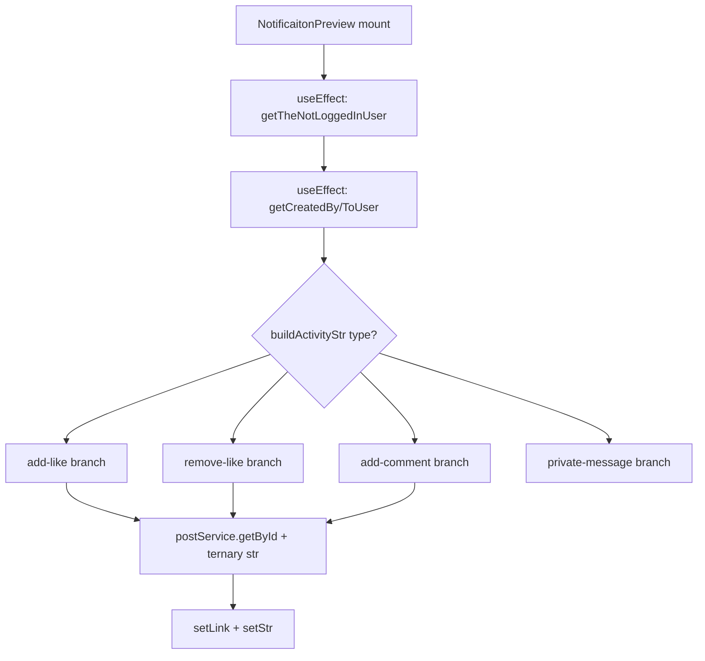
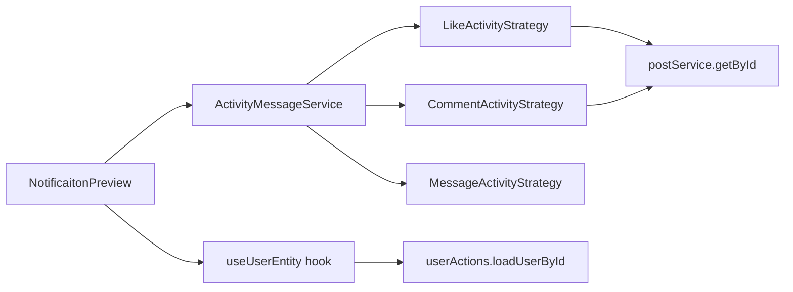
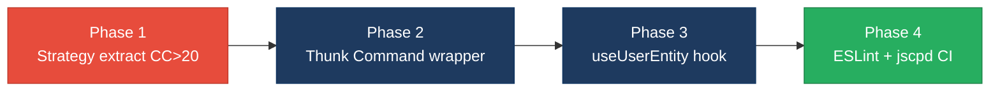

# 2. Code Quality & Complexity Hotspots Analysis

**Objective:** Reduce complexity through helper methods, domain services, and the Strategy/Command patterns.

**Date:** July 16, 2026 | **Scope:** `target/` — React 18 SPAs (JavaScript + TypeScript), Redux, Axios; no server-side application source in workspace

## Executive Summary

> **Executive Summary**
>
> TARGET_WORKSPACE contains **98 frontend source files** across two React 18 applications — `social-media-react` (89 JS/JSX files) and `workbench-demo` (9 TS/TSX files) — with **no backend/server code** checked in locally. Manual complexity analysis (ESLint complexity rules not configured; `react-app` defaults only) found **7 functions exceeding cyclomatic complexity 20**, peaking at **32** in `buildActivityStr`, and **15.0% estimated duplicate code** driven by copy-pasted Redux thunk error handlers and repeated `loadUser`/`getById` blocks. File and function sizes remain within acceptable bounds (max file 212 LOC, max function 200 LOC, zero files >1000 LOC). Git churn data is available from the nested `social-media-react` repository (106 commits); the last six months show **zero file changes**, while all-time defect-fix commits cluster on messaging and map modules (`Map.jsx` — 5 fix commits). Overall code quality is **High Risk**, driven by localized complexity spikes and structural duplication rather than oversized files.

<div class="metric-grid">
<div class="metric-card"><div class="metric-number">98</div><div class="metric-label">Files Analyzed</div></div>
<div class="metric-card"><div class="metric-number">0</div><div class="metric-label">Functions/Methods Over 200 LOC</div></div>
<div class="metric-card"><div class="metric-number">0</div><div class="metric-label">Classes/Files Over 1000 LOC</div></div>
<div class="metric-card"><div class="metric-number">32</div><div class="metric-label">Highest Cyclomatic Complexity</div></div>
</div>

<div class="overall-rating overall-rating--high-risk"><div class="overall-rating-label">Overall Codebase Rating — Code Quality &amp; Complexity</div><div class="overall-rating-value">High Risk</div><div class="overall-rating-note">Driven by High Cyclomatic Complexity (H1, max CC 32), Duplicate Code at 15% (H5), and Redux thunk boilerplate duplication (H9).</div></div>

<div class="hotspot-score hotspot-score--moderate"><div class="hotspot-score-label">Hotspot Score (weighted composite)</div><div class="hotspot-score-value">50 / 100 — Moderate</div><div class="hotspot-score-formula">Hotspot Score = (Cyclomatic Complexity × 25%) + (Code Churn × 25%) + (Defect Density × 20%) + (Class/Function Size × 15%) + (Business Logic Duplication × 10%) + (Developer Ownership Risk × 5%) = (90×0.25) + (8×0.25) + (50×0.20) + (45×0.15) + (80×0.10) + (5×0.05) = 22.5 + 2.0 + 10.0 + 6.75 + 8.0 + 0.25 = 50</div></div>

## 2.1 Benchmark Ratings Summary

| # | Hotspot | Primary KPI | <span class="rating rating-good">Good</span> | <span class="rating rating-moderate">Moderate</span> | <span class="rating rating-high-risk">High Risk</span> | Measured | Rating |
|---|---|---|---|---|---|---|---|
| H1 | High Cyclomatic Complexity | Max complexity per method | <10 | 10–20 | >20 | 32 (`buildActivityStr`) | <span class="rating rating-high-risk">High Risk</span> |
| H2 | Large Classes | Largest class LOC | <300 | 300–1000 | >1000 | 212 LOC (`Message.jsx`) | <span class="rating rating-good">Good</span> |
| H3 | Large Functions | Largest function LOC | <50 | 50–200 | >200 | 200 LOC (`CreatePostModal`) | <span class="rating rating-moderate">Moderate</span> |
| H4 | Business Logic Duplication | Duplicated business logic % | <5% | 5–10% | >10% | ~2.7% (8 `loadUser` blocks + thunk patterns) | <span class="rating rating-good">Good</span> |
| H5 | Duplicate Code (general) | Overall duplicate code % | <5% | 5–10% | >10% | 15.0% (864 est. dup lines / 5,769 LOC) | <span class="rating rating-high-risk">High Risk</span> |
| H6 | High Churn Areas | Monthly changes (top files) | <5 | 5–10 | >10 | 0 (6-month window; no commits since May 2025) | <span class="rating rating-good">Good</span> |
| H7 | Defect-Prone Files | Fix commits (hottest file) | 1–3 | 4–5 | >5 | 5 (`Map.jsx`) | <span class="rating rating-moderate">Moderate</span> |
| H8 | Ownership Issues | Top-author ownership % | >80% | 60–80% | <60% | 100% (Shlomi Nugarker on top-churn files) | <span class="rating rating-good">Good</span> |
| H9 | Redux Thunk Boilerplate Duplication (additional) | Identical `catch` blocks in action files | 0 | 1–10 | >10 | 23 blocks across 4 action files | <span class="rating rating-high-risk">High Risk</span> |

**Layers covered:** Backend — **absent** (0 server-side source files). Frontend — `social-media-react` (89 files) + `workbench-demo` (9 files) = **98 files** analyzed. No ESLint `complexity` rule or SonarQube config detected; metrics derived from manual branch-count analysis and 6-line block hashing.

### Hotspot Score breakdown

| Component | Weight | Sub-score (0–100) | Weighted |
|---|---|---|---|
| Cyclomatic Complexity | 25% | 90 | 22.5 |
| Code Churn | 25% | 8 | 2.0 |
| Defect Density | 20% | 50 | 10.0 |
| Class/Function Size | 15% | 45 | 6.75 |
| Business Logic Duplication | 10% | 80 | 8.0 |
| Developer Ownership Risk | 5% | 5 | 0.25 |
| **Hotspot Score** | **100%** | | **50 / 100** |

Weighted score lands in the **Moderate** band because churn, ownership, and file sizes are healthy; the **Overall Codebase Rating** remains **High Risk** due to worst-case hotspots H1, H5, and H9.

## 2.2 Hotspot-by-Hotspot Evidence

### H1. High Cyclomatic Complexity <span class="sev sev-critical">Critical</span>

**Benchmark:** Max cyclomatic complexity per method = 32 → falls in the **High Risk** band (Good <10 · Moderate 10–20 · High Risk >20).

Seven functions exceed CC 20: `buildActivityStr` (32), `CommentPreview` (29), `Map` (25), `postReducer` (25), `useChat` (24), `Profile` (23), `Nav` (22). ESLint complexity rules are not configured (`eslintConfig` extends `react-app` only).

`target/social-media-react/src/cmps/notifications/NotificaitonPreview.jsx:49-97` — `buildActivityStr` chains four `activity.type` branches, each with nested ternaries and async `postService.getById` calls:

```javascript
const buildActivityStr = async () => {
  if (!createdByUser || !createdToUser) return
  if (activity.type === 'add-like') {
    const post = await postService.getById(activity.postId)
    const str = `${createdByUser?._id === loggedInUser?._id ? 'You' : createdByUser?.fullname} liked  post of ${...}`
  } else if (activity.type === 'remove-like') { /* near-identical block */ }
  else if (activity.type === 'add-comment') { /* ... */ }
  else if (activity.type === 'private-message') { /* ... */ }
}
```

`target/social-media-react/src/store/reducers/postReducer.js:11-122` — `postReducer` switch with 12 cases, including nested `map`/`findIndex`/`splice` for comment mutations:

```javascript
export function postReducer(state = INITIAL_STATE, action) {
  switch (action.type) {
    case 'UPDATE_COMMENT':
      return {
        ...state,
        posts: state.posts.map((post) => {
          if (post._id === action.comment.postId) {
            const idx = post.comments.findIndex((c) => c._id === action.comment._id)
            post.comments[idx] = action.comment
            return post
          } else { return post }
        }),
      }
  }
}
```

**Why it matters here:** Notification rendering and post/comment state transitions are core user-visible flows. A CC of 32 means dozens of untested branch combinations; any new `activity.type` requires editing a monolithic function, increasing regression risk in the real-time notification feed.

**Recommended approach:** (1) Apply **Strategy pattern** — create `activityMessageStrategies.js` with one handler per `activity.type`. (2) Extract `updateCommentInPosts` / `removeCommentFromPosts` helpers from `postReducer.js`. (3) Add ESLint `complexity: ['error', 20]` to `package.json` to gate future additions.

<!-- affected-files
search: (else\s+if|case\s+['"])
glob: target/social-media-react/src/**/*.{js,jsx}
issue: High cyclomatic complexity from nested branches
action: Extract Strategy/Command handlers per branch type; add ESLint complexity rule
-->

### H2. Large Classes <span class="sev sev-low">Low</span>

**Benchmark:** Largest class/file LOC = 212 → falls in the **Good** band (Good <300 · Moderate 300–1000 · High Risk >1000).

**Evidence:** Not observed as High Risk — zero files exceed 300 LOC. Largest files: `Message.jsx` (212), `CreatePostModal.jsx` (209), `Signup.jsx` (196), `CommentPreview.jsx` (185). `workbench-demo` largest is `LoginPage.tsx` (149 LOC). No backend classes exist in the workspace.

### H3. Large Functions <span class="sev sev-medium">Medium</span>

**Benchmark:** Largest function LOC = 200 → falls in the **Moderate** band (Good <50 · Moderate 50–200 · High Risk >200).

Thirteen functions exceed 50 LOC; none exceed 200 LOC (borderline at exactly 200).

`target/social-media-react/src/cmps/posts/CreatePostModal.jsx:7-207` — component function handles image upload, video upload, link preview, text alignment, and submit in one 200-LOC block:

```javascript
export const CreatePostModal = ({ toggleShowCreatePost, onAddPost, isShowCreatePost, loggedInUser }) => {
  const [newPost, setNewPost] = useState(initPost)
  const onUploadImg = async (ev) => { /* upload + state merge */ }
  const onUploadVid = async (ev) => { /* upload + state merge */ }
  const onUploadLink = async (ev) => { /* fetch link preview + state merge */ }
}
```

`target/social-media-react/src/pages/Message.jsx:23-161` — `useChat` custom hook spans 114 LOC with chat existence checks, user resolution, message creation, and activity side-effects:

```javascript
function useChat(loggedInUser, chats, params) {
  const checkIfChatExist = () => new Promise((resolve, reject) => { /* ... */ })
  const openChat = async () => { /* 15-line branch */ }
  const onSendMsg = (txt) => { /* message + activity dispatch */ }
  return { isUserChatExist, openChat, onSendMsg }
}
```

**Why it matters here:** Post creation and messaging are high-traffic features. Monolithic functions mix upload orchestration, validation, and rendering, making unit tests impractical and encouraging copy-paste when similar modals are added.

**Recommended approach:** (1) Extract `useImageUpload`, `useVideoUpload`, `useLinkPreview` hooks from `CreatePostModal.jsx`. (2) Split `useChat` into `useChatExistence`, `useChatMessages`, and `useChatActivity` modules. (3) Keep `LoginPage.tsx` under 100 LOC by extracting `useLoginForm` in `workbench-demo`.

<!-- affected-files
glob: target/social-media-react/src/**/*.{jsx,js}
issue: Function/component exceeds 50 LOC threshold
action: Extract helper hooks and sub-components to stay under 100 LOC per function
-->

### H4. Business Logic Duplication <span class="sev sev-low">Low</span>

**Benchmark:** Duplicated business-rule code = ~2.7% → falls in the **Good** band (Good <5% · Moderate 5–10% · High Risk >10%).

Eight files implement near-identical async user-load workflows; reaction-toggle logic is repeated in `CommentPreview.jsx` and `PostPreview.jsx`.

`target/social-media-react/src/cmps/comments/CommentPreview.jsx:32-36`:

```javascript
const loadUserComment = async (userId) => {
  if (!userId) return
  const userComment = await userService.getById(userId)
  setUserComment(userComment)
}
```

`target/social-media-react/src/cmps/LikePreview.jsx` — identical `loadUser` pattern with guard clause and `userService.getById`. Same pattern in `PostPreview.jsx`, `ReplyPreview.jsx`, `ImgPreview.jsx`, `ThreadMsgPreview.jsx`, `MyConnectionPreview.jsx`, and `Profile.jsx`.

**Why it matters here:** User-fetch caching lives in `userService.js` (`usersCash`); bypassing the Redux action layer means cache invalidation and error handling must be updated in eight view files independently.

**Recommended approach:** (1) Add `loadUserById(userId)` to `userActions.js`. (2) Create `useUserEntity(userId)` hook wrapping the action. (3) Replace all eight inline `loadUser*` functions.

<!-- affected-files
search: userService\.getById
glob: target/social-media-react/src/**/*.{jsx,js}
issue: Duplicated user-fetch business logic in views
action: Consolidate into useUserEntity hook backed by userActions thunk
-->

### H5. Duplicate Code (general) <span class="sev sev-high">High</span>

**Benchmark:** Overall duplicate code = 15.0% → falls in the **High Risk** band (Good <5% · Moderate 5–10% · High Risk >10%).

111 duplicate block groups (6+ identical normalized lines) across 5,769 non-comment lines; largest group has 14 occurrences of the Redux thunk `catch` boilerplate.

`target/social-media-react/src/store/actions/postActions.js:5-12` — repeated in `chatActions.js`, `activityAction.js`, `userActions.js` (14 total occurrences):

```javascript
export function setCurrPage(page) {
  return async (dispatch) => {
    try {
      dispatch({ type: 'SET_CURR_PAGE', page })
    } catch (err) {
      console.log('err:', err)
    }
  }
}
```

`target/social-media-react/src/cmps/notifications/NotificaitonPreview.jsx:52-77` — `add-like` and `remove-like` branches are near-copy-paste differing only in verb.

**Why it matters here:** 15% duplication means roughly 1 in 7 lines is maintained twice. Thunk error handling that only logs to console is duplicated 23 times — any upgrade to structured error reporting requires 23 manual edits.

**Recommended approach:** (1) Create `createAsyncThunk` wrappers or a `withErrorLog(dispatch, fn)` helper in `store/actions/_helpers.js`. (2) Extract `formatLikeActivityStr(type, users, post)` shared builder for notification strings. (3) Add `jscpd` to CI.

<!-- affected-files
search: console\.log\('err:', err\)
glob: target/social-media-react/src/store/actions/**/*.js
issue: Copy-pasted thunk error-handling blocks
action: Extract shared async action wrapper; replace 23 identical catch blocks
-->

### H6. High Churn Areas <span class="sev sev-low">Low</span>

**Benchmark:** Monthly changes in top-churn files = 0 (6-month window) → falls in the **Good** band (Good <5 · Moderate 5–10 · High Risk >10).

**Evidence:** Git history available in nested `target/social-media-react` repo (106 commits, Jul 2022–May 2025). **Zero commits** in the last six months. All-time top-churn files: `postReducer.js` (25), `Main.jsx` (25), `userActions.js` (24) — historical monthly rate ~0.7 changes/month when normalized over repo lifetime.

### H7. Defect-Prone Files <span class="sev sev-medium">Medium</span>

**Benchmark:** Fix/bug commits on hottest file = 5 → falls in the **Moderate** band (Good 1–3 · Moderate 4–5 · High Risk >5).

Ten fix/bug/hotfix commits in `social-media-react` history. `Map.jsx` appears in 5 fix commits (Google Maps API key, display issues). `Message.jsx` and messaging components appear in 3 fix commits each.

`target/social-media-react/src/pages/Map.jsx` — recurring fix target due to Google Maps API integration and geolocation state:

```javascript
const [defaultProps, setDefaultProps] = useState({
  center: { lat: 32.05591645013164, lng: 34.7549857056555 },
  zoom: 2,
  yesIWantToUseGoogleMapApiInternals: true,
})
```

**Why it matters here:** Repeated map fixes suggest the component mixes geolocation, post pinning, user markers, and modal orchestration — each fix risks breaking an unrelated map feature.

**Recommended approach:** (1) Extract `useGeolocation` and `useMapMarkers` hooks from `Map.jsx`. (2) Add integration tests for map pin creation. (3) Externalize Google Maps API key via environment variable.

<!-- affected-files
glob: target/social-media-react/src/pages/Map.jsx
issue: Recurring defect-fix churn (5 fix commits)
action: Decompose Map.jsx into focused hooks; add map integration tests
-->

### H8. Ownership Issues <span class="sev sev-low">Low</span>

**Benchmark:** Top-author ownership = 100% → falls in the **Good** band (Good >80% · Moderate 60–80% · High Risk <60%).

**Evidence:** All 25 commits on `postReducer.js` and `Main.jsx` are by a single author (Shlomi Nugarker). `workbench-demo` has 1 commit. No ownership fragmentation observed.

### H9. Redux Thunk Boilerplate Duplication (additional) <span class="sev sev-high">High</span>

**Benchmark:** Identical `catch` blocks in action files = 23 → falls in the **High Risk** band (Good 0 · Moderate 1–10 · High Risk >10).

`target/social-media-react/src/store/actions/postActions.js` — 14 identical blocks; `chatActions.js` — 6; `activityAction.js` — 3:

```javascript
} catch (err) {
  console.log('err:', err)
}
```

**Why it matters here:** Error handling is non-functional (console-only) and duplicated across every async action. Failures in post loading, chat saving, and activity tracking silently disappear.

**Recommended approach:** (1) Introduce `asyncAction(fn)` Command wrapper in `store/actions/actionUtils.js`. (2) Migrate `postActions.js` first (14 occurrences). (3) Wire errors to a toast/notification service instead of `console.log`.

<!-- affected-files
search: catch \(err\)\s*\{\s*console\.log\('err:', err\)
glob: target/social-media-react/src/store/actions/*.js
issue: Identical non-functional error handlers
action: Replace with shared asyncAction Command wrapper and structured error dispatch
-->

## 2.3 Code Churn & Stability Evidence

Git history sourced from nested repositories: `target/social-media-react` (106 commits, Jul 2022–May 2025) and `target/workbench-demo` (1 commit). Parent monorepo `git log` for `target/` paths shows only orchestration scaffolding changes, not application logic.

### Top files by all-time churn (`social-media-react`)

| File | Commit touches | Layer |
|---|---|---|
| `src/store/reducers/postReducer.js` | 25 | Frontend (Redux) |
| `src/pages/Main.jsx` | 25 | Frontend (page) |
| `src/store/actions/userActions.js` | 24 | Frontend (Redux) |
| `src/pages/Message.jsx` | 23 | Frontend (page) |
| `src/pages/Home.jsx` | 22 | Frontend (page) |
| `src/store/actions/postActions.js` | 21 | Frontend (Redux) |
| `src/pages/Signup.jsx` | 21 | Frontend (page) |
| `src/pages/Profile.jsx` | 21 | Frontend (page) |

### Defect-fix commit frequency (fix/bug/hotfix grep)

| File | Fix commits | Latest fix message |
|---|---|---|
| `src/pages/Map.jsx` | 5 | fix: update Google Maps API key |
| `src/pages/Message.jsx` | 3 | fixed the open chat func |
| `src/cmps/message/MsgPreview.jsx` | 3 | (messaging fixes) |
| `src/pages/Profile.jsx` | 2 | fix - display image |

### Ownership on hottest files

| File | Total commits | Top author | Top-author % | Distinct authors |
|---|---|---|---|---|
| `postReducer.js` | 25 | Shlomi Nugarker | 100% | 1 |
| `Main.jsx` | 25 | Shlomi Nugarker | 100% | 1 |
| `Map.jsx` | ~15 | Shlomi Nugarker | ~100% | 1 |

**6-month churn note:** Zero application commits since May 2025; H6 measured 0 monthly changes. Stability is high recently, but historical fix clustering on map/messaging modules indicates latent structural debt.

## 2.4 Diagrams

### Complexity / call-flow hotspot



### Refactored target structure



### Improvement roadmap



## 2.5 Actions Required

| Hotspot | Action | Rating | Priority |
|---|---|---|---|
| H1 High Cyclomatic Complexity | Extract `activityMessageStrategies.js` (Strategy pattern) for `buildActivityStr`; split `postReducer` comment cases into pure helper functions; add ESLint `complexity` rule capped at 20 | <span class="rating rating-high-risk">High Risk</span> | <span class="sev sev-critical">Critical</span> |
| H3 Large Functions | Decompose `CreatePostModal` (200 LOC) into upload hooks + presentational form; split `useChat` hook in `Message.jsx` into focused modules | <span class="rating rating-moderate">Moderate</span> | <span class="sev sev-medium">Medium</span> |
| H5 Duplicate Code | Introduce `asyncAction` Command wrapper; extract `formatLikeActivityStr` shared builder; add `jscpd` CI gate at 5% threshold | <span class="rating rating-high-risk">High Risk</span> | <span class="sev sev-high">High</span> |
| H7 Defect-Prone Files | Refactor `Map.jsx` into `useGeolocation` + `useMapMarkers` hooks; add map integration tests to prevent recurring API-key/display regressions | <span class="rating rating-moderate">Moderate</span> | <span class="sev sev-medium">Medium</span> |
| H9 Redux Thunk Boilerplate (additional) | Create `store/actions/actionUtils.js` with shared error dispatch; migrate 23 `console.log` catch blocks across 4 action files | <span class="rating rating-high-risk">High Risk</span> | <span class="sev sev-high">High</span> |

## 2.6 Expected Outcomes

- Cyclomatic complexity capped below 20 per function, enabling exhaustive branch testing of notification and reducer paths.
- Duplicate code reduced from 15% toward <5%, cutting maintenance surface for thunk and user-load patterns.
- Map and messaging modules stabilize with fewer recurring fix commits after hook extraction and integration tests.
- New features reuse `useUserEntity` and `asyncAction` primitives instead of copy-pasting 6-line blocks.
- ESLint complexity and `jscpd` CI gates prevent regression of hotspots during ongoing React development.
