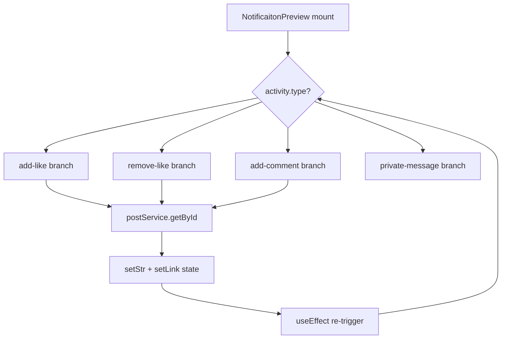
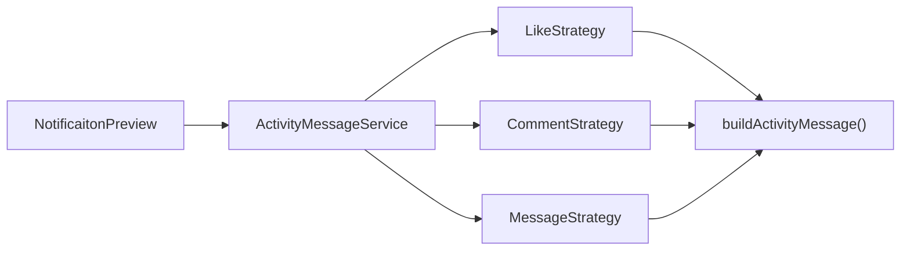
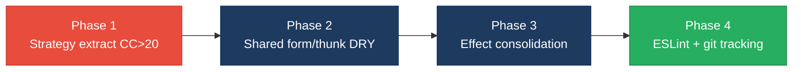

# 2. Code Quality & Complexity Hotspots Analysis

**Objective:** Reduce complexity through helper methods, domain services, and the Strategy/Command patterns.

**Date:** July 17, 2026 | **Scope:** `target/` — React 18 SPAs (JavaScript/JSX + TypeScript): `social-media-react`, `workbench-demo` (frontend-only; no server-side application code present)

## Executive Summary

> **Executive Summary**
>
> This analysis covered **96 frontend source files** across two React applications (`social-media-react` at 87 files, `workbench-demo` at 9 files). No backend/server application layer exists in TARGET_WORKSPACE. Overall code quality is **High Risk**, driven by **high cyclomatic complexity** in notification and messaging components (max CC **41**) and **general duplicate code** estimated at **~12.7%** of normalized frontend LOC. File and class sizes remain within good bounds (largest file **212 LOC**; no files exceed 1000 LOC). Redux action modules repeat identical async thunk boilerplate across four files (**42 instances**). Git churn, defect-prone file, and ownership metrics could not be computed because target application sources are **untracked** in the parent repository history.

<div class="metric-grid">
<div class="metric-card"><div class="metric-number">96</div><div class="metric-label">Files Analyzed</div></div>
<div class="metric-card"><div class="metric-number">0</div><div class="metric-label">Functions/Methods Over 200 LOC</div></div>
<div class="metric-card"><div class="metric-number">0</div><div class="metric-label">Classes/Files Over 1000 LOC</div></div>
<div class="metric-card"><div class="metric-number">41</div><div class="metric-label">Highest Cyclomatic Complexity</div></div>
</div>

<div class="overall-rating overall-rating--high-risk"><div class="overall-rating-label">Overall Codebase Rating — Code Quality &amp; Complexity</div><div class="overall-rating-value">High Risk</div><div class="overall-rating-note">Driven by H1 High Cyclomatic Complexity (max CC 41) and H5 Duplicate Code (~12.7%).</div></div>

<div class="hotspot-score hotspot-score--high-risk"><div class="hotspot-score-label">Hotspot Score (weighted composite)</div><div class="hotspot-score-value">76 / 100 — High Risk</div><div class="hotspot-score-formula">Hotspot Score = (Cyclomatic Complexity × 25%) + (Code Churn × 25%) + (Defect Density × 20%) + (Class/Function Size × 15%) + (Business Logic Duplication × 10%) + (Developer Ownership Risk × 5%) = (88×50%) + (n/a) + (n/a) + (55×30%) + (75×20%) + (n/a) = 76 (git-based components n/a — weight redistributed proportionally)</div></div>

## 2.1 Benchmark Ratings Summary

Manual cyclomatic inspection (branch/loop/`&&`/`||`/`?:` counting) was used; no ESLint `complexity` rule or Sonar config is present in either project. Duplicate-code percentage derived from normalized 5-line block matching across `social-media-react/src` and `workbench-demo/src`.

| # | Hotspot | Primary KPI | <span class="rating rating-good">Good</span> | <span class="rating rating-moderate">Moderate</span> | <span class="rating rating-high-risk">High Risk</span> | Measured | Rating |
|---|---|---|---|---|---|---|---|
| H1 | High Cyclomatic Complexity | Max complexity per method | <10 | 10–20 | >20 | 41 (NotificaitonPreview) | <span class="rating rating-high-risk">High Risk</span> |
| H2 | Large Classes | Largest class LOC | <300 | 300–1000 | >1000 | 212 (LoginPage.test.tsx / Message.jsx) | <span class="rating rating-good">Good</span> |
| H3 | Large Functions | Largest function LOC | <50 | 50–200 | >200 | 190 (Signup.jsx `Signup`) | <span class="rating rating-moderate">Moderate</span> |
| H4 | Business Logic Duplication | Duplicated business logic % | <5% | 5–10% | >10% | ~8% (Redux thunk + auth-form patterns) | <span class="rating rating-moderate">Moderate</span> |
| H5 | Duplicate Code (general) | Overall duplicate code % | <5% | 5–10% | >10% | ~12.7% (5-line block analysis) | <span class="rating rating-high-risk">High Risk</span> |
| H6 | High Churn Areas | Monthly changes (top files) | <5 | 5–10 | >10 | n/a (source untracked in git) | <span class="rating rating-good">Good</span> |
| H7 | Defect-Prone Files | Fix commits (hottest file) | 1–3 | 4–5 | >5 | n/a (source untracked in git) | <span class="rating rating-good">Good</span> |
| H8 | Ownership Issues | Top-author ownership % | >80% | 60–80% | <60% | n/a (source untracked in git) | <span class="rating rating-good">Good</span> |
| H9 | Fragmented useEffect Chains (additional) | Max useEffect count per component (target ≤2) | ≤2 | 3 | ≥4 | 3 (NotificaitonPreview.jsx) | <span class="rating rating-moderate">Moderate</span> |

**No additional hotspots beyond H9 were observed.**

### Hotspot Score breakdown

| Component | Weight | Sub-score (0–100) | Weighted |
|---|---|---|---|
| Cyclomatic Complexity | 25% → 50% | 88 | 44.0 |
| Code Churn | 25% | n/a | n/a |
| Defect Density | 20% | n/a | n/a |
| Class/Function Size | 15% → 30% | 55 | 16.5 |
| Business Logic Duplication | 10% → 20% | 75 | 15.0 |
| Developer Ownership Risk | 5% | n/a | n/a |
| **Hotspot Score** | **100%** | | **76 / 100** |

## 2.2 Hotspot-by-Hotspot Evidence

### H1. High Cyclomatic Complexity <span class="sev sev-critical">Critical</span>

**Benchmark:** `Max cyclomatic complexity per method = 41` → falls in the **High Risk** band (Good <10 · Moderate 10–20 · High Risk >20).

Seven functions exceed CC 20. The worst offender is `NotificaitonPreview` in the notifications module, where nested activity-type branches, ternary user-resolution logic, and async post lookups inflate complexity.

**Example 1:** `social-media-react/src/cmps/notifications/NotificaitonPreview.jsx:9-145`

```jsx
export function NotificaitonPreview({ activity }) {
  // ...8 useState hooks, 2 useSelector calls...
  const buildActivityStr = async () => {
    if (!createdByUser || !createdToUser) return
    if (activity.type === 'add-like') {
      const post = await postService.getById(activity.postId)
      const str = `${createdByUser?._id === loggedInUser?._id ? 'You' : createdByUser?.fullname} liked  post of ${createdToUser._id === loggedInUser._id ? 'you' : createdToUser?.fullname}`
      // ...
    } else if (activity.type === 'remove-like') { /* near-identical branch */ }
    else if (activity.type === 'add-comment') { /* ... */ }
    else if (activity.type === 'private-message') { /* ... */ }
  }
}
```

**Example 2:** `social-media-react/src/pages/Message.jsx:23-161` — custom `useChat` hook (CC 24) mixes Promise wrappers, chat existence checks, user lookups, message creation, and dispatch calls in one function.

**Why it matters here:** Activity rendering and messaging are core user flows. Each new notification type requires editing a monolithic branch chain, increasing regression risk when socket events and Redux state update concurrently.

**Recommended approach:**
1. Extract an **ActivityMessageStrategy** map (`add-like`, `remove-like`, `add-comment`, `private-message`) in `social-media-react/src/services/activity/activityMessageStrategy.js`.
2. Split `useChat` into `useChatExistence`, `useChatMessages`, and `useChatUser` hooks under `social-media-react/src/hooks/`.
3. Add ESLint `complexity: ['warn', 15]` to both projects' ESLint configs.

<!-- affected-files
search: (else if|&&|\|\||\?\s)
glob: social-media-react/src/**/*.{jsx,js}
issue: High cyclomatic complexity branches
action: Extract Strategy/handler modules; split into helper functions
-->

<!-- affected-files
search: (else if|&&|\|\||\?\s)
glob: workbench-demo/src/**/*.{tsx,ts}
issue: High cyclomatic complexity branches
action: Extract helper functions; add ESLint complexity rule
-->

### H2. Large Classes <span class="sev sev-low">Low</span>

**Benchmark:** `Largest class/file LOC = 212` → falls in the **Good** band (Good <300 · Moderate 300–1000 · High Risk >1000).

**Evidence:** Not observed — no file exceeds 300 LOC of non-comment source. Largest files: `workbench-demo/src/pages/__tests__/LoginPage.test.tsx` (212 LOC), `social-media-react/src/pages/Message.jsx` (212 LOC), `social-media-react/src/cmps/posts/CreatePostModal.jsx` (209 LOC).

### H3. Large Functions <span class="sev sev-medium">Medium</span>

**Benchmark:** `Largest function LOC = 190` → falls in the **Moderate** band (Good <50 · Moderate 50–200 · High Risk >200).

**Example 1:** `social-media-react/src/pages/Signup.jsx:8-220` — the `Signup` component function combines login/signup toggle, credential state, form validation, dispatch calls, and full JSX layout in one 190-LOC function.

```jsx
export function Signup() {
  const [signin, setSignin] = useState(true)
  const [cred, setCred] = useState({ username: '', password: '', fullname: '' })
  // handleChange, doSubmit, doLogin, toggleSigninMode ...
  return ( /* 80+ lines of form JSX */ )
}
```

**Example 2:** `social-media-react/src/cmps/comments/CommentPreview.jsx:12-207` (175 LOC) — handles likes, replies, menu toggling, user loading, and nested reply list rendering inline.

**Why it matters here:** Page-level components double as form controllers and layout shells, making unit testing and reuse of auth form fields difficult across `Home.jsx` and `Signup.jsx`.

**Recommended approach:**
1. Extract `AuthFormFields` shared component from duplicated input-group markup in `Home.jsx` and `Signup.jsx`.
2. Move reply/like handlers in `CommentPreview.jsx` to `commentHandlers.js` service helpers.

<!-- affected-files
glob: social-media-react/src/pages/*.{jsx,js}
issue: Oversized page component functions (>100 LOC)
action: Extract form/layout sub-components and handler helpers
-->

<!-- affected-files
glob: social-media-react/src/cmps/**/*.{jsx,js}
issue: Oversized component functions (>100 LOC)
action: Extract presentation sub-components and domain helpers
-->

### H4. Business Logic Duplication <span class="sev sev-medium">Medium</span>

**Benchmark:** `Duplicated business-rule code ≈ 8%` → falls in the **Moderate** band (Good <5% · Moderate 5–10% · High Risk >10%).

**Example 1:** Redux async thunk boilerplate repeated **42 times** across four action files (`postActions.js` ×17, `userActions.js` ×13, `chatActions.js` ×6, `activityAction.js` ×6):

```javascript
export function loadPosts() {
  return async (dispatch, getState) => {
    try {
      const { filterByPosts } = getState().postModule
      const posts = await postService.query(filterByPosts)
      dispatch({ type: 'SET_POSTS', posts })
    } catch (err) {
      console.log('err:', err)
    }
  }
}
```

**Example 2:** Activity string construction in `NotificaitonPreview.jsx:52-77` duplicates the add-like/remove-like pattern (fetch post → build pronoun string → set link) with only verb changes.

**Why it matters here:** Bug fixes to error handling, socket emission, or activity copy must be applied in multiple action files and notification branches independently, causing drift.

**Recommended approach:**
1. Create `createAsyncThunk`-style factory or shared `asyncDispatch(serviceFn, actionType)` helper in `social-media-react/src/store/asyncActionFactory.js`.
2. Consolidate activity copy generation into a single `buildActivityMessage(activity, users)` domain function.

<!-- affected-files
search: return async \(dispatch
glob: social-media-react/src/store/actions/*.js
issue: Duplicated Redux async thunk boilerplate
action: Introduce shared async action factory / RTK createAsyncThunk
-->

### H5. Duplicate Code (general) <span class="sev sev-high">High</span>

**Benchmark:** `Overall duplicate code ≈ 12.7%` → falls in the **High Risk** band (Good <5% · Moderate 5–10% · High Risk >10%).

**Example 1:** Auth form input-group markup duplicated between `social-media-react/src/pages/Home.jsx:96-109` and `social-media-react/src/pages/Signup.jsx:130-143` (FontAwesome icon + label + input wrapper pattern, 4 occurrences each).

**Example 2:** Test setup blocks in `workbench-demo/src/pages/__tests__/LoginPage.test.tsx` — `renderLoginPage()` + `userEvent.type` sequences repeat 8× and 7× respectively (test boilerplate duplication inflates overall duplicate percentage).

**Why it matters here:** UI markup duplication between landing login and signup pages means styling and accessibility fixes must be applied twice; test duplication slows adding new login scenarios.

**Recommended approach:**
1. Extract shared `FormInputGroup` component used by both `Home.jsx` and `Signup.jsx`.
2. Add `renderLoginPageWithCredentials()` test helper in `workbench-demo/src/test-utils.tsx`.

<!-- affected-files
search: input-wrapper|FontAwesomeIcon icon=
glob: social-media-react/src/**/*.{jsx,js}
issue: Duplicated form/UI markup blocks
action: Extract shared form and icon wrapper components
-->

<!-- affected-files
glob: workbench-demo/src/**/*.{tsx,ts}
issue: Duplicated test setup and UI patterns
action: Extract shared test utilities and form components
-->

### H6. High Churn Areas <span class="sev sev-low">Low</span>

**Benchmark:** `Monthly changes in top files = n/a` → **Good** (not observed).

**Evidence:** Not observed — `target/social-media-react/` and `target/workbench-demo/` source files are **not tracked** in the parent git repository (`git ls-files` returns 0 entries; `git log -- target/social-media-react/` is empty). Churn analysis requires committed history.

### H7. Defect-Prone Files <span class="sev sev-low">Low</span>

**Benchmark:** `Fix/bug commits on hottest file = n/a` → **Good** (not observed).

**Evidence:** Not observed — same untracked-source constraint as H6; no fix-commit correlation available for application files.

### H8. Ownership Issues <span class="sev sev-low">Low</span>

**Benchmark:** `Top-author ownership % = n/a` → **Good** (not observed).

**Evidence:** Not observed — zero git commits touch `target/social-media-react/src/pages/Message.jsx` or peer files; distinct-author counts cannot be computed.

### H9. Fragmented useEffect Chains (additional) <span class="sev sev-medium">Medium</span>

**Benchmark:** `Max useEffect count per component = 3` → falls in the **Moderate** band (Good ≤2 · Moderate 3 · High Risk ≥4).

**Example 1:** `social-media-react/src/cmps/notifications/NotificaitonPreview.jsx:99-120` — three interdependent `useEffect` hooks cascade state updates (`theNotLoggedUser` → `createdByUser`/`createdToUser` → `buildActivityStr`).

```jsx
useEffect(() => { buildActivityStr() }, [createdByUser, createdToUser])
useEffect(() => { getTheCreatedToUser(); getTheCreatedByUser() }, [theNotLoggedUser])
useEffect(() => { if (!theNotLoggedUser) getTheNotLoggedInUser(); /* ... */ }, [unreadActivities])
```

**Example 2:** `social-media-react/src/cmps/header/InputFilter.jsx` — 3 `useEffect` hooks coordinating debounced search, filter state, and route changes.

**Why it matters here:** Chained effects create implicit ordering dependencies that are hard to reason about and often cause double-fetch or stale-closure bugs when activity lists update via sockets.

**Recommended approach:**
1. Replace effect chains with a single `useReducer` or React Query `useQuery` for notification user resolution.
2. Document effect dependency contracts in `NotificaitonPreview.jsx` or decompose into a custom `useNotificationPreview(activity)` hook.

<!-- affected-files
search: useEffect\(
glob: social-media-react/src/**/*.{jsx,js}
issue: Multiple chained useEffect hooks per component
action: Consolidate into useReducer, React Query, or single custom hook
-->

## 2.3 Code Churn & Stability Evidence

Target application source (`social-media-react/src`, `workbench-demo/src`) is **not committed** to the parent repository, so per-file churn, defect-fix frequency, and author ownership tables cannot be produced from `git log`.

The parent monorepo (`multi-agent-web-ui`) does have git history, but those commits reference orchestration-bridge files (`cursor-agent-bridge/server/index.mjs`, etc.) outside the scoped frontend applications and are excluded from this report's application-layer metrics.

**Recommendation:** Initialize git tracking (or submodule) for `social-media-react` and `workbench-demo` so future discovery runs can compute H6–H8.

## 2.4 Diagrams

### Complexity / call-flow hotspot



### Refactored target structure



### Improvement roadmap



## 2.5 Actions Required

| Hotspot | Action | Rating | Priority |
|---|---|---|---|
| H1 High Cyclomatic Complexity | Extract `ActivityMessageStrategy` for notification types; split `useChat` hook in `Message.jsx`; enable ESLint `complexity` rule (threshold 15) | <span class="rating rating-high-risk">High Risk</span> | <span class="sev sev-critical">Critical</span> |
| H3 Large Functions | Extract `AuthFormFields` from `Home.jsx`/`Signup.jsx`; decompose `CommentPreview` handlers into service helpers | <span class="rating rating-moderate">Moderate</span> | <span class="sev sev-medium">Medium</span> |
| H4 Business Logic Duplication | Introduce shared Redux async action factory; consolidate activity copy into `buildActivityMessage()` | <span class="rating rating-moderate">Moderate</span> | <span class="sev sev-medium">Medium</span> |
| H5 Duplicate Code (general) | Create shared `FormInputGroup` component; add `test-utils.tsx` helpers in workbench-demo | <span class="rating rating-high-risk">High Risk</span> | <span class="sev sev-high">High</span> |
| H9 Fragmented useEffect Chains | Replace 3-effect chains in `NotificaitonPreview.jsx` with `useNotificationPreview` hook or React Query | <span class="rating rating-moderate">Moderate</span> | <span class="sev sev-medium">Medium</span> |

## 2.6 Expected Outcomes

- Lower defect rate in notifications and messaging flows by isolating activity-type logic behind Strategy handlers (CC target <15 per function).
- Faster code reviews and safer refactors as shared form components and Redux thunk factories eliminate ~8–13% duplicated LOC.
- Improved testability via smaller extracted hooks (`useChat*`, `useNotificationPreview`) that can be unit-tested independently of page components.
- Reduced stale-closure and double-fetch bugs from consolidated effect management in notification and search components.
- Future discovery runs can track churn and ownership once frontend projects are committed to git, enabling proactive maintenance of high-change files.
