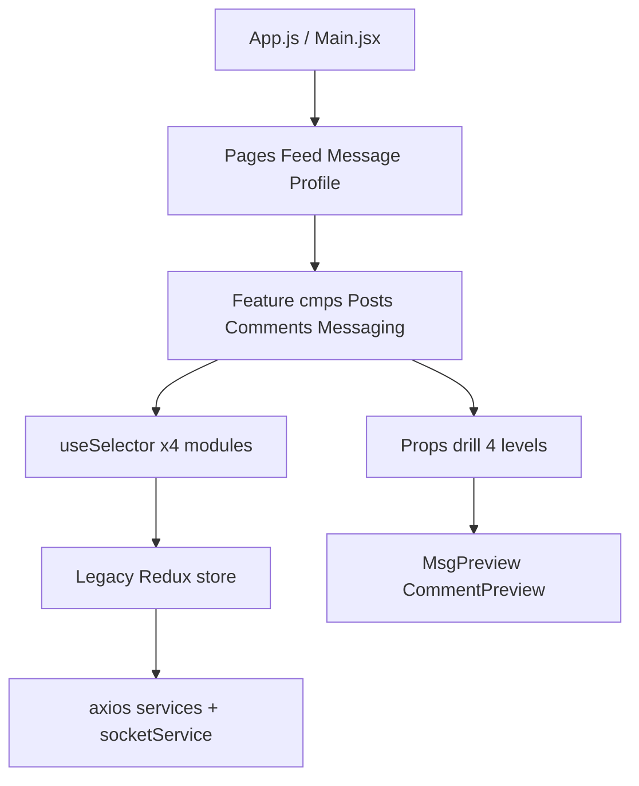
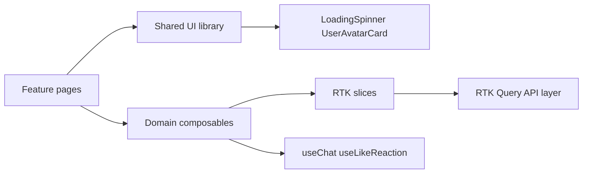
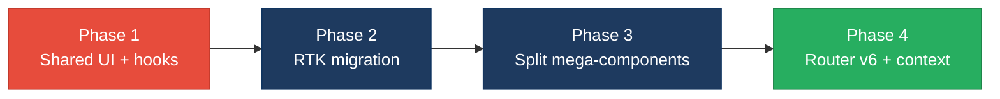

# 3. Frontend Modernization Hotspots Analysis

**Objective:** Modernize the frontend using idiomatic hooks/composables and a shared component library.

**Date:** July 17, 2026 | **Scope:** `target/` — React 18.2.0 (`social-media-react`, Redux 4 + React Router 5) and React 18.3.1 TypeScript (`workbench-demo`, React Router 6)

## Executive Summary

> **Executive Summary**
>
> The `target/` workspace contains two React single-page applications. The primary surface is `social-media-react` (React 18.2.0, legacy Redux `createStore` + thunks, React Router v5), comprising 58 JSX view units plus 3 TypeScript components in `workbench-demo` (React 18.3.1, hooks-only, Tailwind). All 61 scanned components are functional — no class-based components were found. The most severe modernization gaps are duplicated UI patterns (inline loading spinners in 9 files, repeated like-toggle logic in 4 preview components) and legacy global Redux wiring read by 49% of components. `Message.jsx` (250 LOC) mixes chat orchestration, socket side-effects, and view composition in one file, and the messaging feature drills 10+ props through four component layers without a domain composable or context.

<div class="metric-grid">
<div class="metric-card"><div class="metric-number">61</div><div class="metric-label">Components/Files Scanned</div></div>
<div class="metric-card"><div class="metric-number">0</div><div class="metric-label">Legacy Class-Based Components</div></div>
<div class="metric-card"><div class="metric-number">0</div><div class="metric-label">Components Over 500 LOC</div></div>
<div class="metric-card"><div class="metric-number">4</div><div class="metric-label">Global/Shared State Modules</div></div>
</div>

<div class="overall-rating overall-rating--high-risk"><div class="overall-rating-label">Overall Codebase Rating — Frontend Modernization</div><div class="overall-rating-value">High Risk</div><div class="overall-rating-note">Driven by H1 UI component duplication (~15% of scanned files replicate loading/preview patterns without a shared library) and H6 legacy Redux store architecture (0% RTK adoption).</div></div>

## 3.1 Benchmark Ratings Summary

| # | Hotspot | Primary KPI | <span class="rating rating-good">Good</span> | <span class="rating rating-moderate">Moderate</span> | <span class="rating rating-high-risk">High Risk</span> | Measured | Rating |
|---|---|---|---|---|---|---|---|
| H1 | UI Component Duplication | Duplicate components % | <5% | 5–10% | >10% | ~15% (9/61 files) | <span class="rating rating-high-risk">High Risk</span> |
| H2 | Legacy Class-Based Components | Modern component adoption % | >90% | 70–90% | <70% | 100% (61/61) | <span class="rating rating-good">Good</span> |
| H3 | Massive Components | Largest component LOC | <200 | 200–500 | >500 | 250 (`Message.jsx`) | <span class="rating rating-moderate">Moderate</span> |
| H4 | Global State Dependencies | Components reading global state % | <30% | 30–60% | >60% | 49% (30/61) | <span class="rating rating-moderate">Moderate</span> |
| H5 | Complex State Management | Max prop-drilling depth | <3 | 3–5 | >5 | 4 levels (Message → Messaging → ListMsg → MsgPreview) | <span class="rating rating-moderate">Moderate</span> |
| H6 | Legacy Redux Store (additional) | RTK/modern store adoption % | >90% | 70–90% | <70% | 0% (0/4 modules use RTK) | <span class="rating rating-high-risk">High Risk</span> |
| H7 | Direct DOM in React Views (additional) | Components using imperative DOM APIs | 0 files | 1–2 files | >2 files | 2 files | <span class="rating rating-moderate">Moderate</span> |

H6 and H7 are additional hotspots (legacy Redux store, imperative DOM) documented below and folded into the overall rating.

## 3.2 Hotspot-by-Hotspot Evidence

### H1. UI Component Duplication <span class="sev sev-high">High</span>

**Benchmark:** `Duplicate components % = ~15% (9/61 files)` → falls in the **High Risk** band (Good <5% · Moderate 5–10% · High Risk >10%).

Nine component/page files embed near-identical inline loading-spinner markup instead of a shared `LoadingSpinner` component. Four additional preview components (`CommentPreview`, `ReplyPreview`, `PostPreview`, `LikePreview`) duplicate the same like-reaction toggle logic (copy-mutate `reactions` array, push/filter by `loggedInUser._id`) without a shared hook.

**Example 1 — duplicated loading UI in `Feed.jsx` and `Posts.jsx`:**

`social-media-react/src/pages/Feed.jsx:18-26`:

```jsx
  if (!loggedInUser)
    return (
      <section className="feed-load">
        <div className="loading">
          <span>
            
          </span>
        </div>
      </section>
    )
```

`social-media-react/src/cmps/posts/Posts.jsx:32-44`:

```jsx
  if (!posts)
    return (
      <section className="posts">
        
      </section>
    )
```

**Example 2 — duplicated like-toggle logic in `CommentPreview.jsx` and `ReplyPreview.jsx`:**

`social-media-react/src/cmps/comments/CommentPreview.jsx:38-54`:

```jsx
  const onLikeComment = () => {
    const commentToSave = { ...comment }
    const isAlreadyLike = commentToSave.reactions.some(
      (reaction) => reaction.userId === loggedInUser._id
    )
    if (isAlreadyLike) {
      commentToSave.reactions = commentToSave.reactions.filter(
        (reaction) => reaction.userId !== loggedInUser._id
      )
    } else if (!isAlreadyLike) {
      commentToSave.reactions.push({
        userId: loggedInUser._id,
        fullname: loggedInUser.fullname,
        reaction: 'like',
      })
    }
    onSaveComment(commentToSave)
  }
```

`social-media-react/src/cmps/replies/ReplyPreview.jsx:12-28`:

```jsx
  const onLikeReply = () => {
    const replyToUpdate = { ...reply }
    const isAlreadyLike = replyToUpdate.reactions.some(
      (reaction) => reaction.userId === loggedInUser._id
    )
    if (isAlreadyLike) {
      replyToUpdate.reactions = replyToUpdate.reactions.filter(
        (reaction) => reaction.userId !== loggedInUser._id
      )
    } else if (!isAlreadyLike) {
      replyToUpdate.reactions.push({
        userId: loggedInUser._id,
        fullname: loggedInUser.fullname,
        reaction: 'like',
      })
    }
    updateReply(replyToUpdate)
  }
```

**Why it matters here:** Every styling or behavior change to loading states or reaction toggles must be applied in 9+ separate files across pages (`Feed`, `Message`, `Profile`, `Notifications`, `MyNetwork`, `Posts`, `PostsList`, `CreatePostModal`, `Home`) and preview components. This guarantees visual drift and inconsistent bug fixes as the social feed, messaging, and notification surfaces evolve independently.

**Recommended approach:**
1. Create `src/cmps/shared/LoadingSpinner.jsx` and replace all 9 inline GIF blocks.
2. Extract `useLikeReaction(entity, onSave)` hook used by `CommentPreview`, `ReplyPreview`, `PostPreview`, and `LikePreview`.
3. Introduce `UserAvatarCard` base component for the 7+ preview cards that repeat avatar + name + TimeAgo markup.

<!-- affected-files
search: loading-gif\.gif|loadongGif|loadingGif
glob: social-media-react/src/**/*.{jsx,js}
issue: Inline duplicated loading-spinner UI
action: Replace with shared LoadingSpinner component
-->

<!-- affected-files
search: reactions\.some\(\s*\(reaction\)\s*=>\s*reaction\.userId\s*===\s*loggedInUser\._id
glob: social-media-react/src/**/*.{jsx,js}
issue: Duplicated like-reaction toggle logic
action: Extract useLikeReaction hook and shared ReactionButton
-->

### H2. Legacy Class-Based / Imperative Components <span class="sev sev-low">Low</span>

**Benchmark:** `Modern component adoption % = 100% (61/61)` → falls in the **Good** band (Good >90% · Moderate 70–90% · High Risk <70%).

**Evidence:** Not observed — a repository-wide search for `extends Component` and `extends React.Component` across `social-media-react` and `workbench-demo` returned zero matches. All view units use function components with hooks (`useState`, `useEffect`, `useSelector`, `useDispatch`, custom hooks such as `useChat` in `Message.jsx`).

### H3. Massive Components (>500 LOC) <span class="sev sev-medium">Medium</span>

**Benchmark:** `Largest component LOC = 250` → falls in the **Moderate** band (Good <200 · Moderate 200–500 · High Risk >500).

No file exceeds 500 LOC, but several approach the moderate ceiling and mix concerns:

**Example 1 — `Message.jsx` (250 LOC) combines custom hook, Redux dispatches, and page layout:**

`social-media-react/src/pages/Message.jsx:22-50`:

```jsx
function useChat(loggedInUser, chats, params) {
  const dispatch = useDispatch()
  const [isUserChatExist, setIsUserChatExist] = useState(undefined)
  const [messagesToShow, setMessagesToShow] = useState(null)
  const [chooseenChatId, setChooseenChatId] = useState(null)
  const [isNewChat, setIsNewChat] = useState(false)
  const [theNotLoggedUserChat, setTheNotLoggedUserChat] = useState(null)
  const [chatWith, setChatWith] = useState(null)

  const checkIfChatExist = () => {
    return new Promise((resolve, reject) => {
      if (!chats) return reject(false)
      const isChatExist = chats.some(chat =>
        chat.userId === params.userId || chat.userId2 === params.userId
      )
      if (isChatExist) resolve(isChatExist)
      else reject(isChatExist)
    })
  }
```

**Example 2 — `CreatePostModal.jsx` (229 LOC) and `CommentPreview.jsx` (207 LOC) embed form state, media upload, and nested reply UI inline.**

**Why it matters here:** `Message.jsx` owns chat discovery, activity side-effects, socket-adjacent dispatches, and rendering — making it hard to unit-test chat selection independently of page mount logic. Similar density in `CommentPreview` couples reply creation, menu toggles, and reaction handling in one file.

**Recommended approach:**
1. Move `useChat` from `Message.jsx` to `src/hooks/useChat.js`.
2. Split `CommentPreview.jsx` into `CommentPreview`, `CommentActions`, and `ReplyInput` subcomponents.
3. Extract `CreatePostModal` media-upload logic into `usePostMediaUpload` composable.

<!-- affected-files
glob: social-media-react/src/pages/Message.jsx
issue: Component file exceeds 200 LOC threshold
action: Split into feature subcomponents and dedicated hooks/composables
-->

<!-- affected-files
glob: social-media-react/src/cmps/posts/CreatePostModal.jsx
issue: Component file exceeds 200 LOC threshold
action: Split into feature subcomponents and dedicated hooks/composables
-->

<!-- affected-files
glob: social-media-react/src/cmps/comments/CommentPreview.jsx
issue: Component file exceeds 200 LOC threshold
action: Split into feature subcomponents and dedicated hooks/composables
-->

### H4. Global State Dependencies <span class="sev sev-medium">Medium</span>

**Benchmark:** `Components reading global state % = 49% (30/61)` → falls in the **Moderate** band (Good <30% · Moderate 30–60% · High Risk >60%).

Thirty files import `useSelector` or `connect` and read from the monolithic Redux store (`postModule`, `userModule`, `chatModule`, `activityModule`). The store is created with legacy `createStore` + `redux-thunk`:

`social-media-react/src/store/index.js:1-20`:

```javascript
import { applyMiddleware, combineReducers, compose, createStore } from 'redux'
import thunk from 'redux-thunk'
// ...
export const store = createStore(
  rootReducer,
  composeEnhancers(applyMiddleware(thunk))
)
```

**Example — `Main.jsx` wires 8+ socket handlers directly to Redux action dispatches:**

`social-media-react/src/pages/Main.jsx:110-139`:

```jsx
  useEffect(() => {
    socketService.on('add-post', addPost)
    socketService.on('update-post', updatePost)
    socketService.on('remove-post', removePost)
    socketService.on('add-chat', addChat)
    socketService.on('update-chat', updateChat)
    // ... 6 more listeners
    return () => {
      socketService.off('add-post', addPost)
      // ...
    }
  }, [addChat, addComment, addConnectedUser, addConnectedUsers, addPost, removeComment, removePost, updateChat, updateComment, updatePost])
```

**Why it matters here:** Half of all view units are coupled to global Redux modules. Changes to `userModule` shape (e.g., connection list structure) ripple silently into header search, feed identity, messaging, and notifications without compile-time boundaries.

**Recommended approach:**
1. Migrate to Redux Toolkit slices per domain (`userSlice`, `postSlice`, `chatSlice`, `activitySlice`).
2. Colocate selectors in slice files; replace inline `(state) => state.userModule` with memoized selectors.
3. Move socket subscription logic from `Main.jsx` into a `useSocketSync` hook or RTK listener middleware.

<!-- affected-files
search: useSelector|connect\(
glob: social-media-react/src/**/*.{jsx,js}
issue: Direct global Redux store dependency
action: Migrate to RTK slices with scoped selectors and domain hooks
-->

### H5. Complex State Management <span class="sev sev-medium">Medium</span>

**Benchmark:** `Max prop-drilling depth = 4 levels` → falls in the **Moderate** band (Good <3 · Moderate 3–5 · High Risk >5).

The messaging feature passes 10 callback/state props through four layers without context or a composable store:

`social-media-react/src/pages/Message.jsx:230-242` → `Messaging.jsx:20-30` → `ListMsg.jsx:72-84` → `MsgPreview.jsx:6-15`.

**Example — prop chain in `ListMsg.jsx`:**

`social-media-react/src/cmps/message/ListMsg.jsx:72-84`:

```jsx
            <MsgPreview
              key={chat._id}
              chat={chat}
              chats={chats}
              setMessagesToShow={setMessagesToShow}
              setChatWith={setChatWith}
              chatWith={chatWith}
              setChooseenChatId={setChooseenChatId}
              getTheNotLoggedUserChat={getTheNotLoggedUserChat}
              setTheNotLoggedUserChat={setTheNotLoggedUserChat}
              theNotLoggedUserChat={theNotLoggedUserChat}
              chooseenChatId={chooseenChatId}
            />
```

Comment saving also drills three levels: `PostPreview` → `Comments` → `CommentsList` → `CommentPreview` for `onSaveComment`.

**Why it matters here:** Adding a new piece of chat UI state (e.g., typing indicators) requires threading props through `Message`, `Messaging`, `ListMsg`, and `MsgPreview`, increasing regression risk and making intermediate components pure pass-through shells.

**Recommended approach:**
1. Create `ChatContext` or `useMessagingState()` composable consumed by `ListMsg`, `MsgPreview`, and `MessageThread`.
2. Keep `onSaveComment` in a `usePostComments(postId)` hook rather than drilling through three comment layers.
3. Adopt React Router v6 `Outlet` context pattern when upgrading from v5.

<!-- affected-files
search: setMessagesToShow|setChatWith|setChooseenChatId|onSaveComment
glob: social-media-react/src/**/*.{jsx,js}
issue: Prop-drilled messaging/comment callbacks
action: Replace with ChatContext or useMessagingState composable
-->

### H6. Legacy Redux Store Architecture (additional) <span class="sev sev-high">High</span>

**Benchmark:** `RTK/modern store adoption % = 0% (0/4 modules)` → falls in the **High Risk** band (Good >90% · Moderate 70–90% · High Risk <70%).

All four domain modules (`postReducer`, `userReducer`, `chatReducer`, `activityReducer`) use hand-written action types, switch-case reducers, and separate thunk action files (~872 LOC total in `src/store/`). No `@reduxjs/toolkit` dependency is present in `package.json`.

**Why it matters here:** Manual Redux boilerplate slows feature delivery, lacks Immer-powered immutable updates, and provides no built-in RTK Query layer for the axios services in `src/services/`.

**Recommended approach:**
1. Add `@reduxjs/toolkit` and convert `userReducer` first (highest fan-out — 30 consumers).
2. Collocate actions + reducers into slices; delete separate `actions/` and `reducers/` folders.
3. Introduce RTK Query for `userService`, `postService` API calls currently duplicated in components.

<!-- affected-files
glob: social-media-react/src/store/**/*
issue: Legacy createStore + manual reducers/thunks
action: Migrate to Redux Toolkit slices and RTK Query
-->

### H7. Direct DOM Manipulation in Declarative Views (additional) <span class="sev sev-medium">Medium</span>

**Benchmark:** `Components using imperative DOM APIs = 2 files` → falls in the **Moderate** band (Good 0 · Moderate 1–2 · High Risk >2).

**Example 1 — `InputFilter.jsx` builds autocomplete via `innerHTML` and `document.querySelector`:**

`social-media-react/src/cmps/header/InputFilter.jsx:28-43`:

```jsx
  const handleAutComplete = () => {
    let inputField = document.getElementById('txt')
    let ulField = document.querySelector('.suggestions')
    inputField.addEventListener('input', changeAutoComplete)
    if (ulField) ulField.addEventListener('click', selectItem)
    function changeAutoComplete({ target }) {
      let data = target.value
      ulField.innerHTML = ``
      // ...
    }
```

**Example 2 — `MessageThread.jsx` scrolls via `document.querySelector`:**

`social-media-react/src/cmps/message/MessageThread.jsx:20-22`:

```jsx
  const scrollToBottom = () => {
    var msgsContainer = document.querySelector('.user-profile-details')
    msgsContainer.scrollTop = msgsContainer.scrollHeight
  }
```

**Why it matters here:** Imperative DOM updates bypass React's reconciliation, break SSR/testability, and can leak event listeners (as in `InputFilter`'s `addEventListener` without cleanup).

**Recommended approach:**
1. Rewrite `InputFilter` autocomplete as controlled React state rendering a `<ul>` of suggestions.
2. Replace `MessageThread` scroll with `useRef` + `ref.current.scrollTop = ref.current.scrollHeight`.

<!-- affected-files
search: document\.(getElementById|querySelector)|\.innerHTML
glob: social-media-react/src/**/*.{jsx,js}
issue: Imperative DOM manipulation in React component
action: Refactor to refs and declarative React state
-->

## 3.3 State Management & Dependency Evidence

H4 and H5 evidence above covers global Redux coupling and messaging prop-drilling respectively. Additional notes:

- **`Main.jsx`** acts as a god-component for real-time socket → Redux synchronization, creating hidden coupling between unrelated features (posts, chats, comments, connections).
- **`workbench-demo`** uses localized `useState` + `localStorage` token storage in `LoginPage.tsx` — a modern, scoped pattern that contrasts favorably with the primary app's global store sprawl.
- No Pinia/Zustand/Context-based domain stores exist beyond the Redux `Provider` in `index.js`.

## 3.4 Diagrams

### Current UI data flow



### Target component + state layout



### Improvement roadmap



## 3.5 Actions Required

| Hotspot | Action | Rating | Priority |
|---|---|---|---|
| H1 UI Component Duplication | Create `src/cmps/shared/` with `LoadingSpinner`, `UserAvatarCard`, and `useLikeReaction`; replace 9 loading blocks and 4 duplicate like handlers | <span class="rating rating-high-risk">High Risk</span> | <span class="sev sev-high">High</span> |
| H3 Massive Components | Extract `useChat` hook from `Message.jsx`; split `CommentPreview.jsx` and `CreatePostModal.jsx` into subcomponents under 200 LOC each | <span class="rating rating-moderate">Moderate</span> | <span class="sev sev-medium">Medium</span> |
| H4 Global State Dependencies | Migrate `social-media-react/src/store/` to Redux Toolkit slices; add memoized selectors to reduce ad-hoc `useSelector` inline lambdas | <span class="rating rating-moderate">Moderate</span> | <span class="sev sev-high">High</span> |
| H5 Complex State Management | Introduce `ChatContext` / `useMessagingState` composable to eliminate 4-level prop drilling in messaging and comment save chains | <span class="rating rating-moderate">Moderate</span> | <span class="sev sev-medium">Medium</span> |
| H6 Legacy Redux Store | Add `@reduxjs/toolkit`, convert four reducer modules to slices, adopt RTK Query for `userService`/`postService` | <span class="rating rating-high-risk">High Risk</span> | <span class="sev sev-critical">Critical</span> |
| H7 Direct DOM in React | Refactor `InputFilter.jsx` to controlled autocomplete list; replace `MessageThread.jsx` scroll with `useRef` | <span class="rating rating-moderate">Moderate</span> | <span class="sev sev-medium">Medium</span> |

## 3.6 Expected Outcomes

- A shared component library (`LoadingSpinner`, `UserAvatarCard`, `ReactionButton`) reduces duplicated markup from ~15% of files to near zero and enforces consistent loading and interaction UX.
- Extracting `useChat`, `useLikeReaction`, and RTK slices improves unit-test coverage for chat and reaction flows without mounting full page trees.
- Redux Toolkit migration eliminates ~872 LOC of manual boilerplate and provides typed selectors, reducing the 49% global-store coupling through scoped domain hooks.
- `ChatContext` collapses 10-prop drilling chains in messaging to single-hook consumption, simplifying addition of typing indicators and read receipts.
- Replacing imperative DOM calls in `InputFilter` and `MessageThread` restores React-idiomatic rendering and prevents event-listener leaks during hot reload.
