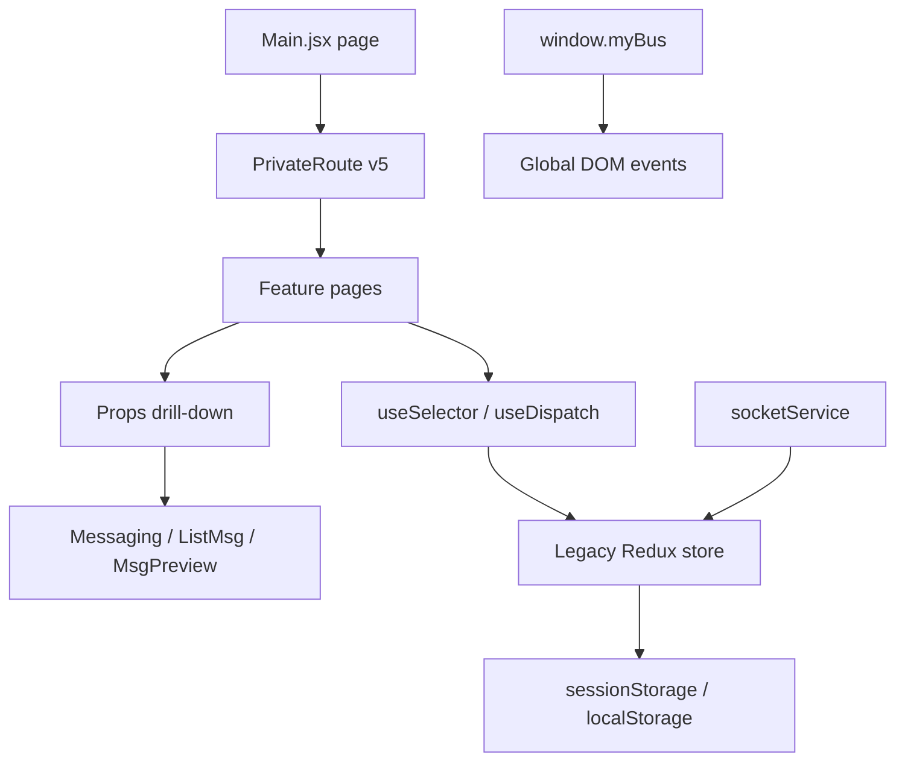
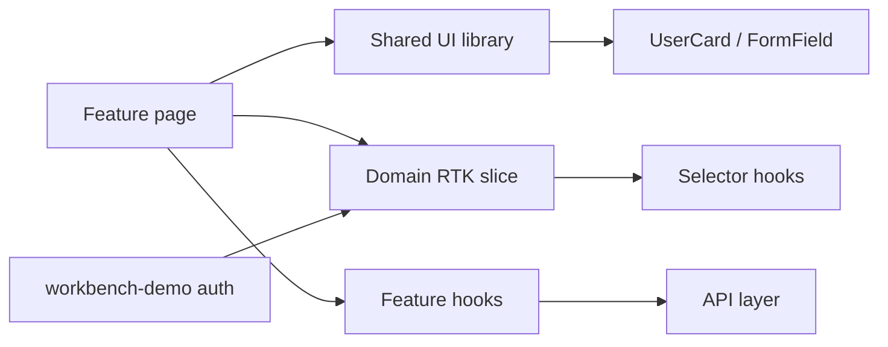
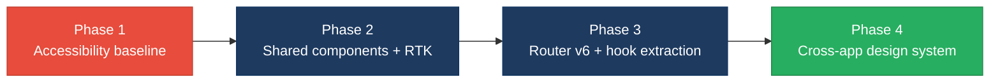

# 3. Frontend Modernization Hotspots Analysis

**Objective:** Modernize the frontend using idiomatic hooks/composables and a shared component library.

**Date:** July 16, 2026 | **Scope:** `target/` — React 18.2.0 (`social-media-react`) + React 18.3.1 / TypeScript (`workbench-demo`)

## Executive Summary

> **Executive Summary**
>
> The `target/` workspace contains two independent React 18 applications with divergent modernization postures. `workbench-demo` is a small TypeScript app using React Router v6, Tailwind CSS, and accessible form patterns; `social-media-react` is a larger JavaScript CRA app with 57 functional components, legacy Redux (`createStore` + thunks), React Router v5 (`Switch`, `useHistory`, `component=` routes), and widespread Redux coupling. No class-based components were found — adoption of function components with hooks is 100%. The primary risks are missing accessibility across the social app (0 `aria-*` attributes in 57 components), moderate UI duplication in user-card preview components (~7%), legacy global Redux patterns (47.5% of components read global store), and messaging prop-drilling depth of 3. Largest single component is `Message.jsx` at 250 LOC (moderate, below the 500 LOC threshold).

<div class="metric-grid">
<div class="metric-card"><div class="metric-number">61</div><div class="metric-label">Components/Files Scanned</div></div>
<div class="metric-card"><div class="metric-number">0</div><div class="metric-label">Legacy Class-Based Components</div></div>
<div class="metric-card"><div class="metric-number">0</div><div class="metric-label">Components Over 500 LOC</div></div>
<div class="metric-card"><div class="metric-number">4</div><div class="metric-label">Global/Shared State Modules</div></div>
</div>

<div class="overall-rating overall-rating--high-risk"><div class="overall-rating-label">Overall Codebase Rating — Frontend Modernization</div><div class="overall-rating-value">High Risk</div><div class="overall-rating-note">Driven by H8 (accessibility gaps — 57/57 social-media-react components lack ARIA attributes) with supporting Moderate ratings on duplication, component size, global state coupling, and prop drilling.</div></div>

## 3.1 Benchmark Ratings Summary

| # | Hotspot | Primary KPI | <span class="rating rating-good">Good</span> | <span class="rating rating-moderate">Moderate</span> | <span class="rating rating-high-risk">High Risk</span> | Measured | Rating |
|---|---|---|---|---|---|---|---|
| H1 | UI Component Duplication | Duplicate components % | <5% | 5–10% | >10% | 6.6% (4/61) | <span class="rating rating-moderate">Moderate</span> |
| H2 | Legacy Class-Based Components | Modern component adoption % | >90% | 70–90% | <70% | 100% | <span class="rating rating-good">Good</span> |
| H3 | Massive Components | Largest component LOC | <200 | 200–500 | >500 | 250 LOC | <span class="rating rating-moderate">Moderate</span> |
| H4 | Global State Dependencies | Components reading global state % | <30% | 30–60% | >60% | 47.5% (29/61) | <span class="rating rating-moderate">Moderate</span> |
| H5 | Complex State Management | Max prop-drilling depth | <3 | 3–5 | >5 | 3 levels | <span class="rating rating-moderate">Moderate</span> |
| H6 | Direct DOM Manipulation (additional) | Components using imperative DOM APIs % | <5% | 5–15% | >15% | 3.3% (2/61) | <span class="rating rating-good">Good</span> |
| H7 | Legacy Redux Store (additional) | Apps using plain `createStore` vs RTK % | 0% | 1–50% | >50% | 50% (1/2 apps) | <span class="rating rating-moderate">Moderate</span> |
| H8 | Accessibility Gaps (additional) | Social-app components lacking any `aria-*` % | <20% | 20–50% | >50% | 100% (57/57) | <span class="rating rating-high-risk">High Risk</span> |

**No additional hotspots beyond the standard set were observed** beyond H6–H8 documented above.

## 3.2 Hotspot-by-Hotspot Evidence

### H1. UI Component Duplication <span class="sev sev-high">High</span>

**Benchmark:** `Duplicate components % = 6.6% (4/61)` → falls in the **Moderate** band (Good <5% · Moderate 5–10% · High Risk >10%).

Four preview components repeat the same user-card shell (async `userService.getById`, avatar image, fullname, profession, profile link) with only minor layout differences. This pattern appears in at least 6 files total when including `NotificaitonPreview.jsx` and `MsgPreview.jsx` variants.

**Example 1 — `target/social-media-react/src/cmps/LikePreview.jsx`**

```jsx
export function LikePreview({ reaction }) {
  const [user, setUser] = useState(null)
  const loadUser = async (id) => {
    const userPost = await userService.getById(id)
    setUser(() => userPost)
  }
  // ... avatar + fullname + profession card
}
```

**Example 2 — `target/social-media-react/src/cmps/connections/MyConnectionPreview.jsx`**

```jsx
export function MyConnectionPreview({ connection }) {
  const [user, setUser] = useState(null)
  const loadUser = async () => {
    const user = await userService.getById(connection.userId)
    setUser(() => user)
  }
  // ... avatar + fullname + profession card
}
```

**Why it matters here:** Every UX tweak to user cards (loading skeleton, error state, avatar fallback, truncation) must be replicated across 4+ preview components. The social app already shows inconsistent loading treatments (`loading-circle.gif` vs `loading-gif.gif` vs empty return).

**Recommended approach:**
1. Extract a shared `UserCard` component under `social-media-react/src/cmps/shared/UserCard.jsx` with `userId` or `user` props and a unified loading skeleton.
2. Refactor `LikePreview`, `MyConnectionPreview`, `ConnectionPreview`, and `ReplyPreview` to compose `UserCard`.
3. Consolidate the repeated like/reaction toggle logic (identical in `CommentPreview`, `ReplyPreview`, and `PostActions`) into a `useReactionToggle` hook.

<!-- affected-files
search: userService\.getById
glob: social-media-react/src/**/*.{jsx,tsx}
issue: Duplicated user-card fetch/render pattern
action: Extract shared UserCard component and useUserProfile hook
-->

### H2. Legacy Class-Based / Imperative Components <span class="sev sev-low">Low</span>

**Benchmark:** `Modern component adoption % = 100%` → falls in the **Good** band (Good >90% · Moderate 70–90% · High Risk <70%).

**Evidence:** Not observed — all 61 scanned `.jsx`/`.tsx` files (excluding `node_modules`) export function components or `React.FC` arrow components. No `extends Component` or `extends React.Component` patterns exist in application source.

### H3. Massive Components (>500 LOC) <span class="sev sev-medium">Medium</span>

**Benchmark:** `Largest component LOC = 250` → falls in the **Moderate** band (Good <200 · Moderate 200–500 · High Risk >500).

No component exceeds 500 LOC. The largest files cluster in the 200–250 range and mix UI, Redux side effects, and domain logic in single files.

**Example 1 — `target/social-media-react/src/pages/Message.jsx:22–243`**

```jsx
function useChat(loggedInUser, chats, params) {
  const dispatch = useDispatch()
  const [isUserChatExist, setIsUserChatExist] = useState(undefined)
  // ... 80+ lines of chat resolution, message creation, socket sync
}

export default function Message() {
  // ... Redux selectors, route params, 10 props drilled to Messaging
  return (
    <Messaging
      chats={chats}
      messagesToShow={messagesToShow}
      setMessagesToShow={setMessagesToShow}
      // ... 7 more props
    />
  )
}
```

**Example 2 — `target/social-media-react/src/cmps/comments/CommentPreview.jsx:1–207`**

```jsx
export const CommentPreview = ({ comment, onSaveComment }) => {
  // ... user load, like toggle, reply input, reply list, menu — 207 lines
  const onLikeComment = () => { /* mutates comment reactions */ }
  const addReply = () => { /* creates reply, calls onSaveComment */ }
  const updateReply = (replyToUpdate) => { /* nested reply mutation */ }
}
```

**Why it matters here:** `Message.jsx` owns chat lifecycle, Redux dispatches, route-param bootstrapping, and render in one 250-line file — making unit testing and reuse of chat logic impractical. `CommentPreview.jsx` at 207 lines similarly blocks isolated testing of comment/reply interactions.

**Recommended approach:**
1. Move `useChat` from `Message.jsx` into `social-media-react/src/hooks/useChat.js` (already partially extracted — finish extraction and add tests).
2. Split `CommentPreview.jsx` into `CommentBody`, `CommentActions`, and `ReplyComposer` subcomponents.
3. Set a 200 LOC soft limit in lint rules for `src/pages/` and `src/cmps/`.

<!-- affected-files
glob: social-media-react/src/pages/Message.jsx
issue: Component exceeds 200 LOC soft limit (250 LOC)
action: Split into feature subcomponents and domain hooks
-->

### H4. Global State Dependencies <span class="sev sev-high">High</span>

**Benchmark:** `Components reading global state % = 47.5% (29/61)` → falls in the **Moderate** band (Good <30% · Moderate 30–60% · High Risk >60%).

Nearly half of all components call `useSelector` or `useDispatch`, coupling UI to a legacy plain-Redux store. Additional global singletons (`window.myBus`, `sessionStorage`/`localStorage` in services) widen the coupling surface.

**Example 1 — `target/social-media-react/src/store/index.js:1–20`**

```javascript
const rootReducer = combineReducers({
  postModule: postReducer,
  userModule: userReducer,
  chatModule: chatReducer,
  activityModule: activityReducer,
})
export const store = createStore(rootReducer, composeEnhancers(applyMiddleware(thunk)))
```

**Example 2 — `target/social-media-react/src/services/eventBusService.js:19–21`**

```javascript
export const eventBusService = { on, emit };
window.myBus = eventBusService;
```

**Why it matters here:** Leaf components like `ReplyPreview` and `PostMenu` reach directly into `state.userModule`, so a reducer shape change in `userReducer` can break unrelated features. The `window.myBus` global exposes a second mutation channel outside React's render cycle.

**Recommended approach:**
1. Migrate `social-media-react/src/store/` to Redux Toolkit slices (`userSlice`, `postSlice`, `chatSlice`, `activitySlice`).
2. Replace `window.myBus` usages with a typed React Context or RTK listener middleware.
3. Introduce selector hooks (`useLoggedInUser()`, `usePosts()`) to localize store knowledge.

<!-- affected-files
search: useSelector|useDispatch
glob: social-media-react/src/**/*.{jsx,tsx}
issue: Direct global Redux store coupling
action: Migrate to RTK slices and domain selector hooks
-->

### H5. Complex State Management <span class="sev sev-medium">Medium</span>

**Benchmark:** `Max prop-drilling depth = 3 levels` → falls in the **Moderate** band (Good <3 · Moderate 3–5 · High Risk >5).

The messaging feature drills 8+ state setter props through three intermediate components before `MsgPreview` consumes them. Comment/reply flows pass `onSaveComment` two levels deep (acceptable), but messaging state bypasses Redux entirely.

**Example 1 — `target/social-media-react/src/pages/Message.jsx:230–241`**

```jsx
<Messaging
  chats={chats}
  messagesToShow={messagesToShow}
  setMessagesToShow={setMessagesToShow}
  chooseenChatId={chooseenChatId}
  setChooseenChatId={setChooseenChatId}
  chatWith={chatWith}
  setChatWith={setChatWith}
  getTheNotLoggedUserChat={getTheNotLoggedUserChat}
  setTheNotLoggedUserChat={setTheNotLoggedUserChat}
  theNotLoggedUserChat={theNotLoggedUserChat}
  onSendMsg={onSendMsg}
/>
```

**Example 2 — `target/social-media-react/src/cmps/message/ListMsg.jsx:72–84`**

```jsx
<MsgPreview
  key={chat._id}
  chat={chat}
  chats={chats}
  setMessagesToShow={setMessagesToShow}
  setChatWith={setChatWith}
  chatWith={chatWith}
  setChooseenChatId={setChooseenChatId}
  getTheNotLoggedUserChat={getTheNotLoggedUserChat}
  setTheNotLoggedUserChat={setTheNotLoggedUserChat}
  theNotLoggedUserChat={theNotLoggedUserChat}
  chooseenChatId={chooseenChatId}
/>
```

**Why it matters here:** `Messaging` and `ListMsg` are pass-through components that exist only to forward props — a classic prop-drilling smell. Adding one new piece of chat UI state requires editing four files (`Message`, `Messaging`, `ListMsg`, `MsgPreview`).

**Recommended approach:**
1. Create a `MessagingContext` or extend `chatModule` Redux slice with `activeChatId`, `messagesToShow`, and `chatWith` state.
2. Collapse `Messaging` and `ListMsg` prop surfaces to `<MessagingProvider>` + `useMessaging()` hook.
3. Align `workbench-demo` auth token storage with a shared `useAuth` composable pattern for cross-app consistency.

<!-- affected-files
search: setMessagesToShow|setChooseenChatId|setChatWith|getTheNotLoggedUserChat
glob: social-media-react/src/**/*.{jsx,tsx}
issue: Messaging state prop-drilled 3 levels deep
action: Replace with MessagingContext or chatModule RTK slice
-->

### H6. Direct DOM Manipulation (additional) <span class="sev sev-low">Low</span>

**Benchmark:** `Components using imperative DOM APIs % = 3.3% (2/61)` → falls in the **Good** band (Good <5% · Moderate 5–15% · High Risk >15%).

**Example 1 — `target/social-media-react/src/cmps/message/MessageThread.jsx:20–22`**

```jsx
const scrollToBottom = () => {
  var msgsContainer = document.querySelector('.user-profile-details')
  msgsContainer.scrollTop = msgsContainer.scrollHeight
}
```

**Example 2 — `target/social-media-react/src/cmps/header/InputFilter.jsx:28–37`**

```jsx
const handleAutComplete = () => {
  let inputField = document.getElementById('txt')
  let ulField = document.querySelector('.suggestions')
  inputField.addEventListener('input', changeAutoComplete)
  if (ulField) ulField.addEventListener('click', selectItem)
  // ... builds <li> elements via innerHTML
}
```

**Why it matters here:** Direct DOM queries break when class names change and bypass React's reconciliation. `InputFilter` builds suggestion lists with `innerHTML`, creating an XSS surface if user names ever contain markup.

**Recommended approach:**
1. Replace `MessageThread` scroll hack with a `useRef` on the messages container.
2. Rewrite `InputFilter` autocomplete as a controlled React list (`usersAutoComplete.map(...)`).

<!-- affected-files
search: document\.(querySelector|getElementById)|\.innerHTML
glob: social-media-react/src/**/*.{jsx,tsx}
issue: Imperative DOM access in declarative React
action: Replace with useRef and controlled React rendering
-->

### H7. Legacy Redux Store (additional) <span class="sev sev-medium">Medium</span>

**Benchmark:** `Apps using plain createStore vs RTK % = 50% (1/2 apps)` → falls in the **Moderate** band (Good 0% · Moderate 1–50% · High Risk >50%).

`social-media-react` uses hand-rolled action types, thunk middleware, and `combineReducers` without Redux Toolkit. `workbench-demo` uses local component state + `localStorage` instead of any store.

**Example — `target/social-media-react/src/store/reducers/userReducer.js` (pattern repeated across 4 reducers)**

```javascript
export function userReducer(state = initialState, action) {
  switch (action.type) {
    case 'SET_USER':
      return { ...state, loggedInUser: action.user }
    // ... manual switch/case for every action
  }
}
```

**Why it matters here:** Manual reducers and stringly-typed actions increase boilerplate and make TypeScript migration costly. The dual-app workspace already has a modern TS reference (`workbench-demo`) but no shared state conventions.

**Recommended approach:**
1. Introduce `@reduxjs/toolkit` to `social-media-react/package.json`.
2. Convert `userReducer`, `postReducer`, `chatReducer`, and `activityReducer` to `createSlice` exports.
3. Document a target-state diagram aligning `workbench-demo` auth with a future shared `authSlice`.

<!-- affected-files
search: createStore|combineReducers
glob: social-media-react/src/**/*.{js,jsx}
issue: Legacy plain-Redux store setup
action: Migrate to Redux Toolkit configureStore and slices
-->

### H8. Accessibility Gaps (additional) <span class="sev sev-critical">Critical</span>

**Benchmark:** `Social-app components lacking any aria-* % = 100% (57/57)` → falls in the **High Risk** band (Good <20% · Moderate 20–50% · High Risk >50%).

All 57 `social-media-react` JSX components lack `aria-*` attributes, `role=`, or `htmlFor` label associations. Interactive elements use bare `<button>` and `<input>` without screen-reader context. By contrast, `workbench-demo/src/pages/LoginPage.tsx` demonstrates the target pattern.

**Example 1 — `target/social-media-react/src/pages/Home.jsx:48–80` (login form — no labels, no aria)**

```jsx
<input
  onChange={handleChange}
  type="text"
  name="username"
  value={creds.username}
  placeholder="Email or Phone"
/>
```

**Example 2 — `target/workbench-demo/src/pages/LoginPage.tsx:68–93` (modern accessible form — contrast)**

```tsx
<label htmlFor="email" className="block text-sm font-medium text-gray-700 mb-1">
  Email address
</label>
<input
  id="email"
  aria-required="true"
  aria-describedby={emailError ? "email-error" : undefined}
  aria-invalid={emailError ? "true" : undefined}
/>
```

**Why it matters here:** An HR modernization platform must meet WCAG 2.1 AA for employee-facing flows. The social app's login (`Home.jsx`), messaging, notifications, and post interactions are entirely inaccessible to keyboard-only and screen-reader users — a compliance blocker for production rollout.

**Recommended approach:**
1. Adopt `workbench-demo/LoginPage.tsx` as the accessibility baseline for all forms.
2. Add `eslint-plugin-jsx-a11y` to `social-media-react` and fix errors iteratively starting with `Home.jsx`, `Signup.jsx`, and `Header/Nav.jsx`.
3. Ensure all icon-only buttons (FontAwesome ellipsis, like, share) receive `aria-label`.

<!-- affected-files
glob: social-media-react/src/**/*.jsx
issue: Missing ARIA roles, labels, and keyboard semantics
action: Add jsx-a11y linting and align with workbench-demo patterns
-->

## 3.3 State Management & Dependency Evidence

H4 and H5 evidence above covers the state-management hotspots. Additional cross-cutting observations:

- **Dual-app divergence:** `workbench-demo` uses React Router v6 (`Routes`, `useNavigate`) while `social-media-react` remains on v5 (`Switch`, `useHistory`, `PrivateRoute` with `component=` prop). This split increases onboarding cost and prevents shared route guards.
- **Storage coupling:** `userService.js` persists session in `sessionStorage`; `LoginPage.tsx` uses `localStorage` for tokens — inconsistent auth persistence across apps.
- **Socket side effects in view layer:** `Main.jsx` registers 10 socket listeners inside a page component (lines 110–140), mixing transport concerns with layout rendering.

## 3.4 Diagrams

### Current UI data flow



### Target component + state layout



### Improvement roadmap



## 3.5 Actions Required

| Hotspot | Action | Rating | Priority |
|---|---|---|---|
| H8 Accessibility Gaps | Add `eslint-plugin-jsx-a11y` to `social-media-react`; refactor `Home.jsx` and `Signup.jsx` forms to match `workbench-demo/LoginPage.tsx` label/ARIA patterns; add `aria-label` to all icon-only buttons | <span class="rating rating-high-risk">High Risk</span> | <span class="sev sev-critical">Critical</span> |
| H1 UI Component Duplication | Extract `UserCard` and `useReactionToggle` shared modules; refactor 4+ preview components to compose them | <span class="rating rating-moderate">Moderate</span> | <span class="sev sev-high">High</span> |
| H4 Global State Dependencies | Migrate `social-media-react/src/store/` to Redux Toolkit slices; remove `window.myBus`; add domain selector hooks | <span class="rating rating-moderate">Moderate</span> | <span class="sev sev-high">High</span> |
| H3 Massive Components | Extract `useChat` hook from `Message.jsx`; split `CommentPreview.jsx` into subcomponents; enforce 200 LOC soft limit | <span class="rating rating-moderate">Moderate</span> | <span class="sev sev-medium">Medium</span> |
| H5 Complex State Management | Introduce `MessagingContext` or extend `chatModule` slice to eliminate 8-prop drill through `Messaging`/`ListMsg` | <span class="rating rating-moderate">Moderate</span> | <span class="sev sev-medium">Medium</span> |
| H7 Legacy Redux Store | Replace `createStore` + manual reducers with `configureStore` and `createSlice` across 4 modules | <span class="rating rating-moderate">Moderate</span> | <span class="sev sev-medium">Medium</span> |

## 3.6 Expected Outcomes

- A shared `UserCard` and form-field library reduces preview-component duplication from 6.6% toward the <5% Good band and standardizes loading/error UX.
- Redux Toolkit slices and selector hooks (`useLoggedInUser`, `useMessaging`) cut global-store coupling below 30% and make state transitions traceable.
- Extracting `useChat` and a `MessagingContext` eliminates 3-level prop drilling and enables isolated unit tests for chat flows.
- Adopting `workbench-demo` accessibility patterns across `social-media-react` closes the WCAG compliance gap on login, navigation, and interactive post/comment flows.
- Aligning both apps on React Router v6 and a shared auth composable enables a single design-system entry point for future HR feature modules.
