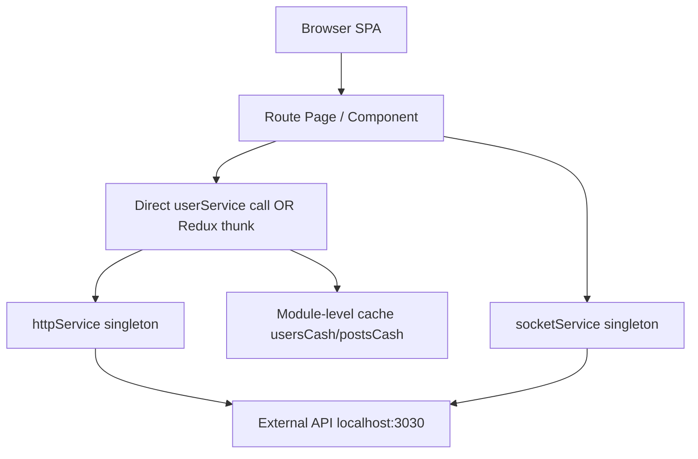
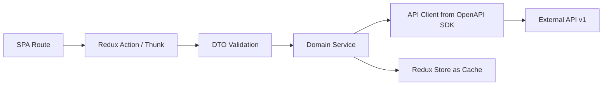
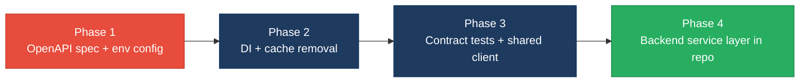

# 4. Backend Modernization Hotspots Analysis

**Objective:** Modernize backend architecture and coding practices; strengthen API & integration governance.

**Date:** July 16, 2026 | **Scope:** `target/` — No server-side backend in workspace; client API consumers (React 18 + Axios 0.27/1.7, Socket.io-client 4.5) targeting external REST API at `localhost:3030/api/`

## Executive Summary

> **Executive Summary**
>
> TARGET_WORKSPACE contains **zero server-side application source files** — only two React 18 SPAs (`social-media-react`, `workbench-demo`) that consume an external REST API assumed to run at `localhost:3030`. The client-side integration layer partially follows a service pattern (`httpService` → domain services → Redux thunks), but **module-level singletons with mutable caches**, **auto-initialized Socket.io wiring**, and **11 view-layer files bypassing the action tier** replicate backend anti-patterns on the client. API governance is absent: **14 distinct endpoint paths are hardcoded** across two apps with **no OpenAPI spec, versioning, or contract tests**. The most severe risks are **singleton/service-lifecycle abuse (H4)**, **missing API governance (H7)**, and **API contract sprawl across dual HTTP stacks (H6/H10)**.

<div class="metric-grid">
<div class="metric-card"><div class="metric-number">0</div><div class="metric-label">Controllers / Handlers Scanned</div></div>
<div class="metric-card"><div class="metric-number">1</div><div class="metric-label">Files Using Dynamic-Variable Patterns</div></div>
<div class="metric-card"><div class="metric-number">12</div><div class="metric-label">Service Classes Found</div></div>
<div class="metric-card"><div class="metric-number">14</div><div class="metric-label">API Endpoints Found</div></div>
</div>

<div class="overall-rating overall-rating--high-risk"><div class="overall-rating-label">Overall Codebase Rating — Backend Modernization</div><div class="overall-rating-value">High Risk</div><div class="overall-rating-note">Driven by High-Risk Static/Singleton Abuse (H4), API Sprawl (H6), Missing API Governance (H7), and Dual HTTP Client Stacks (H10).</div></div>

## 4.1 Benchmark Ratings Summary

| # | Hotspot | Primary KPI | <span class="rating rating-good">Good</span> | <span class="rating rating-moderate">Moderate</span> | <span class="rating rating-high-risk">High Risk</span> | Measured | Rating |
|---|---|---|---|---|---|---|---|
| H1 | Dynamic Variable Creation | Dynamic-var-from-input occurrences | 0 | 1–10 | >10 | 0 | <span class="rating rating-good">Good</span> |
| H2 | Global Mutable State | Globals / mutable static state | 0 | 1–5 | >5 | 5 | <span class="rating rating-moderate">Moderate</span> |
| H3 | Direct SQL Outside Data Layer | Data-layer compliance % | >90% | 60–90% | <60% | N/A — no persistence layer | <span class="rating rating-good">Good</span> |
| H4 | Static / Singleton Abuse | Business-logic static/singleton classes | 0 | 1–5 | >5 | 8 | <span class="rating rating-high-risk">High Risk</span> |
| H5 | Missing Service Layer | Handlers with inline business logic | <10 | 10–20 | >20 | 11 | <span class="rating rating-moderate">Moderate</span> |
| H6 | API Sprawl | Documented & governed endpoints % | >90% | 80–90% | <80% | 0% (0/14) | <span class="rating rating-high-risk">High Risk</span> |
| H7 | Missing API Governance | Governance compliance % | 100% | 90–99% | <90% | 0% | <span class="rating rating-high-risk">High Risk</span> |
| H8 | Hardcoded API Configuration (additional) | Distinct base-URL configuration patterns | 0 | 1–2 | >2 | 3 | <span class="rating rating-high-risk">High Risk</span> |
| H9 | Stale In-Memory Caches (additional) | Module-level caches without TTL/invalidation | 0 | 1–2 | >2 | 3 | <span class="rating rating-high-risk">High Risk</span> |
| H10 | Dual HTTP Client Stacks (additional) | Distinct HTTP client abstractions for same API | 1 | 2 | >2 | 2 | <span class="rating rating-moderate">Moderate</span> |

## 4.2 Hotspot-by-Hotspot Evidence

### H1. Dynamic Variable Creation <span class="sev sev-low">Low</span>

**Benchmark:** Dynamic-var-from-input occurrences = 0 → falls in the **Good** band (Good 0 · Moderate 1–10 · High Risk >10).

**Evidence:** Not observed — no server-side handlers exist, and no `extract()`-equivalent patterns (`Object.assign(this, req.body)`, `eval`, `new Function`) materialize fields from raw request bodies. The closest client-side pattern is dynamic storage-key assignment in `utilService.js`, but keys are explicit function parameters, not untrusted request payloads.

### H2. Global Mutable State <span class="sev sev-medium">Medium</span>

**Benchmark:** Globals / mutable static state = 5 → falls in the **Moderate** band (Good 0 · Moderate 1–5 · High Risk >5).

**Evidence:**

`target/social-media-react/src/services/user/userService.js:16-27` — module-level mutable cache shared across all callers:

```javascript
const usersCash = {}

async function getById(userId) {
  if (usersCash[userId]) return usersCash[userId]
  else {
    const user = await httpService.get(`user/${userId}`)
    usersCash[userId] = user
    return user
  }
}
```

`target/social-media-react/src/services/eventBusService.js:19-21` — service exported to a global window property:

```javascript
export const eventBusService = { on, emit };

window.myBus = eventBusService;
```

Three additional module-level caches exist in `postService.js:13` (`postsCash`), `activityService.js:11` (`activitiesCash`), and a mutable `socket` closure in `socket.service.js:12-15`. Total: **5 mutable global/static state holders**.

**Why it matters here:** Cached user/post/activity objects survive across route navigations and socket-driven updates without invalidation, so stale profile data and connection graphs can display after `updateUser` mutations elsewhere in the app.

**Recommended approach:** (1) Remove `usersCash`/`postsCash`/`activitiesCash` or move caching into Redux selectors with explicit invalidation on `updateUser`/`savePost` actions. (2) Delete `window.myBus` export; import `eventBusService` directly. (3) Scope `socketService` lifecycle to authenticated sessions in `Main.jsx` instead of module-load `setup()`.

<!-- affected-files
search: (usersCash|postsCash|activitiesCash|window\.myBus)
glob: target/social-media-react/src/**/*.{js,jsx}
issue: Module-level mutable cache or global window export
action: Replace with scoped state (Redux) or injectable per-session services with explicit invalidation
-->

### H3. Direct SQL / ORM Outside Data Layer <span class="sev sev-low">Low</span>

**Benchmark:** Data-layer compliance % = N/A → falls in the **Good** band (no persistence layer in repo).

**Evidence:** Not observed — TARGET_WORKSPACE contains no SQL, ORM, or server-side data-access code. Client persistence is limited to `sessionStorage`/`localStorage` via `userService.js` and a dormant `asyncStorageService.js` mock layer; all remote data flows through Axios `httpService`.

### H4. Static Methods & Singleton Abuse <span class="sev sev-critical">Critical</span>

**Benchmark:** Business-logic static/singleton classes = 8 → falls in the **High Risk** band (Good 0 · Moderate 1–5 · High Risk >5).

**Evidence:**

`target/social-media-react/src/services/socket.service.js:7-15` — singleton created and auto-initialized at module import:

```javascript
export const socketService = createSocketService()

socketService.setup()

function createSocketService() {
  var socket = null
  const socketService = {
    async setup() {
      socket = io(baseUrl)
    },
```

`target/social-media-react/src/services/httpService.js:6-23` — stateless HTTP gateway exported as a module singleton with no injection point:

```javascript
var axios = Axios.create({
  withCredentials: true,
})

export const httpService = {
  get(endpoint, data) {
    return ajax(endpoint, 'GET', data)
  },
  post(endpoint, data) {
    return ajax(endpoint, 'POST', data)
  },
```

Eight module-singleton service objects carry business workflows: `httpService`, `socketService`, `eventBusService`, `userService`, `postService`, `chatService`, `commentService`, `activityService`. Each is imported directly with no factory, lifecycle management, or test seam.

**Why it matters here:** `socketService.setup()` fires on every bundle load — before authentication — binding socket listeners in `Main.jsx` to a connection that cannot be mocked or torn down per user session, blocking dependency injection in tests and preventing per-tenant socket configuration.

**Recommended approach:** (1) Convert `socketService` to a factory `createSocketService(baseUrl)` called from `Main.jsx` after login. (2) Inject `httpService` into domain services via constructor/factory instead of direct imports. (3) Add a `services/index.js` composition root for test doubles.

<!-- affected-files
search: export const (httpService|socketService|eventBusService|userService|postService|chatService|commentService|activityService)
glob: target/social-media-react/src/services/**/*.{js,jsx}
issue: Module-singleton service with no injectable lifecycle
action: Introduce factory/DI composition root; defer socket setup to authenticated session
-->

### H5. Missing Service Layer <span class="sev sev-medium">Medium</span>

**Benchmark:** Handlers with inline business logic = 11 → falls in the **Moderate** band (Good <10 · Moderate 10–20 · High Risk >20).

**Evidence:**

`target/social-media-react/src/pages/Profile.jsx:44-99` — route handler implements connection-graph mutations inline instead of delegating to a service:

```javascript
const loadUser = async () => {
  const user = await userService.getById(params.userId)
  setUser(() => user)
}

const connectProfile = async () => {
  if (!user) return
  if (isConnected === true) {
    const connectionToRemve = JSON.parse(JSON.stringify(user))
    const loggedInUserToUpdate = JSON.parse(JSON.stringify(loggedInUser))
    loggedInUserToUpdate.connections =
      loggedInUserToUpdate.connections.filter(
        (connection) => connection.userId !== connectionToRemve._id
      )
    // ... dispatches updateUser twice
```

`target/social-media-react/src/pages/Message.jsx:22-143` — embedded `useChat` hook contains full chat workflow (existence check, entity creation, message send, activity logging):

```javascript
function useChat(loggedInUser, chats, params) {
  // ...
  const createChat = (userId) => {
    return {
      _id: utilService.makeId(7),
      userId,
      userId2: loggedInUser?._id,
      messages: [],
      createdAt: new Date().getTime(),
    }
  }
```

Eleven view files total call domain services directly, bypassing the Redux action layer: `Profile.jsx`, `Message.jsx`, `CommentPreview.jsx`, `PostPreview.jsx`, `ReplyPreview.jsx`, `LikePreview.jsx`, `ImgPreview.jsx`, `ThreadMsgPreview.jsx`, `NotificaitonPreview.jsx`, `MyConnectionPreview.jsx`, `PrivateRoute.jsx`.

**Why it matters here:** Connection mutations and chat orchestration logic cannot be reused from socket handlers, CLI tools, or background jobs — they are trapped in React components, duplicating the "fat controller" anti-pattern on the client entry-point layer.

**Recommended approach:** (1) Extract `connectProfile`/`disconnectProfile` into `connectionService.js`. (2) Move `useChat` workflow into `chatService.js` or `chatActions.js`. (3) Replace all 11 direct `userService.getById` calls with `dispatch(loadUserById(...))`.

<!-- affected-files
search: userService\.(getById|getUsers|login|update)
glob: target/social-media-react/src/{pages,cmps}/**/*.{jsx,js}
issue: View/handler layer bypasses Redux action/service tier
action: Route data access through action thunks and dedicated domain services
-->

### H6. API Sprawl <span class="sev sev-high">High</span>

**Benchmark:** Documented & governed endpoints % = 0% (0/14) → falls in the **High Risk** band (Good >90% · Moderate 80–90% · High Risk <80%).

**Evidence:**

`target/social-media-react/src/services/posts/postService.js:3-38` — REST paths embedded per domain module with no shared contract:

```javascript
const ENDPOINT = 'post'
// ...
return await httpService.get(ENDPOINT, filterBy)
return await httpService.get(ENDPOINT + '/length', filterBy)
return await httpService.get(`${ENDPOINT}/${id}`)
```

`target/workbench-demo/src/services/authService.ts:4-8` — separate app calls the same auth capability via a different base URL env var:

```typescript
export async function login(credentials: LoginRequest): Promise<LoginResponse> {
  const response = await axios.post<LoginResponse>(
    `${process.env.REACT_APP_API_BASE_URL}/auth/login`,
    credentials
  );
```

Fourteen unique endpoint paths are referenced (`user`, `user/:id`, `auth/login`, `auth/signup`, `auth/logout`, `post`, `post/:id`, `post/length`, `comment`, `comment/:id`, `chat`, `activity`, `activity/length`, `cloudinary/upload`) across two apps with inconsistent URL construction and zero machine-readable contract.

**Why it matters here:** When the external backend changes a path or payload shape, each service file must be updated independently with no contract test to catch regressions before deployment.

**Recommended approach:** (1) Publish an OpenAPI 3 spec for the `localhost:3030` API. (2) Generate typed client SDK from the spec. (3) Consolidate endpoint constants into a single `apiRoutes.js` module shared across both SPAs.

<!-- affected-files
search: httpService\.(get|post|put|delete)\(|axios\.post
glob: target/{social-media-react,workbench-demo}/src/**/*.{js,jsx,ts,tsx}
issue: Hardcoded API endpoint path with no shared contract
action: Centralize routes from generated OpenAPI client SDK
-->

### H7. Missing API Governance <span class="sev sev-critical">Critical</span>

**Benchmark:** Governance compliance % = 0% → falls in the **High Risk** band (Good 100% · Moderate 90–99% · High Risk <90%).

**Evidence:** Not observed — no `openapi.yaml`/`swagger.json`, no API versioning prefix (e.g. `/api/v1/`), no contract-test suite, and no API linting configuration anywhere under `target/` (excluding `node_modules`). Both SPAs integrate against undocumented runtime behavior at `localhost:3030`.

**Why it matters here:** Without a published contract, the two frontend apps and the external backend can silently diverge — `workbench-demo` uses Axios 1.7 with `REACT_APP_API_BASE_URL` while `social-media-react` uses Axios 0.27 with hardcoded `//localhost:3030/api/`, multiplying integration failure modes.

**Recommended approach:** (1) Add `docs/openapi.yaml` describing all 14 endpoints. (2) Introduce Pact or OpenAPI-diff contract tests in CI. (3) Add Spectral or Redocly lint rules for breaking-change detection.

### H8. Hardcoded API Configuration (additional) <span class="sev sev-high">High</span>

**Benchmark:** Distinct base-URL configuration patterns = 3 → falls in the **High Risk** band (Good 0 · Moderate 1–2 · High Risk >2).

**Evidence:**

`target/social-media-react/src/services/httpService.js:3-4`:

```javascript
const BASE_URL =
  process.env.NODE_ENV === 'production' ? '/api/' : '//localhost:3030/api/'
```

`target/social-media-react/src/services/socket.service.js:6`:

```javascript
const baseUrl = process.env.NODE_ENV === 'production' ? '' : '//localhost:3030'
```

`target/workbench-demo/src/services/authService.ts:6`:

```typescript
`${process.env.REACT_APP_API_BASE_URL}/auth/login`
```

Three incompatible configuration strategies (hardcoded host, protocol-relative URL, env-var base) prevent environment-consistent deployment.

**Why it matters here:** Production builds of `social-media-react` assume `/api/` reverse-proxy routing while `workbench-demo` requires `REACT_APP_API_BASE_URL` — a single deployment target cannot serve both without custom proxy rules per app.

**Recommended approach:** (1) Standardize on `REACT_APP_API_BASE_URL` in both apps. (2) Remove hardcoded `localhost:3030` literals. (3) Document required env vars in a shared `.env.example`.

<!-- affected-files
search: localhost:3030|REACT_APP_API_BASE_URL|BASE_URL
glob: target/{social-media-react,workbench-demo}/src/**/*.{js,jsx,ts,tsx}
issue: Inconsistent API base URL configuration
action: Standardize on REACT_APP_API_BASE_URL env var across all clients
-->

### H9. Stale In-Memory Caches (additional) <span class="sev sev-high">High</span>

**Benchmark:** Module-level caches without TTL/invalidation = 3 → falls in the **High Risk** band (Good 0 · Moderate 1–2 · High Risk >2).

**Evidence:**

`target/social-media-react/src/services/posts/postService.js:13-28` — cache never invalidated on `save` or `remove`:

```javascript
const postsCash = {}

async function getById(id) {
  if (postsCash[id]) return postsCash[id]
  else {
    const post = await httpService.get(`${ENDPOINT}/${id}`)
    postsCash[id] = post
    return post
  }
}
```

Identical patterns in `userService.js:16` (`usersCash`) and `activityService.js:11` (`activitiesCash`). None of the `save`/`update`/`remove` functions clear corresponding cache entries.

**Why it matters here:** After a socket-driven `update-post` event refreshes Redux state, any component calling `postService.getById` receives a stale cached object, causing UI inconsistency between real-time and cached data paths.

**Recommended approach:** (1) Invalidate cache entries in `save`/`remove` methods. (2) Prefer Redux store as single source of truth and remove service-level caches entirely.

<!-- affected-files
search: (usersCash|postsCash|activitiesCash)
glob: target/social-media-react/src/services/**/*.js
issue: Module-level cache without invalidation on mutation
action: Invalidate or remove caches; use Redux selectors as single source of truth
-->

### H10. Dual HTTP Client Stacks (additional) <span class="sev sev-medium">Medium</span>

**Benchmark:** Distinct HTTP client abstractions = 2 → falls in the **Moderate** band (Good 1 · Moderate 2 · High Risk >2).

**Evidence:**

`target/social-media-react/src/services/httpService.js:1-39` — custom Axios wrapper with credentials, query-param mapping, and error logging.

`target/workbench-demo/src/services/authService.ts:1-10` — raw Axios import with no shared interceptor, credential policy, or error normalization.

**Why it matters here:** Authentication error handling differs between apps (`LoginPage.tsx` checks `axios.isAxiosError` while `httpService` only `console.dir`s and re-throws), so 401/403 behavior is inconsistent across the same API surface.

**Recommended approach:** (1) Extract shared `httpService` into a `packages/api-client` workspace module. (2) Migrate `workbench-demo` to use the shared wrapper. (3) Align Axios versions (0.27 vs 1.7).

<!-- affected-files
search: import.*[Aa]xios|from 'axios'
glob: target/{social-media-react,workbench-demo}/src/**/*.{js,jsx,ts,tsx}
issue: Separate HTTP client abstraction for same API
action: Consolidate into shared api-client package with unified interceptors
-->

## 4.3 API & Integration Governance Evidence

### H6. API Sprawl <span class="sev sev-high">High</span>

See §4.2 H6 evidence above. Fourteen endpoint paths are consumed across two SPAs with no unified contract registry. Socket events (`add-post`, `update-chat`, `add-connected-users`, etc.) in `Main.jsx:111-120` add a parallel undocumented real-time API surface with no schema.

### H7. Missing API Governance <span class="sev sev-critical">Critical</span>

See §4.2 H7 evidence above. Zero governance artifacts detected: no OpenAPI spec, no `/v1/` versioning, no contract tests, no API lint configuration. Both apps depend on reverse-engineering the external backend at runtime.

## 4.4 Diagrams

### Current backend request path



### Modernized service-layer target



### Improvement roadmap



## 4.5 Actions Required

| Hotspot | Action | Rating | Priority |
|---|---|---|---|
| H4 Static / Singleton Abuse | Convert 8 module singletons to factory-injected services; defer `socketService.setup()` until post-login; add composition root for tests | <span class="rating rating-high-risk">High Risk</span> | <span class="sev sev-critical">Critical</span> |
| H7 Missing API Governance | Publish OpenAPI 3 spec for all 14 REST endpoints + socket events; add Spectral lint and contract tests in CI | <span class="rating rating-high-risk">High Risk</span> | <span class="sev sev-critical">Critical</span> |
| H6 API Sprawl | Generate typed SDK from OpenAPI; centralize endpoint constants; align `workbench-demo` auth path with `social-media-react` | <span class="rating rating-high-risk">High Risk</span> | <span class="sev sev-high">High</span> |
| H8 Hardcoded API Configuration | Standardize both SPAs on `REACT_APP_API_BASE_URL`; remove all `localhost:3030` literals | <span class="rating rating-high-risk">High Risk</span> | <span class="sev sev-high">High</span> |
| H9 Stale In-Memory Caches | Remove `usersCash`/`postsCash`/`activitiesCash` or add invalidation on every mutation | <span class="rating rating-high-risk">High Risk</span> | <span class="sev sev-high">High</span> |
| H2 Global Mutable State | Eliminate `window.myBus`; scope socket and cache state to authenticated session lifecycle | <span class="rating rating-moderate">Moderate</span> | <span class="sev sev-medium">Medium</span> |
| H5 Missing Service Layer | Extract `useChat` and `connectProfile` workflows into `chatService`/`connectionService`; route 11 view files through Redux actions | <span class="rating rating-moderate">Moderate</span> | <span class="sev sev-medium">Medium</span> |
| H10 Dual HTTP Client Stacks | Extract shared `httpService` package; migrate `workbench-demo` off raw Axios; align Axios versions | <span class="rating rating-moderate">Moderate</span> | <span class="sev sev-medium">Medium</span> |

## 4.6 Expected Outcomes

- Publishing an OpenAPI spec and contract tests prevents silent breaking changes between the external backend and both React SPAs.
- Replacing module singletons with injectable services enables unit testing of chat, connection, and auth workflows without live socket connections.
- Removing stale in-memory caches and routing all data access through Redux actions eliminates UI inconsistencies between socket-driven and HTTP-fetched state.
- Standardizing API base URL configuration allows both SPAs to deploy against the same reverse-proxy target without per-app proxy exceptions.
- Extracting fat-handler logic from `Profile.jsx` and `Message.jsx` into domain services prepares the codebase for a future checked-in backend service layer.
