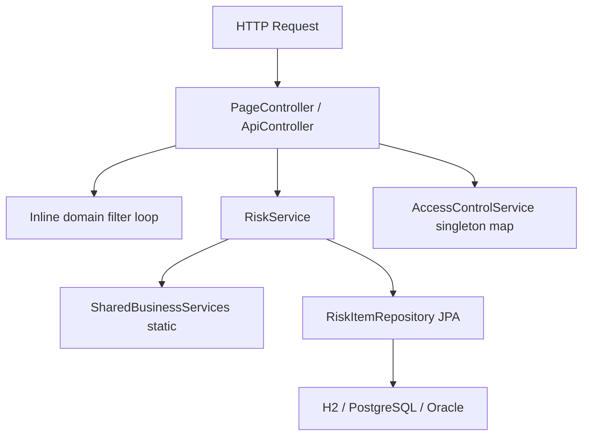
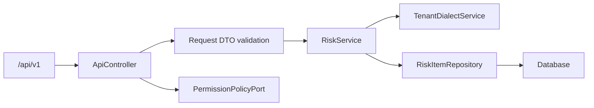
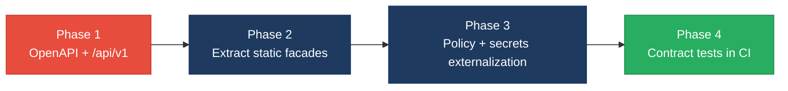

# 4. Backend Modernization Hotspots Analysis

**Objective:** Modernize backend architecture and coding practices; strengthen API & integration governance.

**Date:** Friday, July 17, 2026 | **Scope:** `global-hr-modernization` (glmarvel29-ai/global-hr-modernization) — Java 8 / Spring Boot 2.7.18 / Spring MVC / Spring Data JPA

## Executive Summary

> **Executive Summary**
>
> The **ERM Complexity Demo** backend is a compact Spring Boot 2.7.18 monolith (17 Java source files, &lt;5K LOC) with a deliberate legacy-debt surface: static shared-business facades, duplicated controller logic, and dual Oracle/PostgreSQL dialect routing. Layering is partially sound—JPA access is confined to `RiskService` and `DemoDataLoader`, and controllers inject services rather than repositories—but modernization gaps remain in API governance and static coupling. Eight read-only REST endpoints under `/api` serve AngularJS panels with **no OpenAPI spec, no versioning, and no contract tests** (0% governance compliance). Dynamic-variable-from-input patterns were not observed; however, `SharedBusinessServices` static methods, a Spring singleton holding mutable RBAC state, N+1 repository calls in domain aggregation, and plaintext database passwords in profile properties require remediation before production hardening.

<div class="metric-grid">
<div class="metric-card"><div class="metric-number">2</div><div class="metric-label">Controllers / Handlers Scanned</div></div>
<div class="metric-card"><div class="metric-number">0</div><div class="metric-label">Files Using Dynamic-Variable Patterns</div></div>
<div class="metric-card"><div class="metric-number">4</div><div class="metric-label">Service Classes Found</div></div>
<div class="metric-card"><div class="metric-number">8</div><div class="metric-label">API Endpoints Found</div></div>
</div>

<div class="overall-rating overall-rating--high-risk"><div class="overall-rating-label">Overall Codebase Rating — Backend Modernization</div><div class="overall-rating-value">High Risk</div><div class="overall-rating-note">Driven by H6 (0% documented/governed REST surface) and H7 (0% API governance compliance: no OpenAPI, versioning, or contract tests).</div></div>

## 4.1 Benchmark Ratings Summary

| # | Hotspot | Primary KPI | <span class="rating rating-good">Good</span> | <span class="rating rating-moderate">Moderate</span> | <span class="rating rating-high-risk">High Risk</span> | Measured | Rating |
|---|---|---|---|---|---|---|---|
| H1 | Dynamic Variable Creation | Dynamic-var-from-input occurrences | 0 | 1–10 | >10 | 0 | <span class="rating rating-good">Good</span> |
| H2 | Global Mutable State | Globals / mutable static state | 0 | 1–5 | >5 | 1 | <span class="rating rating-moderate">Moderate</span> |
| H3 | Direct SQL Outside Data Layer | Data-layer compliance % | >90% | 60–90% | <60% | 100% | <span class="rating rating-good">Good</span> |
| H4 | Static / Singleton Abuse | Business-logic static/singleton classes | 0 | 1–5 | >5 | 1 | <span class="rating rating-moderate">Moderate</span> |
| H5 | Missing Service Layer | Handlers with inline business logic | <10 | 10–20 | >20 | 2 | <span class="rating rating-good">Good</span> |
| H6 | API Sprawl | Documented & governed endpoints % | >90% | 80–90% | <80% | 0% | <span class="rating rating-high-risk">High Risk</span> |
| H7 | Missing API Governance | Governance compliance % | 100% | 90–99% | <90% | 0% | <span class="rating rating-high-risk">High Risk</span> |
| H8 | N+1 Repository Calls (additional) | Service methods with per-item repository loops | 0 | 1–2 | >2 | 1 | <span class="rating rating-moderate">Moderate</span> |
| H9 | Hardcoded Credentials (additional) | Plaintext secrets in committed config files | 0 | 1–5 | >5 | 2 | <span class="rating rating-moderate">Moderate</span> |

**No additional hotspots beyond H8–H9 were observed.**

## 4.2 Hotspot-by-Hotspot Evidence

### H1. Dynamic Variable Creation <span class="sev sev-low">Low</span>

**Benchmark:** `Dynamic-var-from-input occurrences = 0` → falls in the **Good** band (Good 0 · Moderate 1–10 · High Risk >10).

**Evidence:** Not observed — no `BeanUtils.populate`, `extract()`-equivalent reflection binding, untyped `@RequestBody Map`, or dynamic property assignment from request input in Java controllers or AngularJS client code.

### H2. Global Mutable State <span class="sev sev-medium">Medium</span>

**Benchmark:** `Globals / mutable static state holding business data = 1` → falls in the **Moderate** band (Good 0 · Moderate 1–5 · High Risk >5).

`AccessControlService` is a Spring `@Component` (default singleton scope) that holds a mutable `HashMap<String, Set<String>> rolePermissions` populated in the constructor with RBAC matrices. This business authorization state lives in a process-wide singleton rather than an external policy store, creating hidden coupling and complicating per-tenant testing.

**Example 1** — `src/main/java/com/erm/legacy/security/AccessControlService.java:22–32`

```java
private final Map<String, Set<String>> rolePermissions = new HashMap<String, Set<String>>();

public AccessControlService() {
    rolePermissions.put("RISK_ADMIN", new HashSet<String>(Arrays.asList(
            "RISK_READ", "RISK_WRITE", "AUDIT_READ", "VENDOR_ASSESS", "COMPLIANCE_READ")));
    // ... additional roles ...
}
```

**Why it matters here:** In a multi-region ERM estate simulating RiskGuard/VendorSight RBAC overlap, a mutable in-memory singleton prevents hot-reloading policy changes, risks stale permissions across rolling deploys, and cannot be isolated in parallel integration tests without Spring context resets.

**Recommended approach:**
1. Extract RBAC/ABAC rules into immutable configuration loaded at startup (`@ConfigurationProperties`) or an external policy service.
2. Make `AccessControlService` depend on a `PermissionPolicyPort` interface for test doubles.
3. Mark role maps `Collections.unmodifiableMap` after initialization to prevent accidental mutation at runtime.

<!-- affected-files
search: rolePermissions\s*=\s*new\s+HashMap
glob: src/main/java/**/*.java
issue: Mutable singleton RBAC state in Spring component
action: Externalize to immutable config or policy service; inject via interface
-->

### H3. Direct SQL / ORM Outside Data Layer <span class="sev sev-low">Low</span>

**Benchmark:** `Data-layer compliance % = 100%` → falls in the **Good** band (Good >90% · Moderate 60–90% · High Risk <60%).

Both HTTP handlers (`ApiController`, `PageController`) delegate all persistence to injected services. `RiskItemRepository` (Spring Data JPA) is accessed only from `RiskService` and the bootstrap `DemoDataLoader`—not from controllers. No raw SQL, `@Query`, `JdbcTemplate`, or `EntityManager` usage was found outside the repository interface.

**Example 1** — `src/main/java/com/erm/legacy/controller/ApiController.java:51–54`

```java
@GetMapping("/risks")
public List<RiskItem> risks(@RequestParam(value = "domain", required = false) String domain) {
    if (domain == null || domain.trim().isEmpty()) {
        return riskService.findAll();
```

**Example 2** — `src/main/java/com/erm/legacy/service/RiskService.java:28–30`

```java
@Transactional(readOnly = true)
public List<RiskItem> findAll() {
    return repository.findAll();
```

**Why it matters here:** Keeping JPA behind `RiskService` preserves a single transaction boundary and allows dialect-specific query optimization (Oracle vs PostgreSQL) without leaking persistence details into JSP/REST handlers.

**Recommended approach:** Maintain current layering; add a dedicated `RiskQueryRepository` if custom `@Query` methods are introduced for production-scale register searches.

### H4. Static Methods & Singleton Abuse <span class="sev sev-medium">Medium</span>

**Benchmark:** `Business-logic static/singleton classes = 1` → falls in the **Moderate** band (Good 0 · Moderate 1–5 · High Risk >5).

`SharedBusinessServices` is an intentional legacy facade with static business methods (`resolveTenantDialect`, `composeLegacyRiskKey`) called from `RiskService` and `DemoDataLoader`. This mirrors the production "shared business services jar" anti-pattern documented in `LegacyDebtCatalog`.

**Example 1** — `src/main/java/com/erm/legacy/legacy/SharedBusinessServices.java:14–24`

```java
public static String resolveTenantDialect(String region) {
    if (region != null && region.toUpperCase().startsWith("EU")) {
        return "POSTGRESQL";
    }
    return "ORACLE";
}

public static String composeLegacyRiskKey(String productPrefix, String numericId) {
    return productPrefix + "-" + numericId;
}
```

**Example 2** — `src/main/java/com/erm/legacy/service/RiskService.java:67–68`

```java
public String dialectForRegion(String region) {
    return SharedBusinessServices.resolveTenantDialect(region);
}
```

**Why it matters here:** Static facades block dependency injection, prevent mocking in unit tests, and encode multi-cloud dialect routing that should be a configurable `TenantDialectResolver` bean per region deployment profile.

**Recommended approach:**
1. Convert `SharedBusinessServices` to an injectable `@Service TenantDialectService` and `RiskIdComposer`.
2. Wire implementations via Spring profiles (`postgres`, `oracle`) instead of hard-coded region prefixes.
3. Deprecate the static facade after migrating callers in `RiskService` and `DemoDataLoader`.

<!-- affected-files
search: SharedBusinessServices\.
glob: src/main/java/**/*.java
issue: Static shared-business facade calls
action: Replace with injectable TenantDialectService and RiskIdComposer beans
-->

### H5. Missing Service Layer <span class="sev sev-low">Low</span>

**Benchmark:** `Handlers with inline business logic = 2` → falls in the **Good** band (Good <10 · Moderate 10–20 · High Risk >20).

Domain-code resolution logic is duplicated inline in both controllers instead of a shared `RiskService.findByDomainCode(String)` method. This is a maintainability smell but affects only 2 of 2 handlers (&lt;10 threshold).

**Example 1** — `src/main/java/com/erm/legacy/controller/PageController.java:50–66`

```java
if (domainCode != null && domainCode.trim().length() > 0) {
    RiskDomain selected = null;
    for (RiskDomain d : RiskDomain.values()) {
        if (d.getCode().equalsIgnoreCase(domainCode) || d.name().equalsIgnoreCase(domainCode)) {
            selected = d;
            break;
        }
    }
    if (selected != null) {
        model.addAttribute("risks", riskService.findByDomain(selected));
```

**Example 2** — `src/main/java/com/erm/legacy/controller/ApiController.java:52–61`

```java
if (domain == null || domain.trim().isEmpty()) {
    return riskService.findAll();
}
for (RiskDomain d : RiskDomain.values()) {
    if (d.getCode().equalsIgnoreCase(domain) || d.name().equalsIgnoreCase(domain)) {
        return riskService.findByDomain(d);
    }
}
return riskService.findAll();
```

**Why it matters here:** Duplicated enum-matching logic between MVC and REST entry points will diverge when acquired-product domain codes (`RG`/`AP`/`VS`) gain aliases—exactly the integration sprawl the demo models.

**Recommended approach:**
1. Add `RiskService.findByDomainCode(String code)` encapsulating the enum loop and fallback.
2. Replace inline loops in `PageController.risks()` and `ApiController.risks()` with the new service method.
3. Add unit tests for unknown/blank domain codes at the service tier.

<!-- affected-files
search: for\s*\(\s*RiskDomain\s+d\s*:\s*RiskDomain\.values\(\)
glob: src/main/java/com/erm/legacy/controller/**/*.java
issue: Duplicated domain-resolution loop in controllers
action: Move to RiskService.findByDomainCode(String) and delegate from both handlers
-->

### H6. API Sprawl <span class="sev sev-high">High</span>

**Benchmark:** `Documented & governed endpoints % = 0%` → falls in the **High Risk** band (Good >90% · Moderate 80–90% · High Risk <80%).

Eight GET endpoints exist under `/api` with no machine-readable contract. Risk data is exposed twice: server-rendered via `PageController` JSP views and again via JSON REST (`/api/risks`, `/risks?domain=`). No endpoint registry, naming convention doc, or deduplication strategy is present.

**Example 1** — REST surface — `src/main/java/com/erm/legacy/controller/ApiController.java:25–92`

```java
@RestController
@RequestMapping("/api")
public class ApiController {
    @GetMapping("/health")
    @GetMapping("/risks")
    @GetMapping("/domains")
    // ... six additional GET mappings ...
```

**Example 2** — Overlapping MVC route — `src/main/java/com/erm/legacy/controller/PageController.java:45–67`

```java
@GetMapping("/risks")
public String risks(@RequestParam(value = "domain", required = false) String domainCode, Model model) {
    // ... same domain filter, HTML response instead of JSON ...
```

**Why it matters here:** Production context cites 4,500+ APIs across acquired products; even this demo's dual HTML/JSON risk paths foreshadow consumer confusion and undocumented behavioral drift between JSP and AngularJS clients.

**Recommended approach:**
1. Consolidate risk reads behind `/api/v1/risks` with content negotiation or a single JSON-first API.
2. Generate OpenAPI 3.0 from Springdoc for all eight endpoints.
3. Document deprecated MVC data routes and migrate AngularJS `$http` calls to versioned paths.

<!-- affected-files
search: @GetMapping\(
glob: src/main/java/com/erm/legacy/controller/ApiController.java
issue: Undocumented REST endpoints without version prefix
action: Introduce /api/v1 namespace and publish OpenAPI spec
-->

### H7. Missing API Governance <span class="sev sev-critical">Critical</span>

**Benchmark:** `Governance compliance % = 0%` → falls in the **High Risk** band (Good 100% · Moderate 90–99% · High Risk <90%).

No OpenAPI/Swagger artifact, no `/api/v1` versioning, and no contract or integration tests for REST responses were found in the repository (`pom.xml` lacks springdoc; no `openapi.yaml`; no `@WebMvcTest` for `ApiController`).

**Example 1** — `pom.xml:1–80` — dependencies include `spring-boot-starter-web` and JPA only; no API documentation or contract-test libraries.

**Example 2** — `src/main/resources/static/js/erm-app.js:15–20` — AngularJS client hard-codes unversioned paths with no schema validation:

```javascript
$http.get('/api/health').then(function (res) {
    vm.health = res.data;
});
$http.get('/api/risks').then(function (res) {
    vm.risks = res.data;
});
```

**Why it matters here:** AngularJS panels assume response shapes (`severity`, `riskId`) with no contract enforcement—breaking field renames in `RiskItem` would silently corrupt the UI, matching real ERM integration fragility.

**Recommended approach:**
1. Add `springdoc-openapi-ui` and publish `/v3/api-docs`.
2. Introduce `/api/v1/` prefix with `@RequestMapping("/api/v1")`.
3. Add Spring MockMvc contract tests asserting JSON schema for `/risks` and `/health`.
4. Wire CI to fail on undocumented new `@GetMapping` methods.

<!-- affected-files
glob: src/main/java/com/erm/legacy/controller/ApiController.java
issue: No OpenAPI spec, API versioning, or contract tests
action: Add springdoc, /api/v1 prefix, and MockMvc contract tests in CI
-->

### H8. N+1 Repository Calls (additional) <span class="sev sev-medium">Medium</span>

**Benchmark:** `Service methods with per-item repository loops = 1` → falls in the **Moderate** band (Good 0 · Moderate 1–2 · High Risk >2).

`RiskService.countsByDomain()` iterates all nine `RiskDomain` enum values and issues a separate `repository.findByDomain(domain)` call per iteration, then counts results in memory—an N+1 read pattern that will degrade as the risk register grows.

**Example 1** — `src/main/java/com/erm/legacy/service/RiskService.java:39–44`

```java
public Map<String, Long> countsByDomain() {
    Map<String, Long> counts = new HashMap<String, Long>();
    for (RiskDomain domain : RiskDomain.values()) {
        counts.put(domain.getLabel(), (long) repository.findByDomain(domain).size());
    }
    return counts;
}
```

**Why it matters here:** The dashboard and `/api/domain-counts` endpoint call this method on every page load; with production-scale registers (8,000+ tables cited in demo metadata), nine full-table scans per request become a latency bottleneck.

**Recommended approach:**
1. Add `@Query("SELECT r.domain, COUNT(r) FROM RiskItem r GROUP BY r.domain")` on `RiskItemRepository`.
2. Replace the loop in `countsByDomain()` with a single aggregated query.
3. Add a cache layer (`@Cacheable`) if counts are read-heavy and eventually consistent.

<!-- affected-files
search: for\s*\(\s*RiskDomain\s+domain\s*:\s*RiskDomain\.values\(\)
glob: src/main/java/com/erm/legacy/service/**/*.java
issue: N+1 repository calls in domain count aggregation
action: Replace loop with GROUP BY repository query
-->

### H9. Hardcoded Credentials (additional) <span class="sev sev-high">High</span>

**Benchmark:** `Plaintext secrets in committed config files = 2` → falls in the **Moderate** band (Good 0 · Moderate 1–5 · High Risk >5).

Database passwords are committed in Spring profile property files for PostgreSQL and Oracle deployments rather than injected from a secrets manager or environment variables.

**Example 1** — `src/main/resources/application-postgres.properties:6`

```properties
spring.datasource.password=erm
```

**Example 2** — `src/main/resources/application-oracle.properties:6`

```properties
spring.datasource.password=erm
```

**Why it matters here:** Even demo credentials in source control normalize unsafe practices for a platform handling enterprise risk and compliance data across multi-cloud Oracle/PostgreSQL estates.

**Recommended approach:**
1. Replace inline passwords with `${ERM_DB_PASSWORD}` environment variable references.
2. Document required secrets in README without embedding values.
3. Add a `.gitignore` check or pre-commit hook blocking `spring.datasource.password=` literals in committed files.

<!-- affected-files
search: spring\.datasource\.password=
glob: src/main/resources/application*.properties
issue: Plaintext database password in committed config
action: Externalize to environment variables or secrets manager
-->

## 4.3 API & Integration Governance Evidence

API surface **is present** (8 REST GET endpoints + 5 MVC page routes). Governance artifacts are **absent**:

| Governance control | Status | Evidence |
|---|---|---|
| OpenAPI / Swagger spec | Missing | No `openapi.yaml`, no springdoc dependency in `pom.xml` |
| API versioning | Missing | Routes use bare `/api/*` without version segment |
| Contract / integration tests | Missing | No tests under `src/test` for `ApiController` |
| Duplicate capability paths | Present | `/risks` (HTML) vs `/api/risks` (JSON) with shared filter logic |

Integration hub (`IntegrationHub`) is a `@Component` returning hard-coded connector stubs—acceptable for demo scope but not governed by external integration contracts.

## 4.4 Diagrams

### Current backend request path



### Modernized service-layer target



### Improvement roadmap



## 4.5 Actions Required

| Hotspot | Action | Rating | Priority |
|---|---|---|---|
| H6 API Sprawl | Consolidate risk reads under versioned `/api/v1/risks`; deprecate duplicate MVC JSON paths; publish OpenAPI listing all 8 endpoints | <span class="rating rating-high-risk">High Risk</span> | <span class="sev sev-high">High</span> |
| H7 Missing API Governance | Add springdoc-openapi, `/api/v1` prefix on `ApiController`, and MockMvc contract tests for `/health` and `/risks` response shapes | <span class="rating rating-high-risk">High Risk</span> | <span class="sev sev-critical">Critical</span> |
| H2 Global Mutable State | Externalize `AccessControlService` RBAC matrix to immutable `@ConfigurationProperties` or policy service; inject via `PermissionPolicyPort` | <span class="rating rating-moderate">Moderate</span> | <span class="sev sev-medium">Medium</span> |
| H4 Static / Singleton Abuse | Replace `SharedBusinessServices` static methods with injectable `TenantDialectService` and `RiskIdComposer` beans | <span class="rating rating-moderate">Moderate</span> | <span class="sev sev-medium">Medium</span> |
| H8 N+1 Repository Calls | Refactor `RiskService.countsByDomain()` to a single `@Query` GROUP BY or `countByDomain` repository method | <span class="rating rating-moderate">Moderate</span> | <span class="sev sev-medium">Medium</span> |
| H9 Hardcoded Credentials | Move Postgres/Oracle passwords from `application-*.properties` to environment variables or Spring Cloud Config | <span class="rating rating-moderate">Moderate</span> | <span class="sev sev-high">High</span> |

## 4.6 Expected Outcomes

- OpenAPI-backed `/api/v1` endpoints give AngularJS and future consumers a stable, versioned contract and prevent silent breaking changes to `RiskItem` JSON shapes.
- Extracting `SharedBusinessServices` into injectable services enables per-region dialect routing via Spring profiles and unit-test isolation without static coupling.
- Externalizing RBAC policy and database credentials removes mutable singleton state and plaintext secrets from committed configuration.
- A single `RiskService.findByDomainCode()` eliminates duplicated controller logic and reduces API sprawl between MVC and REST entry points.
- Replacing N+1 domain count queries with aggregated repository methods improves dashboard load time as the risk register scales beyond demo seed data.
