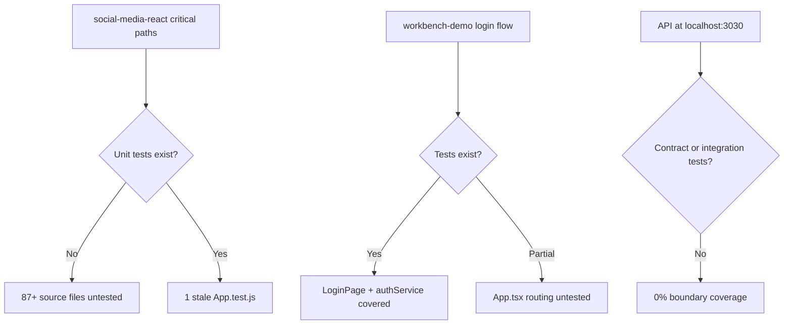
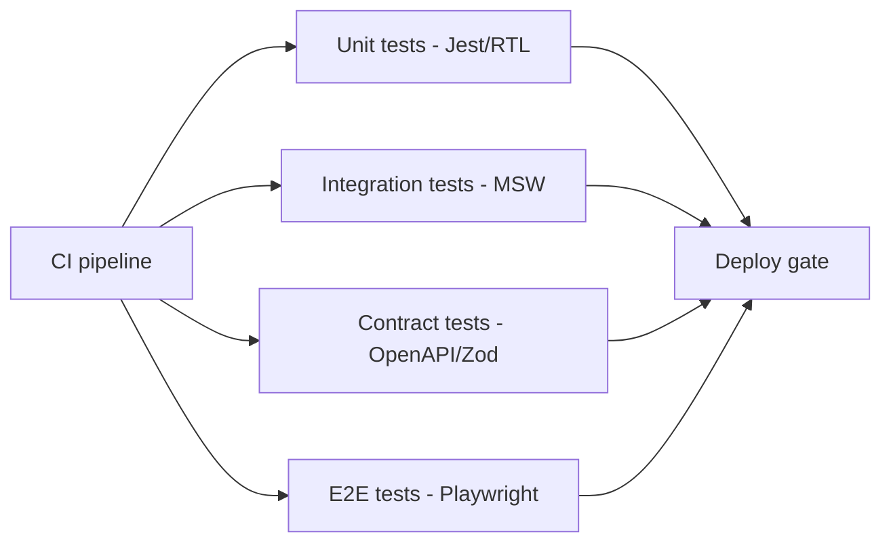
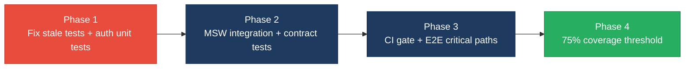

# 5. Testing & Quality Assurance Hotspots Analysis

**Objective:** Improve test coverage and software quality by generating unit, integration, and contract tests where missing.

**Date:** July 16, 2026 | **Scope:** `target/` — Jest + React Testing Library (Create React App / `react-scripts test`)

## Executive Summary

> **Executive Summary**
>
> The target workspace contains two React frontends (`social-media-react` and `workbench-demo`) with no in-repo backend source; API calls target an external service at `localhost:3030/api/`. **Frontend (workbench-demo):** measured line coverage is **81%** (from `workbench-demo/coverage/coverage-final.json`), concentrated on `LoginPage` and `authService` unit tests. **Frontend (social-media-react):** estimated coverage is **~1%** (1 boilerplate test file against 88 source files); auth, routing, Redux, HTTP, and socket layers are untested. **Backend:** not applicable — no server-side source in this workspace. No integration, contract, or E2E tests exist; the sole `App.test.js` asserts removed CRA scaffold text and would fail against the current app. No CI workflow runs tests on commits. Overall testing posture is **High Risk**, driven by untested critical auth/social flows, sub-50% workspace coverage, zero boundary/contract/E2E coverage, and absent CI gates.

3

Test Files Found

91

Source Files With No Matching Test

~8%

Measured/Estimated Coverage

0

Skipped/Disabled Tests

Overall Codebase Rating — Testing &amp; Quality Assurance

High Risk

Driven by H1 untested critical auth/social modules (&gt;3), H2 sub-50% workspace coverage, H3/H4 zero integration and contract tests, H6 no CI gate, and H7 no E2E coverage.

## 5.1 Benchmark Ratings Summary

| # | Hotspot | Primary KPI | Good | Moderate | High Risk | Measured | Rating |
|---|---|---|---|---|---|---|---|
| H1 | Untested Critical Logic | Critical modules with zero tests | 0 | 1–3 | >3 | 7 critical modules | High Risk |
| H2 | Low Test Coverage | Overall coverage % | >80% | 50–80% | <50% | ~8% est. (workbench 81%, social-media ~1%) | High Risk |
| H3 | Missing Integration Tests | Boundaries covered % | >70% | 30–70% | <30% | 0% | High Risk |
| H4 | Missing Contract Tests | APIs with contract tests % | >80% | 40–80% | <40% | 0% (11 API client modules) | High Risk |
| H5 | Flaky / Skipped Tests | Skipped/flaky test count | 0 | 1–5 | >5 | 0 | Good |
| H6 | No CI Test Gate | Tests enforced in CI | Required gate | Runs, not required | No CI test run | No project CI workflow | High Risk |
| H7 | No E2E Tests (additional) | Critical user journeys with E2E specs | >70% | 30–70% | <30% | 0% (0 spec files) | High Risk |
| H8 | Stale / Broken Tests (additional) | Tests asserting removed or invalid UI | 0 | 1–2 | >2 | 1 broken scaffold test | Moderate |

## 5.2 Hotspot-by-Hotspot Evidence

### H1. Untested Critical Logic Critical

**Benchmark:** `Critical modules with zero tests = 7` → falls in the **High Risk** band (Good 0 · Moderate 1–3 · High Risk >3).

Seven business-critical modules in `social-media-react` have no corresponding test files, spanning authentication, authorization, HTTP transport, realtime messaging, and core state management. `workbench-demo` covers login UI and `authService` but leaves `App.tsx` routing shell untested.

**Example 1 — `userService.js`:** Handles `login`, `signup`, `logout`, session persistence (`sessionStorage`), and user CRUD via `httpService`. Zero test coverage; a regression in credential handling or session storage ships undetected.

**Example 2 — `PrivateRoute.jsx`:** Route guard that redirects unauthenticated users to `/signin` based on `userService.getLoggedinUser()`. Untested; a broken guard exposes protected `/main` routes or locks out valid sessions.

**Example 3 — `userReducer.js` + `socket.service.js`:** Redux reducer manages `LOGIN`, `SIGNUP`, `LOGOUT`, and connected-user state; socket service wires realtime `user-watch` / `user-updated` events. Neither file has tests; state corruption or missed socket events break feed and messaging silently.

Across the workspace, **7 critical modules** (11 service files + 9 store files + 12 pages + 45 components in `social-media-react`, minus the single scaffold test) remain without meaningful unit coverage.

**Why it matters here:** Authentication, protected routing, and realtime social features are the application's core value. Without tests, credential bugs, session leaks, and broken route guards reach production with no automated signal before user-facing regressions.

**Recommended approach:**
1. Add Jest unit tests for `userService.js` mocking `httpService` — assert `login` persists user to `sessionStorage` and `logout` clears it.
2. Add React Testing Library tests for `PrivateRoute.jsx` — render with mocked `getLoggedinUser` returning `null` vs a user object; assert redirect vs render.
3. Add reducer tests for `userReducer.js` covering `LOGIN`, `SIGNUP`, `LOGOUT` action types.
4. Extend `workbench-demo` with a shallow `App.tsx` routing smoke test.

<!-- affected-files
search: (login|signup|logout|getLoggedinUser|PrivateRoute|httpService|socket)
glob: social-media-react/src/**/*.{js,jsx}
issue: Critical auth/transport/realtime logic untested
action: Add Jest unit and RTL tests for auth, routing, HTTP, and socket modules
-->

### H2. Low Test Coverage Critical

**Benchmark:** `Overall coverage % = ~8% estimated (workbench-demo 81% measured, social-media-react ~1% file-ratio estimate)` → falls in the **High Risk** band (Good >80% · Moderate 50–80% · High Risk <50%).

**workbench-demo (measured):** `coverage/coverage-final.json` reports **81% statement coverage** (35/43 statements). `LoginPage.tsx` is well covered; `authService.ts` shows 0% in the report because tests mock axios at the module boundary rather than executing service statements under coverage instrumentation.

**social-media-react (estimated):** 88 source files (`*.js`/`*.jsx`) vs 1 test file (`App.test.js`) → **~1% file-ratio estimate**. No `coverage/` directory exists for this app.

**Workspace roll-up:** Weighted by source-file count: (88 × ~1% + 8 × 81%) / 96 ≈ **~8%** overall estimated coverage.

**Why it matters here:** The dominant application (`social-media-react`, ~92% of source files) is effectively untested. Refactors to pages, components, services, or Redux will not be caught by automation, and the measured 81% in the smaller demo app does not offset the primary app's gap.

**Recommended approach:**
1. Run `npm test -- --coverage --watchAll=false` in `social-media-react` to establish a baseline report.
2. Set a coverage threshold in `package.json` (`jest.coverageThreshold`) starting at 30%, ramping to 75%.
3. Prioritize coverage for `src/services/` and `src/store/` before presentational components.
4. Keep `workbench-demo` above 80% by adding `App.tsx` coverage.

<!-- affected-files
glob: social-media-react/src/**/*.{js,jsx}
issue: No coverage report; ~1% estimated file-ratio coverage
action: Establish Jest coverage baseline and raise thresholds toward 75%
-->

### H3. Missing Integration Tests High

**Benchmark:** `Key service/data boundaries covered by integration tests = 0%` → falls in the **High Risk** band (Good >70% · Moderate 30–70% · High Risk <30%).

All existing tests mock external boundaries. `workbench-demo/src/pages/__tests__/LoginPage.test.tsx` mocks `authService.login` via `jest.mock`; `authService.test.ts` mocks `axios.post`. No test exercises the full stack from UI → service → HTTP client → API response parsing.

In `social-media-react`, `httpService.js` configures Axios with `withCredentials: true` and environment-specific `BASE_URL` (`//localhost:3030/api/` in development). No test verifies request formation, error propagation, or credential cookie behavior against a test server or MSW handler.

**Example — `httpService.js`:** Central AJAX wrapper used by every service module. Untested integration between Axios instance config, URL construction, and error re-throw.

**Example — `postService.js` / `chatService.js`:** Domain services calling `httpService.get/post/put/delete` for posts and messaging. No tests verify endpoint paths or response handling.

**Why it matters here:** Unit tests with mocked dependencies can pass while wiring bugs (wrong base URL, missing credentials, malformed payloads) break production API calls. Integration tests at the HTTP boundary catch these failures.

**Recommended approach:**
1. Add [MSW](https://mswjs.io/) (Mock Service Worker) to `social-media-react` for in-process HTTP integration tests.
2. Write integration tests for `httpService` + `userService.login` verifying POST to `auth/login` with correct payload.
3. Add a `workbench-demo` integration test that uses MSW instead of mocking `authService` at the LoginPage level.
4. Optionally add a lightweight test server fixture for socket.io handshake validation.

<!-- affected-files
search: httpService\.(get|post|put|delete)|axios\.(get|post|put|delete)
glob: social-media-react/src/services/**/*.js
issue: HTTP service boundaries tested only via mocks; no integration coverage
action: Add MSW-based integration tests for API client and domain services
-->

### H4. Missing Contract Tests High

**Benchmark:** `Public APIs/contracts with contract tests = 0% (0 of 11 API client modules)` → falls in the **High Risk** band (Good >80% · Moderate 40–80% · High Risk <40%).

The frontend consumes a REST API at `/api/` with endpoints including `auth/login`, `auth/signup`, `auth/logout`, `user`, `user/:id`, and domain-specific routes in `postService`, `chatService`, `commentService`, and `activityService`. No schema validation, OpenAPI contract tests, or consumer-driven contract tests exist.

**Example — `userService.js`:** Expects `httpService.post('auth/login', userCred)` to return a user object persisted to session. No test validates response shape (`_id`, `username`, etc.).

**Example — `authService.ts` (workbench-demo):** Posts to `${REACT_APP_API_BASE_URL}/auth/login` expecting `{ token: string }`. Tests verify call shape but not response schema validation against a published contract.

**Why it matters here:** Backend API changes (field renames, status code changes, removed endpoints) will break the React clients without any automated contract signal, causing silent runtime failures in auth and social features.

**Recommended approach:**
1. Obtain or generate an OpenAPI spec for the `localhost:3030/api/` backend.
2. Add contract tests using `jest-openapi` or Zod schema validation on service response parsing.
3. Validate `LoginResponse` and user object shapes in `authService.test.ts` and `userService` tests.
4. Add CI contract-test step that fails on schema drift.

<!-- affected-files
search: httpService\.(get|post|put|delete)\(
glob: social-media-react/src/services/**/*.js
issue: API request/response contracts unvalidated
action: Add schema or OpenAPI contract tests for each public API endpoint
-->

### H5. Flaky / Skipped Tests Low

**Benchmark:** `Skipped/disabled/flaky test count = 0` → falls in the **Good** band (Good 0 · Moderate 1–5 · High Risk >5).

**Evidence:** Not observed — grep across `social-media-react` and `workbench-demo/src` found no `test.skip`, `describe.skip`, `xit`, `xdescribe`, or `@Disabled` annotations.

### H6. No CI Test Gate High

**Benchmark:** `Tests run automatically on every change = No CI test run` → falls in the **High Risk** band (Good Required gate · Moderate Runs, not required · High Risk No CI test run).

Neither `social-media-react` nor `workbench-demo` contains a project-level `.github/workflows/` directory. The only workflow files found are inside `node_modules` dependencies. `package.json` in both apps defines `"test": "react-scripts test"`, but this command is not invoked by any repository CI pipeline.

**Why it matters here:** Tests that developers run locally but CI never enforces provide false confidence. Regressions merge freely because no automated gate blocks PRs with failing or missing tests.

**Recommended approach:**
1. Add `.github/workflows/test.yml` running `npm test -- --watchAll=false --coverage` on push and PR.
2. Mark the workflow as a required status check in branch protection.
3. Upload coverage artifacts and fail the job below a minimum threshold (e.g., 50% initially).
4. Run tests for both `social-media-react` and `workbench-demo` in a matrix job.

<!-- affected-files
glob: social-media-react/package.json
issue: Test script exists but no CI workflow invokes it
action: Add GitHub Actions workflow with npm test as required PR gate
-->

<!-- affected-files
glob: workbench-demo/package.json
issue: Test script exists but no CI workflow invokes it
action: Add GitHub Actions workflow with npm test as required PR gate
-->

### H7. No E2E Tests (additional) High

**Benchmark:** `Critical user journeys with E2E specs = 0% (0 Playwright/Cypress spec files)` → falls in the **High Risk** band (Good >70% · Moderate 30–70% · High Risk <30%).

No Playwright, Cypress, or Selenium configuration or spec files exist anywhere under `target/`. Critical user journeys — signup/login, feed browsing, posting, messaging, connection management — have no end-to-end validation.

**Example — Signup/login flow:** `Signup.jsx` dispatches Redux `login`/`signup` actions and navigates to `/main/feed` on success. No E2E test verifies the full browser flow.

**Example — Protected route access:** `PrivateRoute` guards `/main/*` routes. No E2E test confirms unauthenticated redirect or authenticated access.

**Why it matters here:** Unit tests cannot catch routing misconfiguration, CSS/layout regressions, or cross-page state issues. E2E tests are the last line of defense for user-visible workflows before release.

**Recommended approach:**
1. Add Playwright to `social-media-react` with `npx playwright install`.
2. Write E2E specs for signup → login → feed navigation and unauthenticated redirect.
3. Run E2E in CI against a staging API or MSW-backed preview build.
4. Start with 3–5 critical-path specs before expanding coverage.

<!-- affected-files
glob: social-media-react/src/pages/**/*.{jsx,tsx}
issue: No E2E specs for critical user journeys
action: Add Playwright E2E tests for auth, feed, and messaging flows
-->

### H8. Stale / Broken Tests (additional) Medium

**Benchmark:** `Tests asserting removed or invalid UI = 1` → falls in the **Moderate** band (Good 0 · Moderate 1–2 · High Risk >2).

`social-media-react/src/App.test.js` is the default Create React App scaffold test. It asserts `screen.getByText(/learn react/i)` is in the document, but `App.js` renders a `HashRouter` with `Home`, `Main`, `Signup`, and `About` routes — no "learn react" text exists. This test would fail if executed, providing negative value and a false sense of coverage.

**Why it matters here:** A failing scaffold test either blocks CI (once added) or is never run, giving stakeholders an inflated test-file count with zero protective value.

**Recommended approach:**
1. Replace `App.test.js` with a meaningful smoke test wrapping `App` in `Provider` + `MemoryRouter` and asserting route rendering.
2. Remove references to removed CRA boilerplate text.
3. Verify the updated test passes with `npm test -- --watchAll=false`.

<!-- affected-files
glob: social-media-react/src/App.test.js
issue: Stale CRA scaffold test asserts removed UI text
action: Rewrite App.test.js to smoke-test current routing and Redux provider setup
-->

## 5.3 Diagrams

### Current test coverage gaps

### Target test pyramid / CI gate

### Improvement roadmap

## 5.4 Actions Required

| Hotspot | Action | Rating | Priority |
|---|---|---|---|
| H1 Untested Critical Logic | Add Jest/RTL unit tests for `userService`, `PrivateRoute`, `userReducer`, `httpService`, and `socket.service` in `social-media-react` | High Risk | Critical |
| H2 Low Test Coverage | Establish coverage baseline in `social-media-react`; set `coverageThreshold` ramping from 30% to 75% | High Risk | Critical |
| H3 Missing Integration Tests | Introduce MSW handlers and integration tests for HTTP service boundaries | High Risk | High |
| H4 Missing Contract Tests | Add OpenAPI or Zod schema validation for API request/response contracts | High Risk | High |
| H6 No CI Test Gate | Create `.github/workflows/test.yml` with `npm test -- --watchAll=false` as a required PR check | High Risk | High |
| H7 No E2E Tests | Add Playwright specs for signup/login, protected routes, and feed navigation | High Risk | High |
| H8 Stale / Broken Tests | Rewrite `App.test.js` to smoke-test current `App.js` routing with Redux provider | Moderate | Medium |

## 5.5 Expected Outcomes

- Authentication, protected routing, and Redux state in `social-media-react` are covered by unit tests before any refactor or extraction.
- MSW integration and contract tests catch API schema drift before it breaks login, posts, or messaging flows.
- A CI test gate on every PR prevents merging code that fails Jest or drops below coverage thresholds.
- Playwright E2E specs validate signup → login → feed and unauthenticated redirect journeys end-to-end.
- Workspace coverage rises from ~8% estimated toward 75–80%, with per-app reporting for `social-media-react` and `workbench-demo`.
