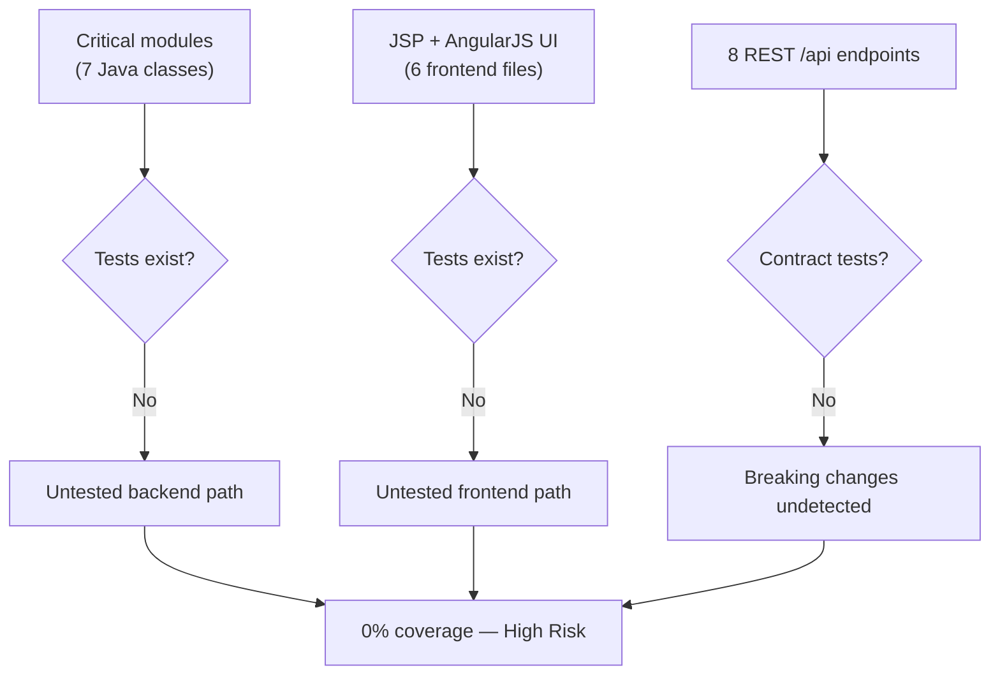
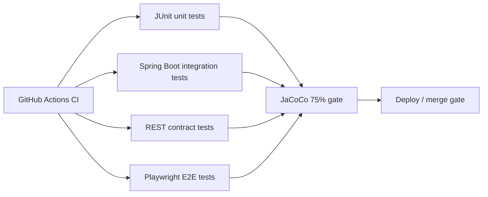

# 5. Testing & Quality Assurance Hotspots Analysis

**Objective:** Improve test coverage and software quality by generating unit, integration, and contract tests where missing.

**Date:** Friday, July 17, 2026 | **Scope:** `global-hr-modernization` (glmarvel29-ai/global-hr-modernization) — Maven / JUnit (via Spring Boot Test, not yet configured); frontend: JSP + AngularJS 1.8 (no JS test runner configured)

## Executive Summary

> **Executive Summary**
>
> The `global-hr-modernization` repository is a Java 8 / Spring Boot 2.7 WAR application with a JSP + AngularJS 1.8 frontend layer. Analysis via the GitHub REST API on branch `main` found **zero test files** (`src/test` absent), **no test dependencies** in `pom.xml` (no `spring-boot-starter-test`, JaCoCo, or Surefire coverage gates), and **no CI workflow** (`.github/workflows` not present). Estimated coverage is **0% backend** (17 Java source files) and **0% frontend** (1 AngularJS module + 5 JSP views + 1 CSS file). Seven business-critical modules—including `AccessControlService` (RBAC/ABAC), `RiskService`, `ApiController`, and `DemoDataLoader`—ship with no automated tests. The README quick-start explicitly runs `mvn package -DskipTests`, reinforcing that tests are not part of the delivery path. Overall testing posture is **High Risk** and must be addressed before any modernization or extraction work.

0

Test Files Found

23

Source Files With No Matching Test

0%

Measured/Estimated Coverage

0

Skipped/Disabled Tests

Overall Codebase Rating — Testing &amp; Quality Assurance

High Risk

Driven by zero test coverage (H2), seven untested critical modules (H1), no integration or contract tests (H3/H4), absent CI gate (H6), and no frontend/E2E or Maven test tooling (H7/H8).

## 5.1 Benchmark Ratings Summary

| # | Hotspot | Primary KPI | Good | Moderate | High Risk | Measured | Rating |
|---|---|---|---|---|---|---|---|
| H1 | Untested Critical Logic | Critical modules with zero tests | 0 | 1–3 | >3 | 7 critical modules, 0 tests | High Risk |
| H2 | Low Test Coverage | Overall coverage % | >80% | 50–80% | <50% | 0% backend · 0% frontend (test-file ratio) | High Risk |
| H3 | Missing Integration Tests | Boundaries covered % | >70% | 30–70% | <30% | 0% (0 of ~5 key boundaries) | High Risk |
| H4 | Missing Contract Tests | APIs with contract tests % | >80% | 40–80% | <40% | 0% (0 of 8 REST endpoints) | High Risk |
| H5 | Flaky / Skipped Tests | Skipped/flaky test count | 0 | 1–5 | >5 | 0 skipped/disabled tests | Good |
| H6 | No CI Test Gate | Tests enforced in CI | Required gate | Runs, not required | No CI test run | No `.github/workflows`; no CI detected | High Risk |
| H7 | No End-to-End / Frontend Tests (additional) | UI flows covered by E2E or component tests (%) | >60% | 20–60% | <20% | 0% (0 specs for 5 JSP pages + AngularJS shell) | High Risk |
| H8 | No Maven Test Tooling / Coverage Gate (additional) | Build enforces test deps + coverage threshold | Yes | Partial (tests run, no threshold) | No test deps or gate | `pom.xml` lacks `spring-boot-starter-test`, JaCoCo, Surefire gate | High Risk |

## 5.2 Hotspot-by-Hotspot Evidence

### H1. Untested Critical Logic Critical

**Benchmark:** `Critical modules with zero tests = 7` → falls in the **High Risk** band (Good 0 · Moderate 1–3 · High Risk >3).

Seven modules carry business-critical behavior with no corresponding files under `src/test/java` or any `*Test.java` / `*Spec.java` naming anywhere in the repository tree (31 blobs on `main`, zero test-like paths).

1. **`AccessControlService`** (`src/main/java/com/erm/legacy/security/AccessControlService.java`) — Implements RBAC role-to-permission maps and ABAC region/classification gates (`hasPermission`, `abacAllow`). A regression could silently grant or deny access to risk data across roles (`RISK_ADMIN`, `AUDITOR`, `VENDOR_ANALYST`, `VIEWER`).

2. **`RiskService`** (`src/main/java/com/erm/legacy/service/RiskService.java`) — Core domain service wrapping `RiskItemRepository` for register queries, domain counts, scale metrics, and tenant dialect resolution. All dashboard and API read paths depend on this service.

3. **`ApiController`** (`src/main/java/com/erm/legacy/controller/ApiController.java`) — Exposes eight public REST endpoints (`/api/health`, `/api/risks`, `/api/domains`, `/api/scale`, `/api/legacy-challenges`, `/api/integrations`, `/api/security/posture`, `/api/domain-counts`) consumed by the AngularJS frontend.

4. **`DemoDataLoader`** (`src/main/java/com/erm/legacy/service/DemoDataLoader.java`) — `CommandLineRunner` that seeds nine risk records into the database on startup via `repository.save`. Data-mutation logic runs on every cold start when the register is empty.

5. **`SharedBusinessServices`** (`src/main/java/com/erm/legacy/legacy/SharedBusinessServices.java`) — Static tenant dialect resolution (`resolveTenantDialect`) and legacy risk ID composition used by loaders and page controllers; encodes Oracle vs PostgreSQL routing by region.

6. **`PageController`** (`src/main/java/com/erm/legacy/controller/PageController.java`) — Five MVC page routes (`/dashboard`, `/risks`, `/integrations`, `/security`, `/legacy`) assemble model attributes from services and security checks for JSP rendering.

7. **`RiskItemRepository`** (`src/main/java/com/erm/legacy/repository/RiskItemRepository.java`) — Spring Data JPA interface with custom finder methods (`findByDomain`, `findBySeverityIgnoreCase`); backs all persistence for the risk register.

**Why it matters here:** This application surfaces enterprise risk registers, security posture, and integration status for executive dashboards. Untested RBAC/ABAC logic, data seeding, and REST contracts mean a single refactor of `RiskService` or `AccessControlService` can break both the JSON API layer and every JSP page without any automated signal before deployment.

**Recommended approach:**
1. Add `spring-boot-starter-test` to `pom.xml` and create `src/test/java` with JUnit 5 + Mockito.
2. Unit-test `AccessControlService.hasPermission` and `abacAllow` first — assert deny/allow matrix for each role and classification.
3. Unit-test `SharedBusinessServices.resolveTenantDialect` for EU vs non-EU regions and `composeLegacyRiskKey` prefix rules.
4. Add `@WebMvcTest` slices for `ApiController` and `@SpringBootTest` integration test for `DemoDataLoader` seeding against H2.

<!-- affected-files
search: @(Service|RestController|Controller|Component|Repository)
glob: src/main/java/**/*.java
issue: Business-critical module with zero automated tests
action: Add JUnit 5 unit or slice tests covering RBAC, domain queries, REST responses, and data seeding
-->

### H2. Low Test Coverage Critical

**Benchmark:** `Overall coverage % = 0% (backend 0%, frontend 0%)` → falls in the **High Risk** band (Good >80% · Moderate 50–80% · High Risk <50%).

No coverage reports (`coverage/`, `target/site/jacoco`, `lcov.info`, `.coverage`) exist in the repository. Measured via test-file-to-source-file ratio:

| Layer | Source files | Test files | Estimated coverage |
|---|---|---|---|
| Backend (Java) | 17 | 0 | 0% |
| Frontend (JS + JSP) | 6 (1 `.js` + 5 `.jsp`) | 0 | 0% |
| **Total** | **23** | **0** | **0%** |

The `pom.xml` build section contains only `spring-boot-maven-plugin` — no `maven-surefire-plugin` coverage configuration, no JaCoCo plugin, and no `spring-boot-starter-test` dependency. The README quick-start instructs `mvn -q package -DskipTests`, confirming tests are not part of the default build path.

**Why it matters here:** With 0% coverage across both layers, any extraction of legacy modules (e.g., splitting `IntegrationHub` or replacing JSP with a SPA) has no safety net. Refactors to the 17 Java classes or the AngularJS HTTP controllers in `erm-app.js` cannot be validated automatically.

**Recommended approach:**
1. Add `spring-boot-starter-test` and configure JaCoCo with a minimum 75% line-coverage gate in `pom.xml`.
2. Prioritize tests for the 7 critical modules identified in H1 before broadening to models and config.
3. Introduce a Karma/Jasmine or Playwright smoke suite for the five JSP routes and three AngularJS controllers.
4. Remove `-DskipTests` from documented build commands once a baseline suite exists.

<!-- affected-files
glob: src/main/java/**/*.java
issue: Java source file with no corresponding test
action: Create matching test class under src/test/java with JUnit 5
-->

<!-- affected-files
glob: src/main/resources/static/js/**/*.js
issue: Frontend JavaScript module with no unit or E2E test
action: Add Jasmine/Karma unit tests or Playwright E2E specs for AngularJS controllers and API bindings
-->

### H3. Missing Integration Tests High

**Benchmark:** `Key service/data boundaries covered by integration tests = 0% (0 of ~5)` → falls in the **High Risk** band (Good >70% · Moderate 30–70% · High Risk <30%).

Five integration boundaries were identified; none have `@SpringBootTest`, `@DataJpaTest`, or HTTP-level integration tests:

1. **JPA repository ↔ database** — `RiskItemRepository` queries H2 (default), PostgreSQL, or Oracle depending on Spring profile; no `@DataJpaTest` validates `findByDomain` or `findBySeverityIgnoreCase`.
2. **Service ↔ repository** — `RiskService.countsByDomain()` aggregates repository calls; no test verifies counts match seeded data.
3. **Startup seeding ↔ persistence** — `DemoDataLoader` writes nine records via `CommandLineRunner`; no test asserts idempotent seed behavior (`repository.count() > 0` guard).
4. **REST controller ↔ services** — `ApiController` delegates to `RiskService`, `IntegrationHub`, and `AccessControlService`; no `@SpringBootTest(webEnvironment = RANDOM_PORT)` or MockMvc integration test.
5. **Frontend HTTP ↔ REST API** — `erm-app.js` `$http.get('/api/risks')` and `/api/security/posture` couple the AngularJS shell to backend endpoints; no contract or E2E test validates the wire-up.

**Why it matters here:** Unit tests alone would not catch misconfigured JPA dialect switching (`application-postgres.properties` / `application-oracle.properties`), broken seed logic, or MVC routing regressions. The dual-database legacy pattern (Oracle for Americas, PostgreSQL for EMEA via `SharedBusinessServices`) is a prime integration-test candidate.

**Recommended approach:**
1. Add `@DataJpaTest` for `RiskItemRepository` with H2 in-memory profile.
2. Add `@SpringBootTest` verifying `DemoDataLoader` seeds exactly 9 records on first run and skips on second.
3. Add MockMvc tests for `ApiController` `/api/risks?domain=CYBER_RISK` filtering path.
4. Add profile-switch integration test for `resolveTenantDialect("EU-WEST")` → PostgreSQL vs Oracle.

<!-- affected-files
search: @(SpringBootTest|DataJpaTest|AutoConfigureMockMvc)
glob: src/test/**/*.java
issue: No integration test directory or annotations present
action: Create src/test/java integration tests for JPA, CommandLineRunner seeding, and MockMvc API calls
-->

### H4. Missing Contract Tests High

**Benchmark:** `Public APIs with contract tests = 0% (0 of 8 endpoints)` → falls in the **High Risk** band (Good >80% · Moderate 40–80% · High Risk <40%).

`ApiController` exposes eight GET endpoints under `/api/*`. No JSON schema tests, OpenAPI spec, or consumer-driven contract tests exist. Example contracts that should be locked:

| Endpoint | Response type | Risk if broken |
|---|---|---|
| `GET /api/health` | `Map<String,Object>` with `status`, `stack`, `databases` | Dashboard health panel fails silently |
| `GET /api/risks` | `List<RiskItem>` | Risk register empty or malformed |
| `GET /api/risks?domain=…` | Filtered `List<RiskItem>` | Domain filter returns wrong subset |
| `GET /api/security/posture` | `Map<String,Object>` with `zeroTrust`, `mfaRequired`, etc. | Security page renders blank |
| `GET /api/domain-counts` | `Map<String,Long>` | Dashboard chart data wrong |

The AngularJS frontend in `erm-app.js` assumes specific JSON field names (`item.severity` in `RisksCtrl.bySeverity`) with no schema validation on either side.

**Why it matters here:** Any change to `RiskItem` serialization, enum naming in `RiskDomain`, or security posture map keys will break the JSP/AngularJS UI without a failing test. Contract tests are the cheapest guard for the documented "4,500+ APIs in production" scaling story this demo represents.

**Recommended approach:**
1. Add MockMvc tests asserting HTTP 200, `Content-Type: application/json`, and required JSON keys for each `/api/*` endpoint.
2. Generate or hand-write an OpenAPI 3 spec for the eight endpoints and validate responses with JSON Schema in tests.
3. Add a regression test that `GET /api/risks` returns at least 9 items after startup seeding.
4. Consider Spring Cloud Contract or REST Assured for consumer-driven tests if the API surface grows.

<!-- affected-files
search: @GetMapping
glob: src/main/java/com/erm/legacy/controller/ApiController.java
issue: Public REST endpoint with no contract or schema test
action: Add MockMvc/REST Assured contract test asserting status, content-type, and required JSON fields
-->

### H5. Flaky / Skipped Tests Low

**Benchmark:** `Skipped/flaky test count = 0` → falls in the **Good** band (Good 0 · Moderate 1–5 · High Risk >5).

**Evidence:** Not observed — no test files exist, therefore no `@Disabled`, `@Ignore`, `test.skip`, `xfail`, or commented-out test blocks were found in the repository. The README uses `mvn package -DskipTests` at build time, which bypasses the (non-existent) test phase entirely rather than marking individual tests as skipped.

### H6. No CI Test Gate Critical

**Benchmark:** `Tests enforced in CI = No CI test run` → falls in the **High Risk** band (Good Required gate · Moderate Runs, not required · High Risk No CI test run).

GitHub API returned 404 for `.github/workflows` on branch `main`. No Jenkinsfile, `.gitlab-ci.yml`, Azure Pipelines, or CircleCI config exists in the 31-file tree. Without CI, even a future test suite would not block merges unless wired into a pipeline.

**Why it matters here:** Discovery and modernization work typically proceeds via pull requests. With no automated test gate, regressions in `AccessControlService` or API contracts merge undetected. The README documents manual `mvn spring-boot:run` verification only.

**Recommended approach:**
1. Add `.github/workflows/ci.yml` running `mvn verify` (not `-DskipTests`) on JDK 8 and 17 matrix.
2. Cache Maven dependencies; fail the job if tests fail or JaCoCo coverage drops below threshold.
3. Optionally add a smoke `curl` step against `/api/health` after `spring-boot:run` in CI.
4. Mark the workflow as a required status check on `main`.

<!-- affected-files
glob: .github/workflows/**
issue: CI workflow directory absent — no automated test gate
action: Add GitHub Actions workflow running mvn verify with JUnit and JaCoCo on every push/PR
-->

### H7. No End-to-End / Frontend Tests High (additional)

**Benchmark:** `UI flows covered by E2E or component tests = 0% (0 of 5 pages)` → falls in the **High Risk** band (Good >60% · Moderate 20–60% · High Risk <20%).

The frontend layer consists of:
- **5 JSP views** under `src/main/webapp/WEB-INF/jsp/` (`dashboard.jsp`, `risks.jsp`, `integrations.jsp`, `security.jsp`, `legacy.jsp`)
- **1 AngularJS module** (`src/main/resources/static/js/erm-app.js`) with controllers `DashboardCtrl`, `RisksCtrl`, `SecurityCtrl`
- **1 CSS file** (`erm.css`)

No Karma, Jasmine, Cypress, Playwright, or Selenium configuration exists. No `package.json` frontend test script. The `RisksCtrl.bySeverity` filter and `$http` bootstrapping in each controller are completely untested.

**Why it matters here:** The README explicitly calls out "High code dependencies (JSP ↔ AngularJS ↔ Spring MVC)" as legacy debt. Without E2E tests, replacing JSP with a modern frontend or upgrading AngularJS cannot be validated. Severity filtering and security posture rendering are user-visible behaviors with zero automated coverage.

**Recommended approach:**
1. Add Playwright or Cypress E2E tests that load `/dashboard`, `/risks`, `/security` and assert key DOM content after seed data loads.
2. Add Karma + Jasmine unit tests for `erm-app.js` controllers with `$httpBackend` mocks.
3. Test `RisksCtrl.bySeverity` filter logic with fixture risk items.
4. Capture baseline screenshots for visual regression on the five JSP pages.

<!-- affected-files
glob: src/main/webapp/WEB-INF/jsp/**/*.jsp
issue: JSP view with no E2E or rendering test
action: Add Playwright/Cypress E2E spec asserting page loads and key content renders after API seed
-->

<!-- affected-files
glob: src/main/resources/static/js/**/*.js
issue: AngularJS controller logic with no unit or E2E test
action: Add Karma/Jasmine unit tests with $httpBackend mocks for /api/* bindings
-->

### H8. No Maven Test Tooling / Coverage Gate Medium (additional)

**Benchmark:** `Build enforces test deps + coverage threshold = No` → falls in the **High Risk** band (Good Yes · Moderate Partial · High Risk No test deps or gate).

The `pom.xml` dependencies section includes `spring-boot-starter-web`, `spring-boot-starter-data-jpa`, and JDBC drivers but **no** `spring-boot-starter-test`. The build plugins section has only `spring-boot-maven-plugin` — no `maven-surefire-plugin` configuration, no JaCoCo `jacoco-maven-plugin`, and no failsafe for integration tests. README references `docs/START_TEST_AND_ISSUES.md` for testing guidance, but the `docs/` directory does not exist on `main` (GitHub API 404).

**Why it matters here:** Without test dependencies in the POM, contributors cannot run `mvn test` even if they write tests manually. Missing JaCoCo means coverage cannot be measured or gated. The absent testing doc referenced by README creates onboarding friction.

**Recommended approach:**
1. Add `spring-boot-starter-test` with `test` scope to `pom.xml`.
2. Configure `jacoco-maven-plugin` with `<minimum>0.75</minimum>` line coverage rule (raise as tests are added).
3. Create `docs/START_TEST_AND_ISSUES.md` with `mvn test` and `mvn verify` instructions (replacing `-DskipTests`).
4. Add `maven-surefire-plugin` explicitly if custom test includes/excludes are needed.

<!-- affected-files
glob: pom.xml
issue: Maven POM lacks test dependencies and coverage enforcement plugins
action: Add spring-boot-starter-test, maven-surefire-plugin, and jacoco-maven-plugin with 75% coverage gate
-->

## 5.3 Diagrams

### Current test coverage gaps

### Target test pyramid / CI gate

### Improvement roadmap

## 5.4 Actions Required

| Hotspot | Action | Rating | Priority |
|---|---|---|---|
| H1 Untested Critical Logic | Add JUnit 5 unit tests for `AccessControlService`, `RiskService`, `SharedBusinessServices`, and slice tests for `ApiController` / `PageController` | High Risk | Critical |
| H2 Low Test Coverage | Add `spring-boot-starter-test`, create `src/test/java` mirroring main packages; target 75% JaCoCo line coverage before refactor | High Risk | Critical |
| H3 Missing Integration Tests | Add `@DataJpaTest` for repository, `@SpringBootTest` for `DemoDataLoader` seeding, MockMvc for controller wiring | High Risk | High |
| H4 Missing Contract Tests | Add MockMvc/REST Assured tests for all 8 `/api/*` endpoints asserting status, content-type, and required JSON fields | High Risk | High |
| H6 No CI Test Gate | Create `.github/workflows/ci.yml` running `mvn verify` on push/PR with JDK 8+17 matrix; require as branch protection check | High Risk | Critical |
| H7 No E2E / Frontend Tests | Add Playwright E2E specs for 5 JSP routes and Karma unit tests for `erm-app.js` AngularJS controllers | High Risk | High |
| H8 No Maven Test Tooling | Add test dependencies, Surefire, and JaCoCo plugins to `pom.xml`; create missing `docs/START_TEST_AND_ISSUES.md` | High Risk | Medium |

## 5.5 Expected Outcomes

- RBAC/ABAC security logic and risk register queries are protected by unit tests before any service extraction or modernization.
- Integration tests validate JPA persistence, startup seeding, and dual-database dialect routing across H2/PostgreSQL/Oracle profiles.
- Contract tests on eight REST endpoints prevent breaking JSON shape changes from reaching the AngularJS frontend undetected.
- CI runs `mvn verify` on every pull request, blocking merges when tests fail or coverage drops below the JaCoCo threshold.
- Playwright E2E tests cover the five JSP dashboard pages, enabling safe JSP-to-SPA migration with a regression safety net.
