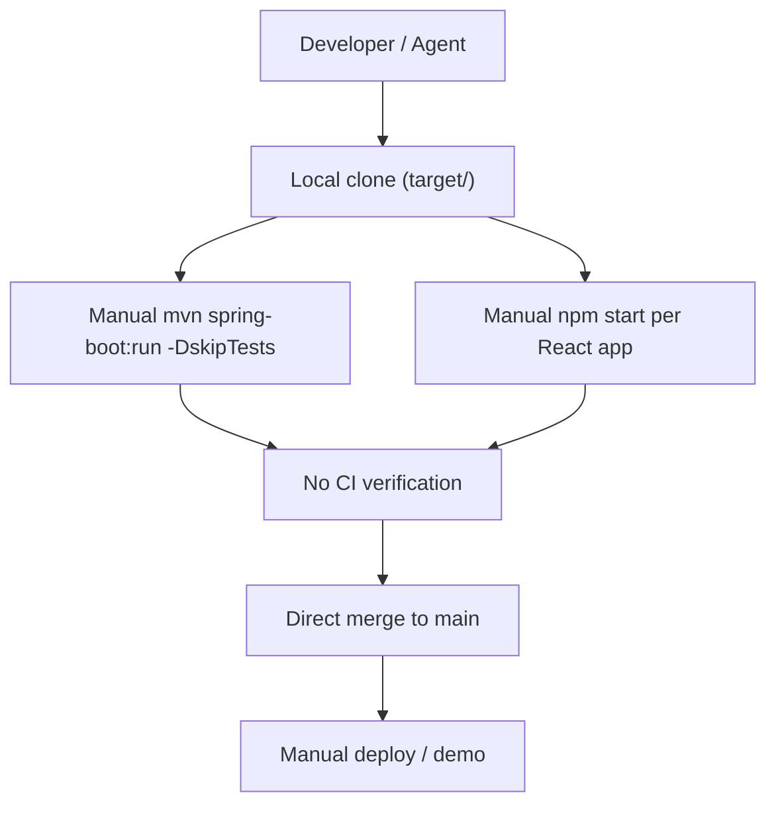
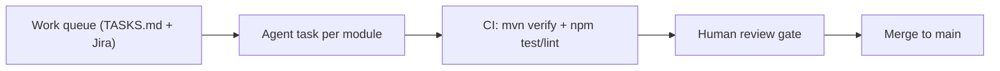
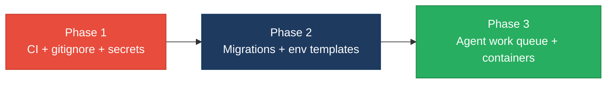

# 7. Technical Debt Analysis

**Objective:** Establish the prerequisites for an Agentic Harness & Marketplace initiative — code repository health, third-party tool usage, AI tool usage, database usage, and development environment readiness.

**Date:** Friday, July 17, 2026 | **Scope:** `target/` — Java 8 / Spring Boot 2.7.18 / JPA / JSP / AngularJS 1.8 (`glmarvel29-ai/global-hr-modernization` on GitHub `main`) plus local React 18 apps (`social-media-react`, `workbench-demo`) and AI workbench scaffolding (`.cursor/`, `.kiro/`)

## Executive Summary

> **Executive Summary**
>
> The TARGET_WORKSPACE combines a compact **ERM Complexity Demo** Spring Boot monolith (31 files on GitHub `main`, zero CI, zero tests) with two **React 18 frontends** used as workbench targets. Repository hygiene is uneven: there is **no top-level `.gitignore`**, **`workbench-demo` lacks any `.gitignore`**, and **`target/.env` plus `.cursor/mcp.json` hold integration tokens locally** without workspace-level exclusion rules. **No `.github/workflows`**, **no `.env.example`**, and **no container/devcontainer path** exist anywhere in scope, so onboarding and agent-authored changes cannot be verified automatically. Database posture relies on **`spring.jpa.hibernate.ddl-auto=update`** with a single flat `risk_register` table and plaintext credentials in profile properties. AI tooling (`.cursor/`, `.kiro/`, `.claude/`, MCP bundles) is present but immature — there is no CI gate to trust agent output. **Overall agentic-harness readiness is High Risk**, driven by absent CI, secrets-adjacent repo hygiene, and non-reproducible dev setup.

Partial

Top-Level .gitignore Present

0

CI/CD Workflows Found

13 / 15

Third-Party Packages Declared / Wired

No

.env.example Present

Overall Codebase Rating — Technical Debt &amp; Agentic Readiness

High Risk

Driven by High Risk gaps in code repository health (D1), database usage (D4), development environment (D5), and committed-adjacent secrets hygiene (D6) — no CI gate exists to validate agent-authored changes.

## Readiness Benchmark Ratings

| # | Dimension | Good | Moderate | High Risk | Measured | Rating |
|---|---|---|---|---|---|---|
| D1 | Code Repository Health | all checks pass | 1–2 gaps | 3+ gaps / no CI | No CI (0 workflows); no top-level `.gitignore`; `workbench-demo` missing `.gitignore`; lock files present for npm apps; Maven `pom.xml` committed on GitHub | High Risk |
| D2 | Third-Party Tool Usage | mostly wired & current | some unused/unwired | many unused or unmaintained | 13 of 15 infra-relevant packages wired; 2 unused npm deps (`dotenv`, `jwt-decode`); Spring Boot 2.7.18 EOL-adjacent | Moderate |
| D3 | AI Tool / Agentic Readiness | ready | partial | not ready | `.cursor/`, `.kiro/`, `.claude/` + MCP configs present; layered Java modules and React feature folders are enumerable; no CI gate or uniform patterns across subprojects | Moderate |
| D4 | Database Usage | sound | some gaps | no constraints / shared flat schema | `ddl-auto=update`; no Flyway/Liquibase; single flat `risk_register` table; no FK/index beyond PK; idempotent seed loader; plaintext DB passwords in profile properties | High Risk |
| D5 | Development Environment | reproducible | partial | manual / fragile | No `.env.example`, Dockerfile, or devcontainer; README runs `mvn package -DskipTests`; ESLint configured but not enforced in CI; `324M` `node_modules` in `workbench-demo` with no local `.gitignore` | High Risk |
| D6 | Secrets & Config Hygiene (additional) | no secrets in tree | isolated local-only | tokens in workspace files | `target/.env` and `target/.cursor/mcp.json` contain live integration tokens; no root `.gitignore` to exclude them | High Risk |
| D7 | Documentation Integrity (additional) | docs match repo | minor drift | broken references | `README.md` links to `docs/START_TEST_AND_ISSUES.md` and `docs/COMPLEXITY_ISSUES.md` but `docs/` returns 404 on GitHub `main` | Moderate |

## 7.1 Code Repository Health

| Check | Files Inspected | Finding | Consequence | Next Step |
|---|---|---|---|---|
| Top-level `.gitignore` | `target/` root (absent); `global-hr-modernization/.gitignore:1-8` (GitHub) | **No** top-level `.gitignore` under `target/`. GitHub repo has minimal Java-centric ignore list (`target/`, `.idea/`, `*.iml`, `*.log`, `.DS_Store`) — no coverage for `.env`, `node_modules/`, or MCP config dirs. | Local-only secrets (`target/.env`), `node_modules/` (324M in `workbench-demo`), and AI config dirs can be accidentally staged in a combined workbench checkout. | Add `target/.gitignore` covering `.env`, `**/node_modules/`, `.cursor/`, `.kiro/`, `.claude/`, and `agent-runs/`; extend GitHub `.gitignore` similarly. |
| Per-app `.gitignore` | `target/social-media-react/.gitignore:1-25`; `target/workbench-demo/` (none) | `social-media-react` ignores `/node_modules`, `/build`, and `.env*`. **`workbench-demo` has no `.gitignore`**, despite committed-style layout and a local `.env`. | Any `git add .` inside `workbench-demo` risks committing dependencies and secrets. | Copy CRA-style `.gitignore` into `target/workbench-demo/.gitignore` immediately. |
| CI/CD presence | GitHub API `GET …/contents/.github` → 404; `find target -path '*/.github/workflows/*'` (only hits inside `node_modules`) | **Zero project-owned CI workflows** across the ERM demo and both React apps. | Lint, test, and build are never enforced before merge; agent-authored patches cannot be auto-validated. | Add `.github/workflows/ci.yml` on `global-hr-modernization` running `mvn verify`; add parallel npm CI for each React app. |
| Branch protection signals | Repo tree on GitHub `main` (31 blobs); `target/` scan for `CODEOWNERS`, `pull_request_template.md` | No `CODEOWNERS`, PR template, or required-checks config visible locally or on GitHub. | Unreviewed changes can land on `main` without automated or ownership gates. | Add `.github/CODEOWNERS` and a PR template referencing CI checks once workflows exist. |
| Lock files | `target/social-media-react/package-lock.json`; `target/workbench-demo/package-lock.json`; `global-hr-modernization/pom.xml` (GitHub) | npm lock files committed for both React apps; Maven coordinates pinned via `spring-boot-starter-parent 2.7.18` in `pom.xml`. | npm installs are reproducible; Java deps inherit BOM versions but no `spring-boot-starter-test` is declared. | Add `spring-boot-starter-test` to `pom.xml`; keep lock files updated via Dependabot once CI exists. |

<!-- affected-files
glob: target/workbench-demo/**
issue: No .gitignore — node_modules and local secrets unprotected
action: Add CRA-style .gitignore excluding node_modules, build, and .env*
-->

## 7.2 Third-Party Tools Usage

| Package | Declared | Actually Wired? | Debt |
|---|---|---|---|
| `spring-boot-starter-web` | Y (`pom.xml`) | Y (`ApiController`, `PageController`) | On Spring Boot 2.7.18 (maintenance mode); plan upgrade path. |
| `spring-boot-starter-data-jpa` | Y | Y (`RiskItemRepository`, `RiskService`) | Schema managed via `ddl-auto=update`, not migrations. |
| `h2` | Y | Y (`application.properties:16-21`) | Default in-memory demo DB; H2 console enabled (`/h2-console`). |
| `postgresql` | Y | Y (`application-postgres.properties:4-8`) | Plaintext `erm/erm` credentials in committed profile file. |
| `ojdbc8` | Y | Y (`application-oracle.properties:4-8`) | Plaintext credentials; Oracle profile for legacy dialect demo. |
| `tomcat-embed-jasper` + `jstl` | Y | Y (`WebMvcConfig`, JSP views under `WEB-INF/jsp/`) | Legacy JSP stack increases agent refactor surface. |
| SAP / Oracle ERP / ServiceNow SDKs | N | N (stubs only in `IntegrationHub.java:17-36`) | Integration names are hard-coded demo data, not real connectors — acceptable for demo but misleading if treated as wired. |
| `axios` (`social-media-react`) | Y (`package.json:15`) | Y (`httpService.js:1-39`) | Pinned to `^0.27.2` — unmaintained line with known CVEs (see security report). |
| `axios` (`workbench-demo`) | Y (`package.json:6`) | Y (`authService.ts:1-9`) | Wired to `REACT_APP_API_BASE_URL`; pinned `1.7.2`. |
| `socket.io-client` | Y (`package.json:28`) | Y (`socket.service.js:1`) | Real-time layer depends on external API at `localhost:3030`. |
| `google-map-react` | Y (`package.json:17`) | Y (`Map.jsx:2,116-155`) | API key hard-coded in component (client bundle leak). |
| `workbox-*` (6 packages) | Y (`package.json:30-41`) | Y (`service-worker.js:10-14`) | PWA scaffolding present; not validated in CI. |
| `dotenv` | Y (`package.json:16`) | **N** — no imports under `src/` | Dead dependency; adds audit noise. Remove from `package.json`. |
| `jwt-decode` | Y (`package.json:18`) | **N** — no imports under `src/` | Dead dependency; remove or wire into auth flow. |
| `react-router-dom` | Y (both apps) | Y | v5 in `social-media-react`, v6 in `workbench-demo` — inconsistent routing patterns for agents. |

## 7.3 AI Tool Usage & Agentic Readiness

**Existing AI-assisted tooling**

| Artifact | Path | Maturity |
|---|---|---|
| Cursor MCP config | `target/.cursor/mcp.json:1-30` | Present — Jira + GitHub MCP servers configured with inline env tokens |
| Kiro settings | `target/.kiro/settings/`, `target/.kiro/context/` | Present — pipeline history and MCP bundles |
| Claude config | `target/.claude/mcp.json` | Present |
| Agent run artifacts | `target/agent-runs/`, `agent-runs/20260717T132536_tkr1f1/` | Active discovery pipeline outputs from current run |

**Enumerable units of work**

The ERM demo on GitHub exposes a clean package-by-layer layout (`controller/`, `service/`, `repository/`, `security/`, `integration/`, `legacy/`) with 17 Java source files — suitable for slice-by-slice agent refactors (e.g., extract `AccessControlService` tests, document `ApiController` endpoints). The React apps organize by feature (`src/pages/`, `src/cmps/`, `src/services/`) but use **inconsistent state patterns** (Redux in `social-media-react`, local state in `workbench-demo`) and **two React Router major versions**, which increases agent task fragmentation.

**Honest assessment:** AI tooling configs exist and modules are listable, but **without CI, lock-step conventions, or a root work queue**, an agentic harness cannot safely accept bulk refactors today. Partial readiness only.

## 7.4 Database Usage

| Check | Files Inspected | Finding | Consequence | Next Step |
|---|---|---|---|---|
| Schema design | `RiskItem.java:21-48` (GitHub); `RiskItemRepository.java:9-14` | Single denormalized `risk_register` entity; `@Id` only — **no foreign keys, no secondary indexes** beyond implicit PK. | Domain integrity (e.g., risk-to-domain cardinality) lives only in application code; extraction to microservices later requires schema rework. | Add `@Index` on `domain` and `severity`; document intentional denormalization in a migration README. |
| Migration hygiene | `application.properties:23` (`ddl-auto=update`); repo tree (no `db/migration`, no Flyway/Liquibase) | **No versioned migrations**; Hibernate auto-updates schema at startup. | Destructive or non-reversible schema changes cannot be reviewed, rolled back, or replayed in CI. | Introduce Flyway under `src/main/resources/db/migration/` and set `ddl-auto=validate`. |
| Data ownership | `RiskItem.java` + `DemoDataLoader.java:24-55` | All persistence in one shared `risk_register` table across nine risk domains — flat, not per-domain schemas. | Blocks safe bounded-context extraction; every service shares one table namespace. | Split seed data and repositories by domain package before service extraction. |
| Seed/sample data hygiene | `DemoDataLoader.java:24-27` (`if (repository.count() > 0) return;`) | Seeding is **idempotent** on empty register; uses synthetic demo narratives, not production data. | Safe for local demo; re-runs skip when data exists. | Keep guard; add `@Profile("demo")` so production profiles never auto-seed. |
| Credentials in config | `application-postgres.properties:6-7`; `application-oracle.properties:6-7` | Plaintext `username`/`password` (`erm/erm`) committed in profile files. | Credential rotation requires code changes; secrets scanners will flag repo. | Externalize to env vars (`SPRING_DATASOURCE_PASSWORD`) and add `.env.example` for local profiles. |

<!-- affected-files
search: spring\.datasource\.password=
glob: **/application*.properties
issue: Plaintext database password in committed properties file
action: Replace with ${SPRING_DATASOURCE_PASSWORD} env placeholder and document in .env.example
-->

## 7.5 Development Environment

| Check | Files Inspected | Finding | Consequence | Next Step |
|---|---|---|---|---|
| `.env.example` | `target/workbench-demo/.env` (present); `target/workbench-demo/.env.example` (absent); `target/social-media-react/.env*` (absent); GitHub repo (no `.env*`) | **No `.env.example` anywhere**; `workbench-demo` expects `REACT_APP_API_BASE_URL` per `authService.ts:6` but documents no variables. | New contributors and agents cannot infer required env vars; onboarding relies on tribal knowledge. | Add `workbench-demo/.env.example` with `REACT_APP_API_BASE_URL=http://localhost:8090/api`. |
| OS portability | `README.md:38-44` (GitHub); React `package.json` scripts | Maven + JDK quick-start is cross-platform; React apps use standard CRA scripts. | Generally portable; no Windows-only tooling detected. | No action required beyond documenting JDK 8–17 compatibility already in README. |
| Containerization | `find target -maxdepth 3 \( -name Dockerfile -o -name docker-compose* -o -name .devcontainer.json \)` → empty | **No Dockerfile, docker-compose, or devcontainer** in scope. | Environment drift between contributors, CI, and agent sandboxes. | Add `Dockerfile` + `docker-compose.yml` for ERM demo (port 8090) and a devcontainer spec. |
| Code style enforcement | `social-media-react/package.json:49-53` (`eslintConfig`); `social-media-react/README.md:56` (`npm run lint`); `social-media-react/package.json:43-47` (scripts — **no `lint` script**); CI search → 0 workflows | ESLint extends `react-app` but **no npm lint script** and **no pre-commit or CI enforcement**; `workbench-demo` has no ESLint config. | Formatting and lint rules drift immediately; agents cannot rely on automated style gates. | Add `"lint": "eslint src --ext .js,.jsx"` to `social-media-react/package.json`; wire `npm run lint` + `npm test -- --watchAll=false` into CI. |

<!-- affected-files
glob: target/social-media-react/src/**/*.{js,jsx}
issue: Source file with no enforced lint/CI gate
action: Wire eslint + CI check for this file path
-->

## 7.6 Prerequisites for Agentic Harness & Marketplace Readiness

| Prerequisite | Current State | Gap |
|---|---|---|
| Enumerable work queue (clear, listable units of refactor work) | Java packages by layer (17 files); React pages/components by feature (~90 files in `social-media-react`) | No central `TASKS.md` or issue-linked queue; subprojects use different stacks | High |
| Isolated, verifiable units of work | ERM controllers/services are small and injectable; React services partially centralized (`httpService.js`) | Shared Redux + socket orchestration in `Main.jsx`; client-only auth guards; no backend in repo for React apps | High |
| CI gate to accept agent-authored output | **None** — 0 workflows | Agent PRs cannot be auto-verified | Critical |
| Repo hygiene for automation (clean checkout, no secrets) | Partial `.gitignore` on one React app; **`target/.env` and MCP configs with live tokens** | Secrets-adjacent files lack root exclusion; `workbench-demo` unprotected | Critical |
| Marketplace packaging readiness | Single Maven WAR + two standalone CRA apps; no monorepo tooling or shared versioning | No unified release manifest, changelog, or artifact publishing pipeline | Medium |

## 7.7 Diagrams

### Current dev / delivery flow

### Agentic harness readiness target

### Improvement roadmap

## 7.8 Actions Required

| Gap | Action | Rating | Priority |
|---|---|---|---|
| No CI/CD workflows | Add `.github/workflows/ci.yml` on `global-hr-modernization` with `mvn verify`; add npm `test` + `lint` jobs for `social-media-react` and `workbench-demo` | High Risk | Critical |
| Missing / incomplete `.gitignore` | Create `target/.gitignore` and `workbench-demo/.gitignore`; extend GitHub `.gitignore` for `.env`, `node_modules/`, AI config dirs | High Risk | Critical |
| Secrets in workspace config files | Rotate exposed tokens; move values to env vars; add `.env.example`; ensure `.env` and MCP configs are gitignored | High Risk | Critical |
| No `.env.example` | Add `workbench-demo/.env.example` documenting `REACT_APP_API_BASE_URL`; add `.env.example` for Spring profiles using `${…}` placeholders | High Risk | High |
| `ddl-auto=update` with no migrations | Adopt Flyway; set `spring.jpa.hibernate.ddl-auto=validate`; create initial migration for `risk_register` | High Risk | High |
| Plaintext DB passwords in properties | Replace with env-var placeholders in `application-postgres.properties` and `application-oracle.properties` | High Risk | High |
| No containerization | Add `Dockerfile` + `docker-compose.yml` for ERM demo on port 8090; optional devcontainer for agents | High Risk | Medium |
| ESLint configured but unenforced | Add `lint` script to `social-media-react/package.json`; enforce via CI and optional pre-commit hook | High Risk | Medium |
| Unused npm dependencies | Remove `dotenv` and `jwt-decode` from `social-media-react/package.json` or wire them into auth/config | Moderate | Low |
| Broken README doc links | Create `docs/START_TEST_AND_ISSUES.md` and `docs/COMPLEXITY_ISSUES.md` on GitHub or remove links from `README.md` | Moderate | Medium |
| Partial agentic module isolation | Publish a prioritized refactor queue (`docs/agent-tasks.md`) mapping Java packages and React feature folders to isolated PR-sized tasks | Moderate | Medium |

## 7.9 Expected Outcomes

- Clean, reproducible checkout with `.gitignore`, lock files, and `.env.example` — no accidental secret commits.
- CI gate (`mvn verify` + npm test/lint) trusts agent-authored PRs before human review.
- Versioned database migrations replace `ddl-auto=update`, enabling safe schema evolution.
- Containerized local dev removes manual Maven/npm setup drift across contributors and agent sandboxes.
- Documented, enumerable work queue enables phased agentic harness adoption without cross-stack surprises.
