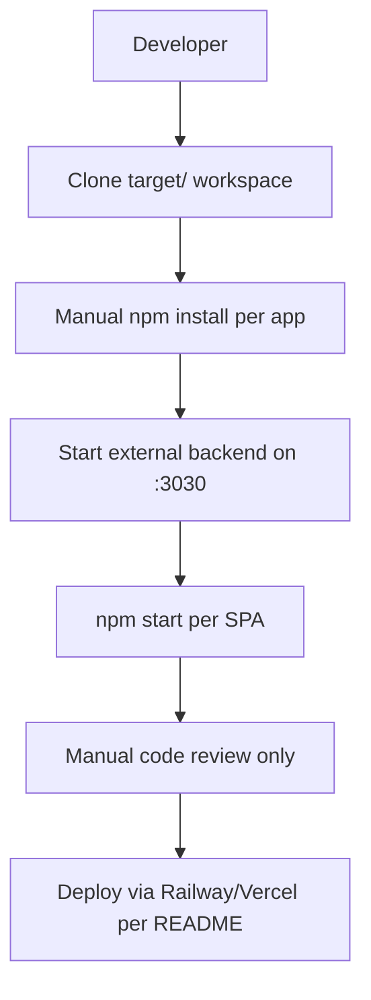
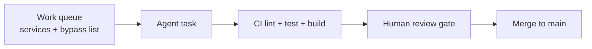

# 7. Technical Debt Analysis

**Objective:** Establish the prerequisites for an Agentic Harness & Marketplace initiative — code repository health, third-party tool usage, AI tool usage, database usage, and development environment readiness.

**Date:** July 16, 2026 | **Scope:** `target/` — React 18 SPAs (Create React App 5): `social-media-react` (JavaScript/JSX, Redux, Socket.io) and `workbench-demo` (TypeScript/TSX); AI orchestration configs (`.cursor/`, `.kiro/`, `.claude/`); no server-side or database source in workspace

## Executive Summary

> **Executive Summary**
>
> TARGET_WORKSPACE hosts two independent React 18 frontends plus mature AI-orchestration scaffolding (MCP configs, pipeline history, knowledge base), but **lacks the baseline engineering gates an agentic harness requires**. The three most severe gaps are: **(1) zero project-level CI/CD workflows**, so no automated lint/test/build gate exists to accept agent-authored changes; **(2) live API tokens committed in nine `mcp.json` files** under `.cursor/`, `.claude/`, and `.kiro/settings/`, creating a secrets-exposure and clean-checkout risk for automation; and **(3) no `.env.example`, Dockerfile, or enforced lint/format pipeline**, leaving onboarding and environment parity manual. Third-party dependencies are mostly wired (Axios, Socket.io, Redux), but `jwt-decode`, `dotenv`, and seven `workbox-*` packages are declared yet unused. Database schema and migrations are entirely external to this workspace. **Agentic-harness readiness today is High Risk**, driven by repository hygiene (D1), development environment (D5), and credential management (D6).

Partial

Top-Level .gitignore Present

0

CI/CD Workflows Found

10 / 15

Third-Party Packages Declared / Wired

No

.env.example Present

Overall Codebase Rating — Technical Debt &amp; Agentic Readiness

High Risk

Driven by High-Risk gaps in Code Repository Health (D1), Development Environment (D5), and Credential Hygiene (D6) — no CI gate and committed secrets block safe agent automation.

## Readiness Benchmark Ratings

| # | Dimension | Good | Moderate | High Risk | Measured | Rating |
|---|---|---|---|---|---|---|
| D1 | Code Repository Health | all checks pass | 1–2 gaps | 3+ gaps / no CI | No top-level `.gitignore`; `workbench-demo` lacks `.gitignore`; 0 CI workflows; lock files present in both apps; no PR template/CODEOWNERS | High Risk |
| D2 | Third-Party Tool Usage | mostly wired & current | some unused/unwired | many unused or unmaintained | 10 of 15 security/infrastructure packages wired; `jwt-decode`, `dotenv`, 7 `workbox-*` packages declared but unused | Moderate |
| D3 | AI Tool / Agentic Readiness | ready | partial | not ready | Rich `.cursor`/`.kiro`/`.claude` configs and knowledge base; 11 enumerable domain services; but no CI gate, dual-app paradigm split, stale default test | Moderate |
| D4 | Database Usage | sound | some gaps | no constraints / shared flat schema | No schema, migrations, or seed scripts in workspace; persistence assumed external (MongoDB per README) | Moderate |
| D5 | Development Environment | reproducible | partial | manual / fragile | No `.env.example`, no containerization, ESLint configured but not enforced; README documents nonexistent `npm run lint` | High Risk |
| D6 | Credential / Secrets Hygiene (additional) | tokens externalized & gitignored | some config files hold secrets | live tokens in tracked configs | 9 `mcp.json` files contain `ATLASSIAN_API_TOKEN` and `GITHUB_PERSONAL_ACCESS_TOKEN` literals | High Risk |

## 7.1 Code Repository

| Check | Files Inspected | Finding | Consequence | Next Step |
|---|---|---|---|---|
| Top-level `.gitignore` | `target/` (root) | **Missing** — no `target/.gitignore` exists | Workspace-level artifacts (`.env`, orchestration outputs, local `node_modules`) at `target/` root are not excluded by any ignore rules | Add `target/.gitignore` covering `.env`, `node_modules/`, `coverage/`, `agent-runs/`, and local MCP bundle caches |
| App-level `.gitignore` | `target/social-media-react/.gitignore:1-25`, `target/workbench-demo/` | `social-media-react` covers `/node_modules`, `/build`, `.env*` variants; **`workbench-demo` has no `.gitignore`** | `workbench-demo/node_modules` (324 MB on disk) and `workbench-demo/coverage/` (192 KB) can be accidentally committed without an app-level ignore file | Copy CRA-standard `.gitignore` into `target/workbench-demo/.gitignore` |
| CI/CD presence | `target/**/.github/workflows/` (excluding `node_modules`) | **0 project workflows found** — only third-party workflows inside `node_modules` | Merges to `main` are not validated by automated lint, test, or build; agent-authored PRs have no verification gate | Add `.github/workflows/ci.yml` at repo root running `npm ci && npm test && npm run build` for each app matrix |
| Branch protection signals | `target/**/CODEOWNERS`, `target/**/PULL_REQUEST_TEMPLATE*` | **Not found** locally | No visible CODEOWNERS or PR template to enforce human review alongside CI | Add `.github/CODEOWNERS` and `.github/pull_request_template.md` |
| Lock files | `target/social-media-react/package-lock.json`, `target/workbench-demo/package-lock.json` | **Both present and committed** (1.2 MB and 662 KB respectively) | Reproducible `npm ci` installs are possible for both apps | Keep lock files updated on dependency changes; add CI `npm ci` step |

## 7.2 Third-Party Tools Usage

| Package | Declared | Actually Wired? | Debt Note |
|---|---|---|---|
| `axios` | Y (`social-media-react/package.json:15`, `workbench-demo/package.json:6`) | Y — `httpService.js:1-39`, `authService.ts:1-9` | Core HTTP client; hard-coded `localhost:3030` in social-media-react instead of env var |
| `socket.io-client` | Y (`social-media-react/package.json:28`) | Y — `socket.service.js:1-33` | Wired; connects to `//localhost:3030` with no env override |
| `redux` / `react-redux` / `redux-thunk` | Y (`social-media-react/package.json:21-23,25`) | Y — `store/index.js`, `store/actions/*.js` | Fully wired state layer |
| `react-router-dom` | Y (v5 in social-media-react, v6 in workbench-demo) | Y — route pages in both apps | **Version split** (v5 vs v6) increases agent refactor surface |
| `google-map-react` | Y (`social-media-react/package.json:17`) | Y — `Map.jsx:2,24-30` | Wired for map feature |
| `@strg/react-snip` | Y (`social-media-react/package.json:11`) | Y — `MsgPreview.jsx:2` | Wired in messaging UI |
| `jwt-decode` | Y (`social-media-react/package.json:18`) | **N** — no imports in `src/` | Declared for auth but unused; auth uses localStorage via `userService.getLoggedinUser()` |
| `dotenv` | Y (`social-media-react/package.json:16`) | **N** — no imports in `src/` | Redundant with CRA's built-in env loading |
| `workbox-core` | Y | Y — `service-worker.js:10` | Used in PWA service worker |
| `workbox-expiration` | Y | Y — `service-worker.js:11` | Used |
| `workbox-precaching` | Y | Y — `service-worker.js:12` | Used |
| `workbox-routing` | Y | Y — `service-worker.js:13` | Used |
| `workbox-strategies` | Y | Y — `service-worker.js:14` | Used |
| `workbox-background-sync` | Y | **N** | Declared but never imported |
| `workbox-broadcast-update` | Y | **N** | Declared but never imported |
| `workbox-cacheable-response` | Y | **N** | Declared but never imported |
| `workbox-google-analytics` | Y | **N** | Declared but never imported |
| `workbox-navigation-preload` | Y | **N** | Declared but never imported |
| `workbox-range-requests` | Y | **N** | Declared but never imported |
| `workbox-streams` | Y | **N** | Declared but never imported |

<!-- affected-files
search: workbox-(background-sync|broadcast-update|cacheable-response|google-analytics|navigation-preload|range-requests|streams)
glob: target/social-media-react/package.json
issue: Workbox sub-packages declared but not imported in source
action: Remove unused workbox dependencies or wire them in service-worker.js
-->

## 7.3 AI Tool Usage & Agentic Readiness

**Existing AI tooling (mature orchestration layer):**

- `target/.cursor/mcp.json:1-99` — Cursor MCP server definitions for Jira, GitHub, observability
- `target/.kiro/settings/mcp.json` — Kiro-equivalent MCP bundle with Jira/GitHub integration
- `target/.claude/mcp.json` — Claude MCP mirror config
- `target/.kiro/context/knowledge-base/` — `error-patterns.md`, `resolutions.md`, `root-causes.md` (institutional memory for agents)
- `target/.kiro/context/pipeline-history/index.md` — MAD-5, MAD-81, MAD-102 incident pipeline records
- Nested copies under `target/workbench-demo/.cursor/`, `target/ServiceCategoryInputFiles/.cursor/` (duplicated MCP configs)

**Code generators / scaffolding:** No dedicated codegen scripts (e.g., Plop, Hygen) found. Agent definitions live in the parent orchestration catalog (`multi-agent-web-ui/.cursor/agents/`), not in TARGET_WORKSPACE application source.

**Enumerable units of work:**

| Unit Type | Count | Location | Agent Refactor Potential |
|---|---|---|---|
| Domain services | 11 | `target/social-media-react/src/services/**/*.js` | High — uniform CRUD-via-`httpService` pattern |
| Redux action modules | 4 | `target/social-media-react/src/store/actions/*.js` (544 LOC total) | High — thunk-per-domain pattern |
| Route pages (social-media) | 13 | `target/social-media-react/src/pages/*.jsx` | Moderate — mixed direct-service vs dispatch calls |
| TS pages (workbench-demo) | 4 | `target/workbench-demo/src/pages/*.tsx` | High — small, typed, test-covered |
| View-layer service bypasses | 11 | Files calling `userService` directly (see architecture report H2) | High — enumerable migration to action layer |

**Assessment:** AI orchestration infrastructure is **ahead of application engineering maturity** — agents have MCP access, knowledge base, and pipeline history, but the application repos they target lack CI verification, consistent patterns across the two SPAs, and a trustworthy test baseline (`social-media-react/src/App.test.js:4-7` still asserts `/learn react/i`, which does not exist in the current `App.js` routing shell). An agent could enumerate service-layer refactors systematically, but **cannot safely auto-merge** without a CI gate.

<!-- affected-files
search: userService\.(getById|getUsers|login|update)
glob: target/social-media-react/src/**/*.{jsx,js}
issue: Enumerable view-layer bypass of Redux action tier
action: Route through userActions thunks for agent-verifiable refactors
-->

## 7.4 Database Usage

| Check | Files Inspected | Finding | Consequence | Next Step |
|---|---|---|---|---|
| Schema design | `target/**/*.{sql,prisma,schema*}` — **0 files** | No database schema, ORM models, or migration files exist in TARGET_WORKSPACE | Foreign keys, indexes, and normalization cannot be verified locally; all persistence is assumed in the external backend ([Social Network Backend](https://github.com/shlomiNugarker/Social-Network-Backend) per `social-media-react/README.md:9`) | Clone/link backend repo into workspace or document API contract schema for agent reference |
| Migration hygiene | `target/**/migrations/**` — **not found** | No migration history visible | Schema changes are opaque to frontend agents; destructive migrations cannot be assessed | Add backend as git submodule or publish OpenAPI/JSON Schema for API entities |
| Data ownership | N/A locally | Frontend uses flat REST endpoints (`user`, `post`, `chat`) with no domain-scoped schema | Shared flat API surface mirrors monolithic backend coupling | Define bounded-context API contracts when extracting services |
| Seed/sample data hygiene | `target/**/seed*`, `target/**/fixtures/**` — **not found** | No seed scripts in workspace | Agents cannot spin up reproducible data scenarios locally | Add `fixtures/` or MSW mock handlers for offline agent testing |

**Note:** Absence of local DB artifacts is expected for a frontend-only checkout, but it is a **moderate modernization risk** because agents working on data-validation or migration tasks have no local source of truth.

## 7.5 Development Environment

| Check | Files Inspected | Finding | Consequence | Next Step |
|---|---|---|---|---|
| `.env.example` | `target/**/.env.example` — **0 files** | Neither app nor workspace root provides an example env file | `workbench-demo/src/services/authService.ts:6` requires `REACT_APP_API_BASE_URL` with no documented default; new contributors and CI runners cannot discover required vars | Add `target/workbench-demo/.env.example` with `REACT_APP_API_BASE_URL=http://localhost:3030/api` and `target/social-media-react/.env.example` documenting optional overrides |
| OS portability | `social-media-react/README.md:21-49`, both `package.json` scripts | Standard `npm install` / `npm start` — **OS-portable** | Works on Linux/macOS/Windows via Node.js | Document minimum Node version (e.g., `engines` field in `package.json`) |
| Containerization | `target/**/Dockerfile`, `target/**/docker-compose*.yml`, `target/**/.devcontainer/**` — **0 files** | No container or devcontainer config | Environment drift between contributors; agents cannot assume reproducible container baseline | Add `docker-compose.yml` wiring frontend + documented backend port 3030 |
| Code style enforcement | `social-media-react/package.json:49-54` (eslintConfig), `workbench-demo/package.json` (no eslintConfig), no `.husky/` or `.pre-commit-config.yaml` | ESLint **configured** in social-media-react via CRA defaults but **not enforced** in CI or pre-commit hooks; workbench-demo has no ESLint config block; README claims `npm run lint` (`README.md:56`) but **no lint script exists** in `package.json:43-48` | Style drift is immediate; documented lint command fails; agents cannot rely on lint gate | Add `"lint": "eslint src --ext .js,.jsx"` script and wire into CI workflow |
| Backend dependency | `httpService.js:3-4`, `socket.service.js:6` | Hard-coded `localhost:3030` for dev API and WebSocket | Agents and contributors must manually start external backend; no health-check or startup script | Add `README` prerequisite section with backend clone/start commands and optional compose service |

## 7.6 Prerequisites for Agentic Harness & Marketplace Readiness

| Prerequisite | Current State | Gap |
|---|---|---|
| Enumerable work queue (clear, listable units of refactor work) | 11 domain services + 11 view-layer bypass files + 4 Redux action modules provide listable targets | Partial — queue exists but spans two apps with different paradigms (JS/v5 vs TS/v6) |
| Isolated, verifiable units of work | `workbench-demo` has isolated `authService.ts` with co-located tests; `social-media-react` services are isolated but views mix concerns | Partial — social-media-react lacks test coverage beyond stale CRA default |
| CI gate to accept agent-authored output | **0 CI workflows** in project scope | Critical — no automated verification path for agent PRs |
| Repo hygiene for automation (clean checkout, no secrets) | Lock files present; **9 `mcp.json` files contain live API tokens**; `workbench-demo` missing `.gitignore` | Critical — secrets exposure and missing ignore rules |
| Marketplace packaging readiness | AI orchestration configs exist but application repos are not independently publishable packages | High — no monorepo tooling, no per-app CI, no version strategy |

## 7.7 Diagrams

### Current dev / delivery flow

### Agentic harness readiness target

### Improvement roadmap

## 7.8 Actions Required

| Gap | Action | Rating | Priority |
|---|---|---|---|
| No CI/CD workflows — agent changes unverified | Add `.github/workflows/ci.yml` running `npm ci`, `npm test -- --watchAll=false`, and `npm run build` for `social-media-react` and `workbench-demo` on every PR | High Risk | Critical |
| Live API tokens in 9 tracked `mcp.json` files | Rotate `ATLASSIAN_API_TOKEN` and `GITHUB_PERSONAL_ACCESS_TOKEN`; remove literals from all `mcp.json` files; load from environment; add `**/mcp.json` env blocks to `.gitignore` or use `.env` references | High Risk | Critical |
| Missing top-level and workbench-demo `.gitignore` | Add `target/.gitignore` and `target/workbench-demo/.gitignore` covering `node_modules/`, `coverage/`, `.env`, and build output | High Risk | High |
| No `.env.example` — undocumented `REACT_APP_API_BASE_URL` | Create `.env.example` in both apps documenting required and optional environment variables | High Risk | High |
| ESLint configured but not enforced; README lint script missing | Add `lint` npm script to both apps; wire `npm run lint` into CI workflow; fix or remove stale `npm run lint` reference in `social-media-react/README.md:56` | High Risk | Medium |
| No containerization path | Add `docker-compose.yml` at workspace root with frontend services and documented backend dependency on port 3030 | High Risk | Medium |
| Unused dependencies (`jwt-decode`, `dotenv`, 7 `workbox-*`) | Remove unwired packages from `social-media-react/package.json` or integrate them (e.g., `jwt-decode` in `PrivateRoute.jsx` auth check) | Moderate | Low |
| No local database schema/migrations | Link backend repo or add API schema artifacts (OpenAPI/JSON Schema) for agent data-validation tasks | Moderate | Medium |
| Stale default test (`App.test.js` expects "learn react") | Rewrite `social-media-react/src/App.test.js` to match current routing shell or add MSW-backed integration tests | Moderate | Medium |
| Dual-app paradigm split (JS/Router v5 vs TS/Router v6) | Document app boundaries; prioritize TypeScript migration roadmap for `social-media-react` as enumerable agent work queue | Moderate | Medium |

## 7.9 Expected Outcomes

- Clean, reproducible checkout with `.gitignore`, `.env.example`, and no committed secrets — safe for agent automation clones
- CI gate (lint + test + build) trusts agent-authored PRs before human review
- Removed unused dependencies reduce install surface and supply-chain risk
- Containerized dev path eliminates manual backend-port tribal knowledge
- Enumerable service-layer and view-bypass refactors become agent-ready work queue items with verifiable test coverage

<!-- affected-files
search: ATLASSIAN_API_TOKEN|GITHUB_PERSONAL_ACCESS_TOKEN
glob: target/**/mcp.json
issue: Live API tokens committed in MCP config
action: Rotate tokens; externalize to environment variables; gitignore credential blocks
-->
